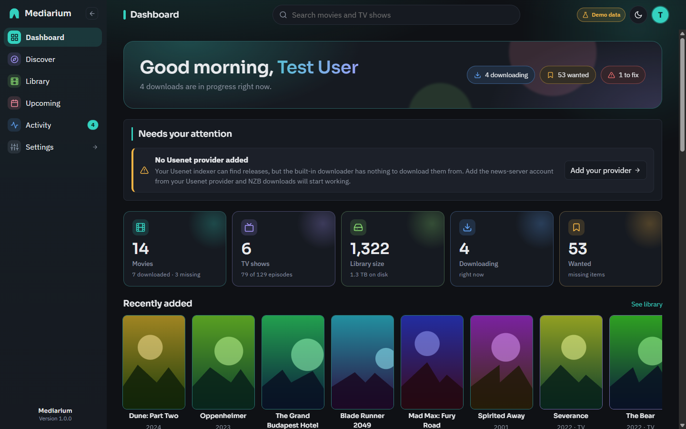
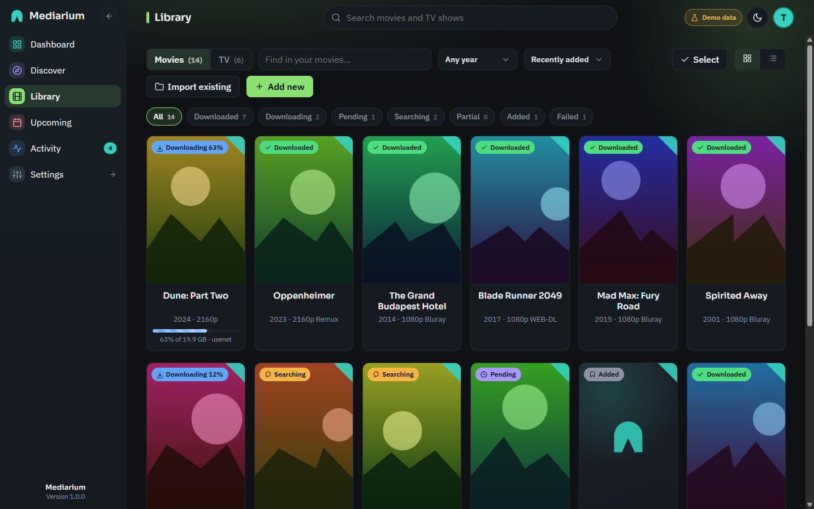
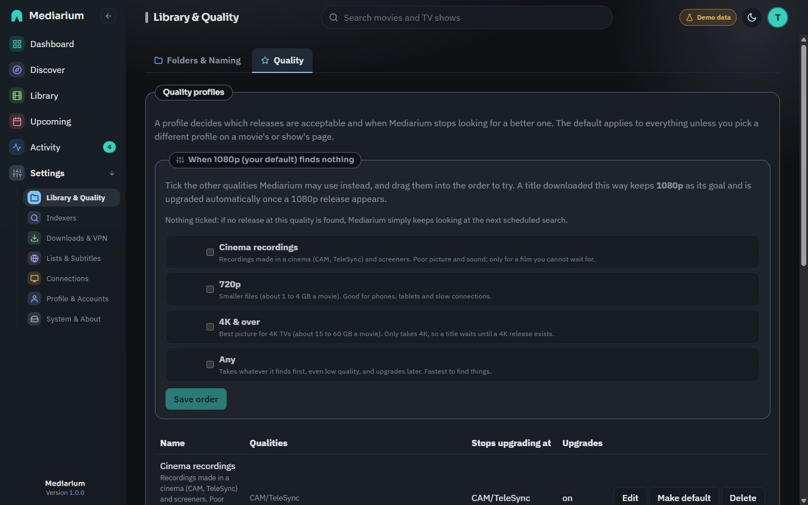
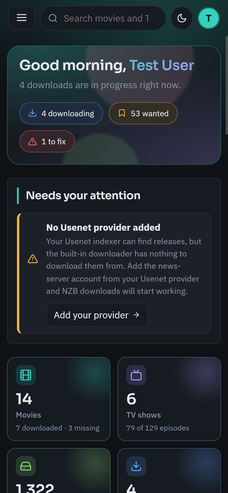

<p align="center">
  <picture>
    <source media="(prefers-color-scheme: dark)" srcset="branding/mediarium-lockup-dark.svg" />
    
  </picture>
</p>

# Mediarium

A single-binary, self-hosted, all-in-one media manager: search, grab, download, and organize your movie and TV library without running Radarr, Sonarr, Prowlarr, SABnzbd, and Bazarr as five separate containers.

One process. One database. One web UI. One search bar.

> **Status:** pre-release. Movies and TV work end to end: Discover and one search across Usenet and torrent indexers, grab, the built-in Usenet and torrent downloaders, repair and unpack, and import with your naming. Around that: quality profiles with fallbacks and upgrades, automation, a built-in VPN for torrents, subtitles, notifications, Plex/Jellyfin/Emby library refresh, family accounts, backups and clean-up. See [docs/FEATURES.md](docs/FEATURES.md) for everything it does and [CHANGELOG.md](CHANGELOG.md) for what changed.

## Why

- One container instead of five-plus → lower resource footprint, one thing to update, one thing to back up
- One unified search across every configured indexer, not five separate search boxes
- Built-in torrent VPN protection with no `NET_ADMIN`/`/dev/net/tun` requirement (embedded userspace WireGuard)
- Deploys cleanly on Synology, Unraid, QNAP, or any Linux/Docker host

Documentation lives in [`docs/`](./docs): install guides, the feature audit and the reference pages.

## Screenshots

Screenshots use the built-in sample data.

| | |
|---|---|
|  |  |
| **Dashboard**: what is downloading, wanted and needs attention | **Discover**: trending, popular and coming soon, filters and paging |
|  |  |
| **Library**: live download progress on every title | **Activity**: the queue, history and blocklist |
|  |  |
| **Quality**: profiles and the fallback order | **Media servers**: Plex, Jellyfin and Emby |

<p align="center"></p>

## Quickstart

```bash
git clone <this repo>
cd <this repo>
cp .env.example .env    # adjust PUID/PGID/TZ for your system
docker compose up -d
```

Or as a single `docker run`:

```bash
docker run -d \
  --name mediarium \
  -p 8264:8264 \
  -p 58264:58264/tcp -p 58264:58264/udp \
  -e PUID=1000 -e PGID=1000 -e TZ=Etc/UTC \
  -v ./config:/config \
  -v ./downloads:/downloads \
  -v ./movies:/movies \
  -v ./tv:/tv \
  --restart unless-stopped \
  ghcr.io/rdborg/mediarium:latest
```

Then open `http://<your-host>:8264` and follow the first-run setup wizard.

Full install guide for every platform (Docker, Synology, Unraid, QNAP, TrueNAS, Portainer, CasaOS, Windows, macOS, Linux binary): **[`docs/INSTALL.md`](./docs/INSTALL.md)**. What the app can and cannot do today compared with Radarr, Sonarr, Prowlarr, SABnzbd, qBittorrent and Bazarr: **[`docs/FEATURES.md`](./docs/FEATURES.md)**. Responsible-use notice: **[`docs/LEGAL.md`](./docs/LEGAL.md)**.

Platform-specific guides: [`docs/synology.md`](./docs/synology.md) · [`docs/unraid.md`](./docs/unraid.md) · [`docs/qnap.md`](./docs/qnap.md) · [`docs/linux.md`](./docs/linux.md)

> The image isn't published yet. Until it is, build it locally instead: `docker compose build && docker compose up -d`, or `docker build -t mediarium .` then swap the image name above for `mediarium`.

## How folders work under Docker

Mediarium runs inside a container, so it only sees the folders you map in. You give it up to four, each `host path : container path`:

| Container path | What to map it to | What Mediarium does there |
|---|---|---|
| `/config` | A small folder for Mediarium itself | Stores its database and key. Back this up. |
| `/movies` | Your existing movie folder (or an empty one) | Adds new movies, and finds what is already there. |
| `/tv` | Your existing TV folder (or an empty one) | Adds new episodes, and finds what is already there. |
| `/downloads` | Where in-progress downloads may live | Downloads into `incomplete/`, then imports finished files into the library. |

The first-run wizard asks for the *container* paths (the defaults above are right if you used the compose file), and checks each one live: does it exist, can Mediarium write to it, is it really mapped from the host, and how much space is free. The same checks show on the dashboard and in Settings, Media Management.

**Hardlinks:** keep `/downloads` and your library on the same drive. Then importing is instant and uses no extra space. Easiest way: map one parent folder instead of separate ones, for example `-v /mnt/media:/data`, and use `/data/downloads`, `/data/movies` and `/data/tv` as the paths in Settings. On different drives Mediarium copies instead, which works but uses double the space until the download is cleared.

**Permissions:** set `PUID`/`PGID` to the owner of your media folders (`id -u` / `id -g`). If a folder is not writable by that user the container logs a warning and the dashboard flags it.

**What Mediarium never does to your folders:**

- It never changes ownership or permissions of `/movies`, `/tv` or `/downloads` (only its own `/config`).
- It never deletes or overwrites an existing file in your library on its own. If a file is already there it skips it, or asks you, depending on the "existing file" setting. When you do choose to replace one, the new file is written next to it first and swapped in, so a failure can never destroy the original.
- It only deletes library files when you tick "delete files" while removing a title. Removing a title from the library alone leaves every file on disk.
- It only cleans up its own `downloads/incomplete/queue-N` working folders, and only after a Usenet download has been imported. Torrent data is left in place while it seeds.

## API keys

Movie and show details come from TMDB, subtitles from OpenSubtitles, and public lists from Trakt. An official build ships with app-wide keys for these (nothing to do). If you build it yourself, either pass `TMDB_API_KEY`, `OPENSUBTITLES_API_KEY` and `TRAKT_CLIENT_ID` as build args (see `docker-compose.yml`), or enter your own keys in the wizard or under Settings. Your Usenet provider, indexer accounts and VPN are always your own.

## Environment variables

Container-level settings only — everything else (indexers, Usenet servers, naming, VPN, notifications) is configured from the app's Settings UI after first run, not via environment variables.

| Variable | Default | Purpose |
|---|---|---|
| `PUID` | `1000` | User ID files are written as — match your host user so NAS permissions come out correct |
| `PGID` | `1000` | Group ID, same reasoning as `PUID` |
| `TZ` | `Etc/UTC` | Timezone for logs and scheduling |
| `APP_PORT` | `8264` | Port the web UI/API is served on inside the container |
| `CONFIG_DIR` | `/config` | Where `app.db` and `secret.key` live — back this up (see below) |
| `DOWNLOADS_DIR` | `/downloads` | Parent of `incomplete/` and `complete/` |
| `MOVIES_DIR` | `/movies` | Organized movie library root |
| `TV_DIR` | `/tv` | Organized TV library root (overridable in Settings) |

## Backup & restore

Everything that isn't a media file lives in one SQLite database, `app.db`, plus one small key file, `secret.key` — both under `/config`. That's the whole selling point: back up `/config`, and you have the entire app state (accounts, sessions, indexers, Usenet server config, VPN configs, library, queue, activity history, settings).

**Backup:** stop the container (or at least pause activity) and copy the `/config` volume/folder somewhere safe. `secret.key` decrypts every encrypted credential in `app.db` (API keys, VPN keys, Usenet server passwords) — losing it means those specific fields become unrecoverable even with `app.db` intact, so back the two files up together, never `app.db` alone.

**Restore:** stop the container, replace `/config` with your backup, start the container again. No migration step needed — the binary re-applies its own schema migrations idempotently on startup (`internal/store`).

**Built-in backup and restore (administrators only):** Mediarium can also do this while running. `GET /api/system/backup` downloads `mediarium-backup-YYYYMMDD-HHMMSS.zip` (a consistent `VACUUM INTO` snapshot of `app.db`, `secret.key`, and a `manifest.json`); the zip contains your encryption key, so treat it like a password. `POST /api/system/restore` (multipart field `file`, up to 1 GB) validates a backup, stages it, and restarts the app (relying on the container restart policy; start it manually if you have none); on that start the files are swapped in, and your previous `app.db`/`secret.key` are kept in `/config/before-restore-<timestamp>/` and never deleted. An unusable staged restore leaves your data untouched and is moved to `/config/restore-failed-<timestamp>/`.

## Troubleshooting

- **Files import as copies instead of hardlinks, and storage use doubles:** `/downloads` and your library path (`/movies`) need to be on the *same* underlying filesystem/volume for hardlinking to work — this is the single most common misconfiguration (see the Synology/Unraid guides for the platform-specific version of this).
- **Permission denied writing to `/config`, `/downloads`, or `/movies`:** `PUID`/`PGID` don't match the owner of those host folders. Find your real UID/GID with `id -u`/`id -g` (or the NAS-specific equivalent — DSM/Unraid guides linked above) and set the env vars to match, then restart the container.
- **Search returns nothing:** confirm at least one indexer is configured and enabled in Settings — the top search bar searches indexers directly, it isn't a TMDB title search.
- **Grab never leaves "queued":** confirm a Usenet server (your provider's news-server account) is added under Settings > Downloads and passes its Test button; torrent grabs don't need one (the engine is embedded) but do need at least one working network path to the swarm.
- **Onboarding wizard reappears after restart:** `onboarding.done` lives in `app.db` under `/config` — if `/config` isn't actually persisted as a volume (e.g. it's inside the container's writable layer), everything resets on every restart. Double-check your volume mounts.

## Development

Requires Go 1.26.8+ (see `go.mod`'s `go` directive for the exact minimum).

```bash
go build ./cmd/app
./app
```

See [`CONTRIBUTING.md`](./CONTRIBUTING.md) for coding conventions and project structure.

### Building multi-arch images

The Dockerfile targets `linux/amd64` + `linux/arm64` and cross-compiles the Go binary natively per target rather than emulating the whole build, so a multi-arch build is meaningfully faster than it looks:

```bash
docker buildx create --use --name mediarium-builder   # one-time, if you don't already have a buildx builder
docker buildx build \
  --platform linux/amd64,linux/arm64 \
  -t ghcr.io/rdborg/mediarium:1.0.0 \
  --push .
```

Drop `--push` (and the registry tag) to build locally without publishing — buildx still builds both platforms, it just can't load a multi-platform result into the local `docker images` list the way a single-platform build can (`docker buildx build --platform linux/amd64 --load .` for a local single-arch test image instead).

## Versioning & updates

Update policy: version-pinned Docker tags, a changelog per release, no forced auto-update. Versions follow [Semantic Versioning](https://semver.org/) (MAJOR.MINOR.PATCH), and the [`VERSION`](./VERSION) file at the repository root is the single source of the number: a Docker build reads it (pass `--build-arg VERSION=...` to override), while a plain `go build` reports `dev`. The running version shows in `GET /api/version` and on the About page. Each release is tagged `vX.Y.Z` to match `VERSION`, publishes images tagged `X.Y.Z`, `X.Y` and `latest`, and gets a section in [`CHANGELOG.md`](./CHANGELOG.md). Pin `X.Y.Z` (or `X.Y` for bug fixes only) if you do not want to follow `latest`. How a release is cut: [`docs/RELEASING.md`](./docs/RELEASING.md).

## License

[AGPL-3.0](./LICENSE) — free to self-host and use for personal purposes without restriction. Anyone offering this as a hosted/paid network service must release their source under the same license. See the LICENSE file for full terms.

## Contributing

Not yet open for contributions (the repo is private during initial build-out). [`CONTRIBUTING.md`](./CONTRIBUTING.md) will apply once the repo goes public.
