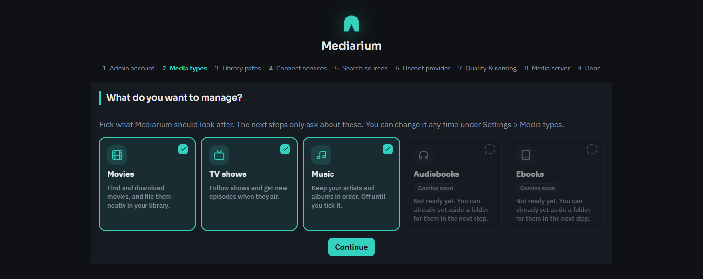
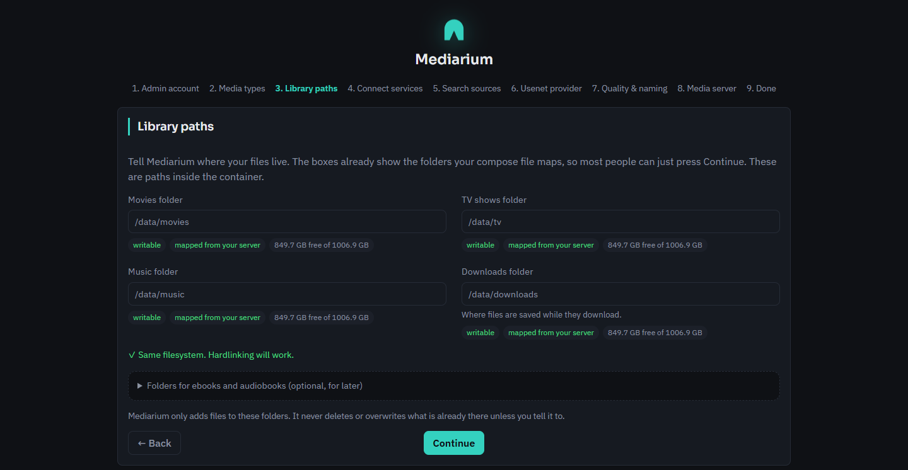
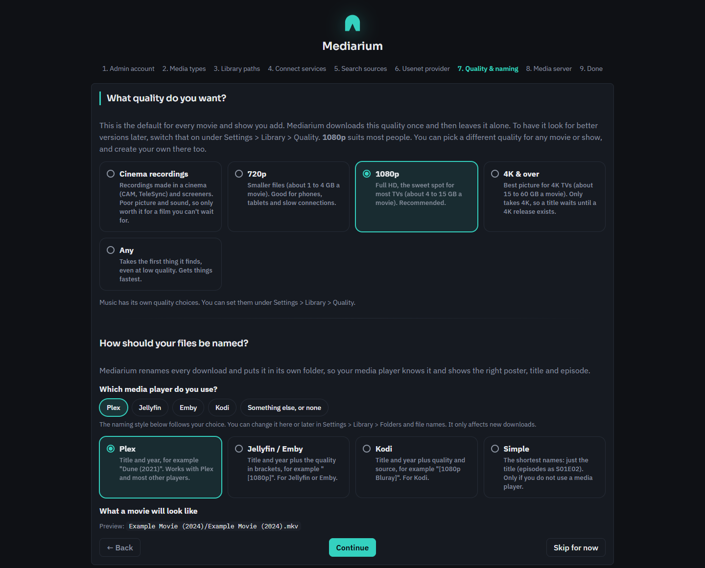
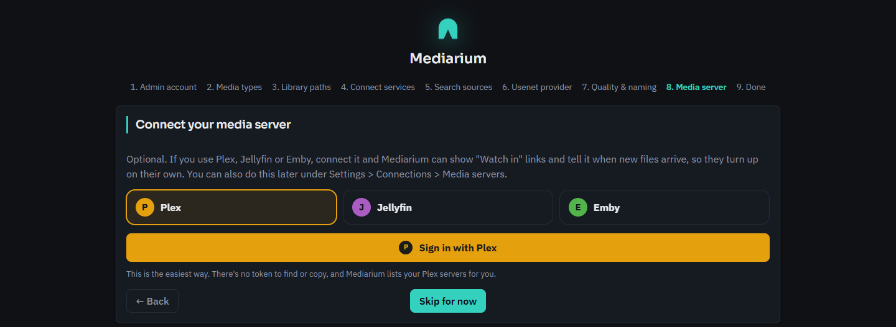
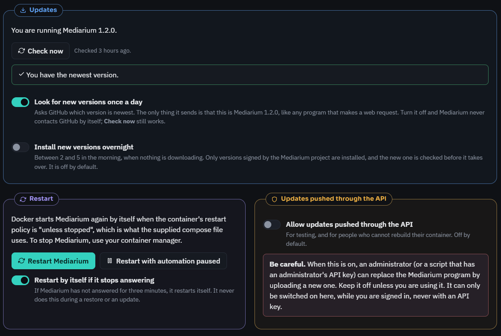

# Installing Mediarium

Mediarium runs in **Docker**, the one supported way to install it today. It works on any 64-bit Linux computer or NAS (Intel/AMD `amd64` or ARM `arm64`, including a Raspberry Pi 3, 4 or 5 with a 64-bit system). Windows and macOS installers, Linux packages and one-click app-store entries are coming soon: see [What runs where](./PLATFORMS.md).

It takes about ten minutes. You don't need to know Docker well: you copy one file, change a few lines, and run one command.

Using a NAS? There are step-by-step guides for [Synology](./synology.md) (including running it next to Radarr, Sonarr and SABnzbd), [Unraid](./unraid.md) and [QNAP](./qnap.md). Plain Linux: [linux.md](./linux.md).

**On a NAS, create every folder you map before you start Mediarium.** If a mapped folder doesn't exist, Docker stops with an error like `Bind mount failed: '/volume1/Media/downloads' does not exist`.

Mediarium does not host or provide any content. See [LEGAL.md](./LEGAL.md).

## Contents

1. [Quick start](#quick-start)
2. [The compose file](#the-compose-file)
3. [Choosing your folders](#choosing-your-folders)
4. [Why one /data folder? (hardlinks)](#why-one-data-folder-hardlinks)
5. [PUID, PGID and TZ](#puid-pgid-and-tz)
6. [Ports](#ports)
7. [Other environment variables](#other-environment-variables)
8. [The setup wizard](#the-setup-wizard)
9. [Optional: getting past Cloudflare checks](#optional-getting-past-cloudflare-checks)
10. [Everyday commands](#everyday-commands)
11. [Updating](#updating)
12. [Updating without rebuilding the container](#updating-without-rebuilding-the-container)
13. [Backup and restore](#backup-and-restore)
14. [Uninstalling](#uninstalling)
15. [One command instead: docker run](#one-command-instead-docker-run)
16. [Using a Docker app (Portainer, Container Manager, Container Station...)](#using-a-docker-app)
17. [Troubleshooting](#troubleshooting)
18. [Building from source](#building-from-source)

---

## Quick start

1. **Install Docker** with the Compose plugin: follow [docs.docker.com/engine/install](https://docs.docker.com/engine/install/) for your system. Check it works with `docker compose version`. (On a NAS, use its own Docker app instead: see the NAS guides above.)
2. **Make a folder for Mediarium** and go into it:
   ```bash
   mkdir mediarium
   cd mediarium
   ```
3. **Create a file called `docker-compose.yml`** in that folder and paste in [the compose file](#the-compose-file) below. Change the lines marked `CHANGE`. The defaults are fine for a first try.
4. **Start it:**
   ```bash
   docker compose up -d
   ```
   The first start downloads the image, which takes a minute.
5. **Open `http://<your-server-ip>:8264`** in your browser (for example `http://192.168.1.20:8264`, or `http://localhost:8264` on the same machine) and follow the [setup wizard](#the-setup-wizard).

That's it. With the file exactly as below, Mediarium keeps its settings in `mediarium/config` and your downloads, movies and TV in `mediarium/data`. To use folders you already have, read [Choosing your folders](#choosing-your-folders).

## The compose file

This is the same file as [`docker-compose.yml`](../docker-compose.yml) in the repository.

```yaml
# Mediarium: movies, TV shows and music, from search to your library, in one app.
#
# How to use this file
#   1. Put it in an empty folder, for example "mediarium".
#   2. Change the lines marked CHANGE. The defaults work for a quick try.
#   3. In that folder run:   docker compose up -d
#   4. Open http://<your-server-ip>:8264 and follow the setup steps.
#
# On a NAS? Create every folder you map BEFORE you start it, or Docker stops
# with "Bind mount failed ... does not exist". A Synology example is at the
# bottom of this file.
#
# Full guide: https://github.com/rdborg/Mediarium/blob/main/docs/INSTALL.md

services:
  mediarium:
    # For sites behind a Cloudflare check, use ghcr.io/rdborg/mediarium:latest-full
    # instead (bigger, but has the helper built in). See docs/INSTALL.md.
    image: ghcr.io/rdborg/mediarium:latest
    container_name: mediarium
    restart: unless-stopped
    # Nothing running in the container can gain more privileges than it starts with.
    security_opt:
      - no-new-privileges:true
    ports:
      # The web page. To use another port, change only the LEFT number,
      # for example "8300:8264", then open http://<your-server-ip>:8300.
      - "8264:8264"
      # Optional: the torrent port (TCP and UDP). Torrents work without it, but
      # with it you find more peers and can seed. Delete these two lines if you
      # only use Usenet.
      - "58264:58264/tcp"
      - "58264:58264/udp"
    environment:
      # CHANGE: the user and group that own your media folders.
      # On the server, run "id" and use the uid and gid numbers it prints.
      # (On a Synology, copy them from another container's Environment tab.)
      - PUID=1000
      - PGID=1000
      # CHANGE: your timezone, for example Europe/London or America/New_York.
      - TZ=Etc/UTC
      # Where movies, TV and downloads are inside the /data folder mapped
      # below. Only change them if your folders have other names (capital
      # letters count).
      - DOWNLOADS_DIR=/data/downloads
      - MOVIES_DIR=/data/movies
      - TV_DIR=/data/tv
      # OPTIONAL folders. Take off the # to use one. Music works today, ebooks
      # and audiobooks are on the way. Keep them inside /data and there is
      # nothing more to map:
      # - MUSIC_DIR=/data/music
      # - EBOOKS_DIR=/data/ebooks
      # - AUDIOBOOKS_DIR=/data/audiobooks
    volumes:
      # CHANGE the left side of each line (the right side must stay as it is).
      # Mediarium's own settings and database. Keep it on a local disk and back it up.
      - ./config:/config
      # ONE folder that holds downloads, movies and TV. With a single mapping,
      # finished downloads move into your library instantly and use no extra
      # space (hardlinks).
      - ./data:/data
      # OPTIONAL: a folder somewhere else gets its own line. Keep the right
      # side as it is and you don't need a *_DIR line for it.
      # - /path/to/music:/music
      # - /path/to/ebooks:/ebooks
      # - /path/to/audiobooks:/audiobooks

  # Optional: only needed for torrent sites that show a Cloudflare
  # "checking your browser" page. Start everything with:
  #   docker compose --profile cloudflare up -d
  # then enter http://flaresolverr:8191 in Mediarium under Settings > Indexers & Search.
  flaresolverr:
    image: ghcr.io/flaresolverr/flaresolverr:latest
    restart: unless-stopped
    profiles: ["cloudflare"]
    environment:
      - TZ=Etc/UTC

# -----------------------------------------------------------------------------
# NAS EXAMPLE (Synology)
#
# The shared folder "Media" holds four folders: Movies, tv, Music and
# downloads. Create them first in File Station, and a "docker/mediarium" folder
# for Mediarium's settings. Then use these lines in place of the environment
# and volumes above:
#
#     environment:
#       - PUID=1026
#       - PGID=101
#       - TZ=Europe/London
#       - DOWNLOADS_DIR=/data/downloads
#       - MOVIES_DIR=/data/Movies
#       - TV_DIR=/data/tv
#       - MUSIC_DIR=/data/Music
#     volumes:
#       - /volume1/docker/mediarium:/config
#       - /volume1/Media:/data
#
# Step by step: https://github.com/rdborg/Mediarium/blob/main/docs/synology.md
```

In a `volumes` line, the part **before** the colon is the folder on your server and the part **after** it is where Mediarium sees it. Only ever change the part before the colon.

## Choosing your folders

Mediarium needs two folders on your server:

| Mapped as | What it is | Tips |
|---|---|---|
| `/config` | Mediarium's own settings, database and encryption key. Small. | Keep it on a local disk (an SSD is nice), never on a network share. Back it up. |
| `/data` | **One** folder that contains your downloads, movies and TV. | Put all three inside it, so finished downloads can be [hardlinked](#why-one-data-folder-hardlinks). |

Music, ebooks and audiobooks are optional and have folders of their own (see [Optional folders](#optional-folders-music-ebooks-and-audiobooks) below). The setup wizard asks only for the kinds of media you choose.

A good layout looks like this:

```
/your/storage/data/            ->  mapped as /data
├── downloads/                     DOWNLOADS_DIR=/data/downloads
│   ├── incomplete/                (Mediarium creates these two)
│   └── complete/
├── movies/                        MOVIES_DIR=/data/movies
├── tv/                            TV_DIR=/data/tv
└── music/                         MUSIC_DIR=/data/music     (optional)

/your/storage/mediarium-config/ ->  mapped as /config
```

- **Brand-new setup:** if the `data` folder and the three folders in it don't exist yet, Mediarium creates them on first start, owned by your `PUID`/`PGID` user.
- **You already have a library:** map the folder *above* your movies and TV as `/data`, and set `MOVIES_DIR`, `TV_DIR` and `DOWNLOADS_DIR` to match what is inside it. For example, a layout of `/volume1/data/media/movies`, `/volume1/data/media/tv` and `/volume1/data/downloads` becomes:
  ```yaml
      environment:
        - DOWNLOADS_DIR=/data/downloads/mediarium
        - MOVIES_DIR=/data/media/movies
        - TV_DIR=/data/media/tv
      volumes:
        - /volume1/docker/mediarium:/config
        - /volume1/data:/data
  ```
  Folder names are case sensitive (`Movies` is not `movies`). You can add what is already in your library, and Mediarium never deletes or overwrites existing files on its own.
- **Other download apps use the same downloads folder?** (SABnzbd, NZBGet, qBittorrent, Transmission...) Give Mediarium a folder of its own inside it, like `DOWNLOADS_DIR=/data/downloads/mediarium` above. Mediarium tidies up leftover files in its own `incomplete` folder, so it must not share that folder with another app. Hardlinks still work, because it is all inside `/data`.
- **Use full paths** on a real server (`/srv/data`, `/volume1/data`, `/mnt/user/data`). The `./config` and `./data` in the example mean "next to the compose file", which is handy for a first try.
- **Disk format:** the disk must support hardlinks. ext4, XFS, Btrfs, ZFS and NTFS all do; exFAT and FAT (common on USB sticks) do not.
- Moving over from Radarr, Sonarr, Prowlarr or SABnzbd? Use the same folders they use: see [Move from Radarr, Sonarr, Prowlarr, SABnzbd and other apps](./migrate.md).

### Optional folders: music, ebooks and audiobooks

Each kind of media has its own folder setting. You only need the ones you use.

| Media | Environment variable | Default | Notes |
|---|---|---|---|
| Music | `MUSIC_DIR` | `/music` | Works today. Switch it on under Settings > Media types ([music.md](./music.md)). |
| Ebooks | `EBOOKS_DIR` | `/ebooks` | Not ready yet. The folder is only remembered for later. |
| Audiobooks | `AUDIOBOOKS_DIR` | `/audiobooks` | Not ready yet. The folder is only remembered for later. |

There are two ways to give one of them a folder:

- **Inside `/data` (nothing more to map).** Create the folder next to `movies` and `tv`, and add one line to `environment`, for example `- MUSIC_DIR=/data/music`.
- **A folder somewhere else.** Add a line to `volumes`, for example `- /path/to/music:/music`. If you keep `/music` on the right, you don't need the `MUSIC_DIR` line.

The compose file above has these as commented lines you can switch on. After changing the file, run `docker compose up -d`.

### Adding music, ebooks or audiobooks later

1. Create the folder on your server (on a NAS, before the next step).
2. Add the `environment` line or the `volumes` line as described above, then run `docker compose up -d`. In a NAS app, stop the project, rebuild it and start it again.
3. In Mediarium, switch the type on under **Settings > Media types** (music today) and check the folder under **Settings > Library > Folders and file names**. The page shows the folder Mediarium really uses and whether it is **Mapped to your device**.

## Why one /data folder? (hardlinks)

When a download finishes, Mediarium puts it in your library with a **hardlink**: a second name for the same file. It is instant and uses no extra space, and the download can keep seeding from its original place.

A hardlink only works inside **one** mapped folder. If you map `downloads`, `movies` and `tv` as three separate `volumes` lines, each one is a separate mount inside the container and Mediarium has to **copy** every file instead, which is slower and uses extra space while both copies exist. This is true even when all three folders are on the same disk.

Copying is not a disaster, just less tidy. Usenet downloads are deleted once they are copied, so you only lose a little time. Torrents keep seeding from the downloads folder, so a copied file takes double the space until it is done seeding. The setup wizard tells you which case you're in, under the folder boxes.

So: one parent folder, mapped once as `/data`, with `downloads`, `movies` and `tv` inside it. Also keep that parent on one disk, one share or one dataset (on Synology one shared folder, on TrueNAS one dataset, on Unraid one share).

To check after your first download: on the server run `stat -c '%h %n' /your/storage/data/movies/*/*.mkv`. A `2` at the start of a line means that file is hardlinked. A `1` means it was copied (or the download has since been deleted).

### What Mediarium never does to your folders

- It never changes the owner or permissions of your existing media folders (only of its own `/config`). The one exception is a brand-new, empty folder that Docker made for you because the folder you mapped did not exist: that one folder is handed to your `PUID`/`PGID` user so Mediarium can write to it.
- It never replaces a file that is already in your library unless you say so. **If a file already exists** (Settings > Library > Folders and file names) can skip the new file (the default), ask you each time, always overwrite, or overwrite only if the new file is better. A replacement is written next to the original first and then swapped in, so a failure can't destroy the original. If the new file has a different name (another quality tag or file type), the old one is removed too, but only when you chose to overwrite (or overwrite if better) and only inside your library folder. A file copied to another drive is written under a temporary name (`.mediarium-tmp`) until the copy is complete, so Plex, Jellyfin or Emby never see half a movie.
- It only deletes library files when you remove a title with its delete-files box ticked, or when a new version replaces a file and **If a file already exists** is set to overwrite. **Also delete everything on disk** starts unticked and shows how many files and how much space would go. The same goes for **Also delete the files of all ... from the disk** when you remove several titles at once. Through the API, files are only deleted when the request says `deleteFiles=true`.
- It only tidies up its own working folder (`incomplete` inside its downloads folder). Torrent data is kept while it seeds.

## PUID, PGID and TZ

Mediarium writes files as the user and group you give it, so that you (and Plex, Jellyfin or Emby) can use them normally.

- **PUID and PGID:** the numbers of the user that owns your media folders. On the server, run `id yourusername`. It prints something like `uid=1000(you) gid=1000(you) ...`: the `uid` is your `PUID` and the `gid` is your `PGID`.
  - Unraid usually uses `PUID=99` and `PGID=100`.
  - Synology and QNAP: whatever `id` prints for the user that owns your shared folders (see the [Synology guide](./synology.md#2-find-your-user-numbers)).
  - Already running Radarr, Sonarr or SABnzbd in Docker? Use the same `PUID` and `PGID` as those containers.
  - Advanced: you can instead start the container as a user directly (`user: "1000:1000"` in the compose file). `PUID` and `PGID` are then ignored, and the folders must already be writable by that user.
- **TZ:** your timezone, from the [list of tz names](https://en.wikipedia.org/wiki/List_of_tz_database_time_zones), for example `Europe/London`, `Europe/Berlin` or `America/New_York`. It sets the time in logs and schedules.

Mediarium changes the owner of its own `/config` folder, and of a media folder only when that folder is brand new, empty and made by Docker (see above). It never changes the owner or permissions of your existing media folders. If it cannot write to one, the container log says `WARNING: /data/... is not writable by uid ...` and the dashboard shows it; fix the folder on the server, or change `PUID`/`PGID`.

## Ports

| Port | What it is for | Notes |
|---|---|---|
| `8264` | The web page | Change the **left** number to use another port, for example `"8300:8264"`. |
| `58264` TCP and UDP | Torrent peers connecting to you | Optional. Without it torrents still download, but with it you find more peers and can seed. Keep both numbers the same, and the same as the **Listen port** under Settings > Downloading > Usenet and torrents. Forward it on your router for peers from the internet. It isn't used while the built-in VPN is connected. |

Mediarium serves plain HTTP. **Do not open port 8264 to the internet.** To reach it from outside your home, use a VPN into your network (Tailscale, WireGuard) or a reverse proxy with HTTPS; [security.md](./security.md) has the checklist and examples for Nginx Proxy Manager, Traefik, Caddy, Cloudflare Tunnel and Synology.

## Other environment variables

Most settings live under **Settings**. Besides the folders, `PUID`, `PGID` and `TZ`, these are the container-level ones you may meet. Every variable is listed in [reference/environment.md](./reference/environment.md).

| Variable | What it does |
|---|---|
| `APP_PORT` | The port the web page listens on inside the container (default `8264`). To use another port on your server, change the left number of the `ports` line instead. |
| `CONFIG_DIR` | Where `app.db` and `secret.key` live (default `/config`). Leave it alone in Docker. |
| `TRUSTED_PROXIES`, `ALLOWED_ORIGINS` | For a reverse proxy: see [security.md](./security.md#trusted_proxies). |
| `MEDIARIUM_PAUSE_AUTOMATION` | Set to `1` to start in **safe mode**: nothing searches, downloads, refreshes, checks connections or looks for new versions by itself. Downloads waiting in line come back paused. You can still search and download by hand, and the dashboard says "Safe mode is on". Remove it to go back to normal. See [Troubleshooting](#troubleshooting). |
| `MEDIARIUM_SUPERVISED` | Set to `1` only for a program you run yourself when a service manager other than Docker, systemd or launchd starts it again after it exits. It lets the Restart buttons work. |
| `MEDIARIUM_SKIP_INSTALLED_UPDATE` | Set to any value to make the Docker entrypoint ignore an [installed update](#update-now-docker-image) and start the program inside the image. |

The Docker images set `BUNDLED_FLARESOLVERR` (the `-full` image only) and `MEDIARIUM_IMAGE_VERSION` themselves. Don't set those two.

## The setup wizard

Open `http://<your-server-ip>:8264`. The first time, a short wizard walks you through:

1. **Admin account.** The first account you make is the administrator. From outside your home network (through a reverse proxy, or on a server) the page also asks for a one-time setup code. Find it in the log: `docker logs mediarium`, look for `setup_code`. You also tick that you have read the responsible-use notice ([LEGAL.md](./LEGAL.md)).
2. **Media types.** Pick movies, TV shows and music. At least one has to stay on, and audiobooks and ebooks show as coming soon. Later steps only ask about what you picked.
3. **Library paths.** One box for each kind you picked, plus downloads. They show the folders your compose file maps (from `MOVIES_DIR`, `TV_DIR`, `DOWNLOADS_DIR`, `MUSIC_DIR` and so on) and check each one live: whether it exists, whether Mediarium can write to it, whether it is **Mapped to your device**, and the free space. A folder that isn't mapped shows the exact line to add to your compose file. Ebooks and audiobooks folders can be set here too, for later.
4. **Connect services.** Movie and show details, subtitles and lists come from TMDB, OpenSubtitles and Trakt. The official image has these built in, so there is usually nothing to do. If a key is needed, the wizard explains how to get a free one. Subtitles are switched on later, under Settings > Info, lists and subtitles > Subtitles.
5. **Indexers** (where Mediarium looks for releases) and **Usenet provider** (your Usenet provider's login; skip it if you only use torrents).
6. **Quality & naming.** The default quality, and the media player you use (Plex, Jellyfin, Emby, Kodi or something else), which picks the matching file naming style.
7. **Media server** (optional). Sign in to Plex, Jellyfin or Emby so "Watch in" links work and the server refreshes when something new arrives.



*Step 2, Media types.*



*Step 3, Library paths. Each folder is checked as you look at it.*



*Step 6, Quality & naming. The media player you pick chooses the naming style.*



*Step 7, Media server. It is optional.*

Indexers, Usenet provider, Quality & naming and Media server have **Skip for now**, and everything can be changed later under **Settings**. If a check fails, the wizard says what to fix. The last screen checks what you set up. If there is no indexer or download provider, it lists what is missing, each with a button to the right settings page (a media server is listed as optional). **Open Mediarium** is there either way. Until those are added, the dashboard shows a **Getting started** card with the same list. It goes away when everything is set up, or when you close it with the x (your browser remembers that).

When the wizard is done you land on the dashboard, which also works on a phone:


*The dashboard after setup: what is downloading, wanted and needs attention, one card per kind of media, and the Server card.*

<p align="center"></p>

*The same dashboard on a phone.*

## Optional: getting past Cloudflare checks

Some torrent sites show a Cloudflare "checking your browser" page that only a real browser can pass. You only need one of these fixes if a site you use tells you it is behind a Cloudflare check.

**Easiest: use the `-full` version of Mediarium.** It has the helper (FlareSolverr) built in and started for you, in the same container. In your compose file, change the image line to:

```yaml
image: ghcr.io/rdborg/mediarium:latest-full
```

Then run `docker compose pull && docker compose up -d`. Nothing else to set up: **Settings > Indexers & Search** shows "Built in and running". You can switch between `latest` and `latest-full` at any time. Your settings and library stay.

The `-full` download is about 300 MB instead of about 20 MB, takes about 1.2 GB on disk and uses about 250 MB of memory when idle (more for a moment when it opens a page). The helper only listens inside the container, so nothing on your network can reach it. The image is rebuilt every week, so browser fixes arrive quickly.

**Or run FlareSolverr as its own container.** It is already in the compose file, switched off:

```bash
docker compose --profile cloudflare up -d
```

Then in Mediarium go to **Settings > Indexers & Search** and enter `http://flaresolverr:8191`. More in [indexers.md](./indexers.md).

## Everyday commands

Run these in the folder with your `docker-compose.yml`:

| To... | Run |
|---|---|
| See the log | `docker compose logs -f mediarium` (Ctrl+C to stop watching) |
| Stop Mediarium | `docker compose stop` |
| Start it again | `docker compose start` |
| Apply changes to the compose file | `docker compose up -d` |
| Reset a forgotten password | `docker exec -it -u 1000:1000 mediarium /app/app reset-password yourusername` (use your own `PUID:PGID` instead of `1000:1000`; on the `-full` image the program is `/opt/mediarium/app`) |

## Updating

```bash
docker compose pull
docker compose up -d
```

That downloads the newest image and restarts Mediarium with it. Your settings and library stay put, and the database updates itself on start. Nothing updates on its own unless you switch on **Install new versions overnight** (see below). A restart pauses running downloads; press **Resume** in Activity.

- Read the [changelog](../CHANGELOG.md) first, and [back up](#backup-and-restore) `/config` before a big update. There is no way back to an older version once the database has been updated, except restoring a backup.
- `:latest` always follows the newest release. To stay on a version, use its number instead. Each release has these tags (add `-full` for the [Cloudflare helper version](#optional-getting-past-cloudflare-checks)):

  | Tag | Moves when |
  |---|---|
  | `ghcr.io/rdborg/mediarium:1.3.0` (`:1.3.0-full`) | never |
  | `ghcr.io/rdborg/mediarium:1.3` (`:1.3-full`) | a bug-fix release of 1.3 comes out (1.3.1, 1.3.2...) |
  | `ghcr.io/rdborg/mediarium:latest` (`:latest-full`) | any new release |

  A pre-release (for example `1.3.0-beta.1`) only gets its exact tag. What the numbers mean: [RELEASING.md](./RELEASING.md#what-the-version-numbers-mean).

### Knowing when there is a new version

Once a day Mediarium asks GitHub for the newest release (the first time about two minutes after it starts, and again in an hour after a failed try). If yours is older, administrators see a card on the dashboard and in the **Updates** box under **Settings > System > Server and backup**. It shows what is new and the steps for your kind of install (Synology Container Manager, Unraid or Docker Compose, plus a note for the `-full` image; a program you run yourself gets its own steps). The card has **Hide until the next version**. If a [notification](./notifications.md) target has **New version** ticked, you also get one message per new version. A pre-release is only offered to someone already running one.

- **What it sends:** one plain web request to `api.github.com` with the program name and version (`Mediarium/1.3.0`) and nothing else: no account, no library, no settings. GitHub sees your address, as any website does.
- **Turning it off:** untick **Look for new versions once a day** in the Updates box (stored as `updates.check`). Then Mediarium never contacts GitHub by itself. **Check now** still works when you press it.
- If GitHub cannot be reached or is limiting requests, the card says "Couldn't check just now." and Mediarium tries again later. A failed check (other than one held back by GitHub's limit) is also listed under Settings > System > Logs and errors. Nothing else is affected.



*Updates, Restart and the pushed-updates switch on Server and backup. This one shows an up-to-date install.*

### Update now (Docker image)

If the release is signed by the Mediarium project, the card and the Updates box also have an **Update now** button. It asks you to confirm first. Mediarium then downloads the program for your system from the GitHub release, checks the signature of the checksum list against the public key built into your copy, checks the download against that list, starts the new program once to see that it answers as Mediarium, and restarts into it. It takes about a minute. Running downloads are paused, so press **Resume** afterwards. If any step fails, nothing is installed and the card says why (it is also under Settings > System > Logs and errors). A release without a signature never gets the button, so update the way you installed Mediarium.

- The new program is kept in `/config/update/`, next to your database, and the previous one is kept beside it. Your image is not changed. **If you later recreate the container from a newer image, Mediarium starts whichever is newer, the image's or the installed one.** So updating this way and updating the image later work together.
- **Going back:** the Updates box shows what is installed and has **Go back to the image's version**. That removes the installed program; Mediarium uses the version inside the image again after a restart. If you change your mind again, press Update now.
- **A bad update cannot stop Mediarium from starting.** If an installed program stops within 20 seconds of starting, three times in a row, the container's next start puts it aside (as `/config/update/app.failed`) and starts the program in the image instead. The card tells you when that happened, and has **Remove it** to delete the put-aside file.
- **Overnight:** the switch **Install new versions overnight** installs a new signed release between 2 and 5 in the morning (server time), when nothing is downloading. It does nothing in safe mode.
- **Restart:** the restart at the end needs Docker to start Mediarium again by itself, which the `restart: unless-stopped` line in the supplied compose files does. Without a restart policy Mediarium stops after installing, and the installed version runs the next time you start the container.
- **Only in the Docker images, on Linux.** A program you run yourself has no entrypoint to start the new file, so it shows the steps instead.

### Restarting Mediarium

The **Restart** box under **Settings > System > Server and backup** has **Restart Mediarium** and **Restart with automation paused**. The second one starts Mediarium once in [safe mode](#other-environment-variables) (no automatic searching, downloading or refreshing) so the pages load and you can fix a setting. The next restart is normal. Both ask you to confirm and pause running downloads (press **Resume** in Activity afterwards). Both need something that starts Mediarium again after it exits. Docker, systemd and launchd are found automatically (in Docker that means a restart policy such as the `restart: unless-stopped` line in the supplied compose file), and `MEDIARIUM_SUPERVISED=1` covers any other service manager. Where nothing would start it again, the box says "Restart is not available here. Start Mediarium again yourself." and, on a program you run yourself, offers **Shut down** instead. To stop a container, use your container manager.

Mediarium also watches itself. Every 30 seconds it checks that its database and web server answer. If either fails for three minutes in a row it restarts itself (never during a restore, an update or a move from another app). The next start says so in the Updates box, under Logs and errors and in the support report. Switch this off with **Restart by itself if it stops answering**. The Docker images also have a health check on `/api/version`, so Docker, Synology and other tools show healthy or unhealthy.

## Updating without rebuilding the container

This is for testing, and for people who can't rebuild their container. An administrator sends a new program file to the running Mediarium, which restarts into it. It needs no Docker socket and no extra privileges. Leave it off unless you use it: [security.md](./security.md#updating-the-program) explains what it allows.

1. As an administrator, switch on **Allow updates pushed through the API** in the **Updates pushed through the API** box under **Settings > System > Server and backup**. It asks you to confirm. This can only be switched on here, while you are signed in, never with an API key.
2. Create an administrator API key under **Settings > Accounts > API keys**.
3. Send the file:

   ```bash
   sha=$(sha256sum mediarium | cut -d ' ' -f 1)
   curl -X POST "http://your-server:8264/api/system/update" \
        -H "X-API-Key: $MEDIARIUM_API_KEY" -H "X-Update-SHA256: $sha" \
        -H "Content-Type: application/octet-stream" --data-binary @mediarium
   ```

   The body is the raw Linux program (at most 200 MB) and `X-Update-SHA256` is required. Mediarium refuses the file unless its SHA-256 matches, it is a Mediarium program for the same system (it is started once with `--version-check`, which only prints its version and exits), and its version is newer than the running one. Add `?force=true` to allow the same or an older version, for example to go back; the checksum is still required. A version older than the one inside the image is never accepted, because the image's entrypoint would ignore it. The answer is `202` with `{"version": "...", "restartingIn": 2}`, then Mediarium exits and Docker's restart policy starts it again.
4. `GET /api/system/update` shows what is running and what is installed. `DELETE /api/system/update` removes the installed program (add `?restart=true` to restart at once); Mediarium then uses the image's own version. Removing works even while pushing is switched off.

Maintainers can use `tools/push-update.sh`, which builds the program from the committed source in Docker, works out the checksum and uploads it: see [RELEASING.md](./RELEASING.md#pushing-a-test-build). The user interface is part of the program, so a pushed program brings its new pages; the browser is told to re-check the page every time, so it never keeps showing the old ones.

**If something goes wrong,** the installed program lives in `/config/update/`. Deleting the `update` folder (with Mediarium stopped) goes back to the image. Starting the container with `MEDIARIUM_SKIP_INSTALLED_UPDATE=1` ignores an installed program without deleting it.

## Backup and restore

Everything that is not a media file lives in `/config`. The two files that matter are `app.db` (settings, library, history, accounts) and `secret.key`. **Keep the two together:** `secret.key` unlocks the passwords and keys saved in `app.db`. The folder also holds caches (for example music covers and the list of torrent sites) and, if you use one, the `update` folder.

**From the app (easiest):** administrators can download a backup zip with **Download a backup** in the **Backup** box under **Settings > System > Server and backup**. It is safe to make while downloads are running. The zip holds `app.db`, `secret.key` and a small note about the version, and no media files. It contains your encryption key, so keep it as private as a password. To restore, choose the zip in the **Restore** box on the same page and press **Restore this backup**: Mediarium checks it (a backup made by a newer version of Mediarium than yours is refused; a backup can be up to 1 GB), restarts, and keeps your previous files in a `before-restore-<date>` folder inside `/config`. Restoring needs something that starts Mediarium again, like `restart: unless-stopped`; otherwise start it yourself and the restore is applied then.

**By hand:**

```bash
docker compose stop
cp -a ./config ./config-backup-$(date +%F)
docker compose start
```

While Mediarium runs, its newest changes sit in two small files next to the database, `app.db-wal` and `app.db-shm`. They belong to `app.db`, so only copy `app.db` on its own with Mediarium stopped. Copying the whole `config` folder as above, or using the in-app backup, always gets everything.

To restore by hand: stop Mediarium, put the backup folder back in place of `config`, start it again.

## Uninstalling

```bash
docker compose down
docker image rm ghcr.io/rdborg/mediarium:latest
```

This removes the container and the image. Your folders stay on disk:

- Delete the `config` folder to remove Mediarium's settings and database for good.
- Your `data` folder holds your downloads, movies and TV. It is yours: keep it, or delete only what you no longer want.

## One command instead: docker run

If you prefer not to use a compose file, this does the same in one command. Replace the two `/path/to/...` folders and the `PUID`, `PGID` and `TZ` values:

```bash
docker run -d --name mediarium --restart unless-stopped \
  -p 8264:8264 -p 58264:58264/tcp -p 58264:58264/udp \
  -e PUID=1000 -e PGID=1000 -e TZ=Etc/UTC \
  -e DOWNLOADS_DIR=/data/downloads -e MOVIES_DIR=/data/movies -e TV_DIR=/data/tv \
  -v /path/to/mediarium/config:/config \
  -v /path/to/data:/data \
  ghcr.io/rdborg/mediarium:latest
```

For the optional folders, add for example `-e MUSIC_DIR=/data/music` (and `EBOOKS_DIR`, `AUDIOBOOKS_DIR`) for a folder inside `/data`, or `-v /path/to/music:/music` for one somewhere else.

To update: `docker pull ghcr.io/rdborg/mediarium:latest`, then `docker rm -f mediarium` and run the same command again (your folders are kept).

## Using a Docker app

Many NAS systems and servers have an app for Docker. The same compose file works in all of them: paste it, change the folders, start it.

| Tool | Where to paste the compose file |
|---|---|
| Synology Container Manager (DSM 7.2+) | Project → Create. Full guide: [synology.md](./synology.md) |
| QNAP Container Station 3 | Applications → Create. Guide: [qnap.md](./qnap.md) |
| Unraid | Docker tab → Add Container (a form, not compose). Guide: [unraid.md](./unraid.md) |
| Portainer | Stacks → Add stack → Web editor, then Deploy the stack |
| TrueNAS SCALE 24.10 or newer | Apps → Discover Apps → the menu next to Custom App → Install via YAML |
| CasaOS / ZimaOS | App Store → the **+** menu → Install a customized app → Import, then paste |
| OpenMediaVault (with omv-extras) | Services → Compose → Files → Add |

One-click entries in these app stores are on the way: see [What runs where](./PLATFORMS.md). Until then, pasting the compose file is the way to go.

**Docker Desktop on Windows or Mac** can run Mediarium too, which is fine for trying it out. For a machine that runs day and night, a NAS or Linux server is the better home: sharing Windows or macOS folders with Docker is slower, and hardlinks may not work there.

## Troubleshooting

**The page does not open.**
Check that it is running: `docker compose ps` should show `mediarium` as running, and `docker compose logs mediarium` should show a line that starts with `Mediarium listening on :8264`. Then check that your server's or NAS's firewall allows port 8264, and that no other app is already using it (if one is, change the left number of `8264:8264`).

**"not writable" in the log, or a folder warning on the dashboard.**
`PUID`/`PGID` do not match the owner of that folder. Find the owner's numbers with `ls -ln /your/storage/data`, then either set `PUID`/`PGID` to them and run `docker compose up -d`, or give that user write access on the server (on a NAS: the shared folder's permissions page).

**"Finished downloads will be copied, not moved" in the wizard, or disk use doubles.**
Usually `downloads`, `movies` and `tv` are mapped as separate `volumes` lines, or they sit on different disks, shares or datasets. Use one `/data` folder: see [Why one /data folder?](#why-one-data-folder-hardlinks).

**`Bind mount failed: ... does not exist` when starting.**
A folder on the left side of a `volumes` line isn't there. Create it on your server with exactly that name (capital letters count) and start again.

**The wizard shows `/movies`, `/tv` and `/downloads`, or "This folder isn't mapped to your server yet".**
The `DOWNLOADS_DIR`, `MOVIES_DIR` and `TV_DIR` lines are missing, or you changed the file after the first start. Fix `environment`, then run `docker compose up -d`. For a folder that isn't mapped, the wizard shows the line to add.

**"is not mapped to a folder on your host" in the log, or the wizard shows up again after a restart.**
That folder only exists inside the container, so it is lost when the container is recreated. Check the `volumes` lines, and that `DOWNLOADS_DIR`, `MOVIES_DIR` and `TV_DIR` point inside `/data`.

**Search finds nothing, or downloads never start.**
Add at least one indexer under Settings > Indexers & Search and press its **Test** button. For Usenet, add your provider under Settings > Downloading > Usenet and torrents and press **Test connection**. More in [indexers.md](./indexers.md) and [downloads.md](./downloads.md).

**A download finished but was not imported.**
Open the title and look at its activity log: it says what happened in plain words ([activity.md](./activity.md)). Password-protected or damaged releases are blocklisted and the next one is tried.

**Pages do not load, or say "Reconnecting to Mediarium".**
Update to the newest version first. Then check that the settings folder (`/config`) is on a disk inside your server, not on a network share: the dashboard says so when it isn't. Mediarium logs any database call that takes more than three seconds, and a page that waits more than ten seconds shows "Mediarium is taking longer than usual to answer" with a **Try again** button. If the pages still won't open, start in safe mode: add `MEDIARIUM_PAUSE_AUTOMATION=1` under `environment` and run `docker compose up -d`. Nothing searches, downloads, refreshes or checks connections by itself, so the pages load and you can pause things or read the log. Remove the line and run `docker compose up -d` again to go back to normal. If the pages do open, **Restart with automation paused** (see [Restarting Mediarium](#restarting-mediarium)) does the same for one start.

**The time in the log is wrong.**
Set `TZ` and run `docker compose up -d`.

**Still stuck?** First look at **Settings > System > Logs and errors**: it lists what went wrong, in plain words, with what to try ([Logs and errors](./logs-and-errors.md)). If the pages open, go to **Settings > System > Server and backup**, find the **Help and support** box and press **Copy for support**. It copies your version, how the database is doing, the setup warnings, the latest problems from Logs and errors and the last 500 lines of the log, with passwords, keys and tokens left out. Paste it into an [issue](https://github.com/rdborg/Mediarium/issues/new/choose) together with how you installed Mediarium. If the pages do not open, use the log instead (`docker compose logs mediarium`) and remove API keys, passwords and VPN keys before pasting anything.

## Building from source

For people working on Mediarium itself. You need Docker and a copy of the source:

```bash
git clone https://github.com/rdborg/Mediarium.git
cd Mediarium
docker compose -f docker-compose.dev.yml up -d --build
```

[`docker-compose.dev.yml`](../docker-compose.dev.yml) builds the image from the source (the frontend and the Go program are built inside Docker, so you need nothing else installed) and uses `./config`, `./downloads`, `./movies`, `./tv` and `./music` next to it (with commented lines for `./ebooks` and `./audiobooks`). Copy `.env.example` to `.env` to set the port and other values. Or build the image alone with `docker build -t mediarium:local .` and use `image: mediarium:local` in your compose file.

Optional build arguments `TMDB_API_KEY`, `OPENSUBTITLES_API_KEY` and `TRAKT_CLIENT_ID` build in app-wide keys; without them the wizard asks for your own. Coding conventions and running the tests: [CONTRIBUTING.md](../CONTRIBUTING.md).

---

See also: [What runs where](./PLATFORMS.md) · [Synology](./synology.md) · [Unraid](./unraid.md) · [QNAP](./qnap.md) · [Linux](./linux.md) · [Features](./FEATURES.md) · [Legal](./LEGAL.md)
