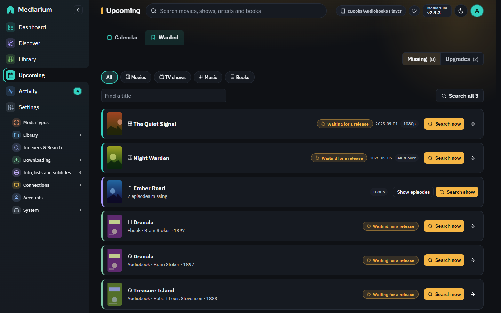
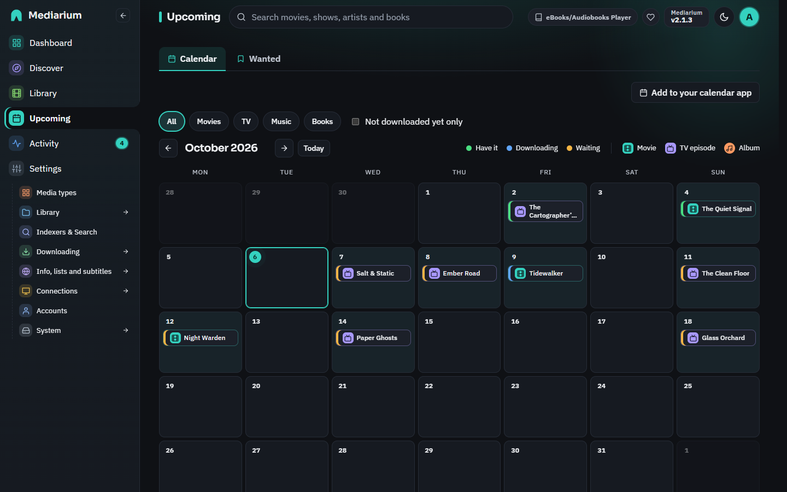
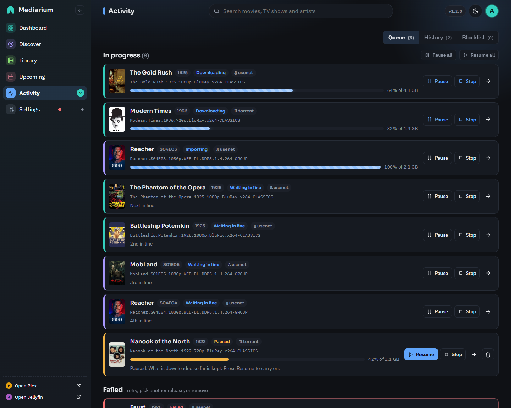
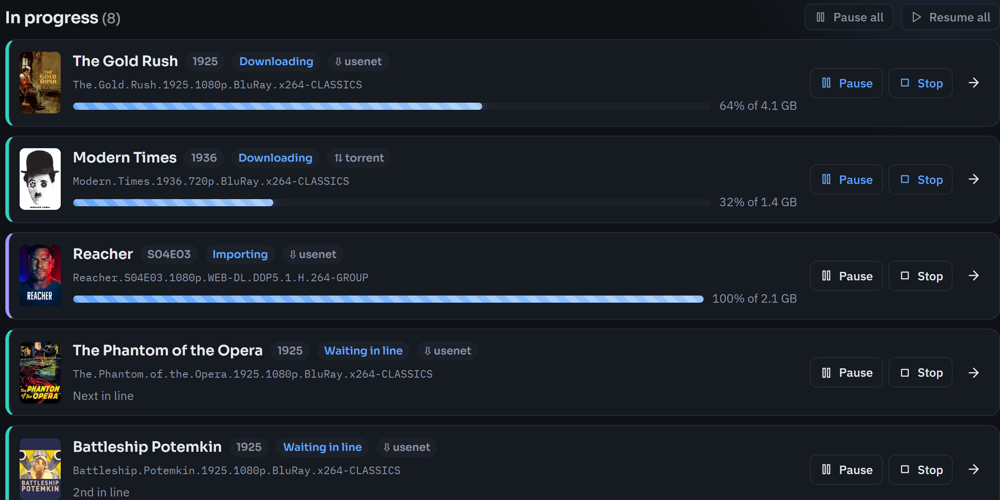

# Activity per title, pausing downloads, one download at a time, retries

## When a download fails

A failed download stays in the Queue tab with the reason. **Why did this happen, and what can I do?** under it explains the reason in plain words and lists what to try. For a release that is no longer complete on your Usenet provider (the most common failure), that is: **Blocklist & search again** to try the next release (automatic searching does this by itself), a quality profile that accepts more qualities so there are more releases to pick from, and a second Usenet provider from a different company. Once the movie or episode has been downloaded another way, its earlier failed tries are removed from the list by themselves.

## Import a file by hand

**Activity > Import a file by hand** (administrators) lists the video files in the downloads folder, biggest first, with what each file's name suggests ("looks like Heat (1995)", the quality). For each one, choose **Movie** or **Episode**, pick the title from your library (the best guess is already chosen when the name matches), and for an episode the season and episode number, then press **Import**. Mediarium names the file and puts it in your library as it does for a download, marks the title as downloaded and tells your media server. The title must already be in your library. A file already at the destination is never overwritten. The copy left in the downloads folder is removed by the daily clean-up. Files smaller than 20 MB (samples, extras) and hidden folders are not listed. Scripts: `GET /api/manual-import` and `POST /api/manual-import` with `{"path": "...", "movieId": 12}` or `{"path": "...", "seriesId": 4, "season": 2, "episode": 5}` (the path is relative to the downloads folder).

## The Wanted page

**Upcoming > Wanted** lists what Mediarium is still looking for (**Missing**) and what is below the quality you asked for (**Upgrades**). Episodes of the same show are folded into one line ("12 episodes missing") with **Show episodes** and **Search show**. **Find a title** narrows the list, the first 50 are shown with **Show more** for the rest, and **Search all** searches every title in the list now, one after another (one search per movie, one per show). Above 25 titles it asks first, because many indexers allow only so many searches a day.

## The series page

A show's seasons start folded, except the one that needs attention (the latest with missing episodes, or else the latest season). The row of season buttons at the top opens a season and jumps to it; a dot marks seasons with missing episodes. **Missing episodes only** shows just the episodes that have aired and are not downloaded. **Open all** and **Close all** do what they say. The facts at the top include the **Next episode** and the day it airs.

## A title's own activity log

Every movie, show and album keeps its own log of what happened to it, newest first. It tells you why a title hasn't downloaded yet, without digging through server logs.

- `GET /api/movies/{id}/events` `GET /api/series/{id}/events` and `GET /api/music/albums/{id}/events` (every account can read them) return a list of at most 200 events, newest first: `[{"at": "2026-09-29T08:30:00.000Z", "kind": "searched", "message": "...", "level": "info"}]`. `level` is `info`, `warn` or `error`. A show's log covers all its episodes.

*Upcoming > Wanted lists what Mediarium is still looking for. Each row shows the state (Waiting for a release), the release date and quality, and a Search now button. The arrow opens the title and its activity log.*

*Upcoming > Calendar: releases and episode air dates on their day. The stripe on each entry says whether you have it (green), it's downloading (blue) or it's waiting (yellow). The badge says what it is: a film for a movie, a TV for an episode, a note for an album.*

What is recorded (`kind`):

| kind | when | example |
|---|---|---|
| `searched` | each automatic search (the scheduled search, **Search now**, the search after adding a title, the retry after a bad release) | `Searched: 12 releases, none acceptable: 8 CAM/TeleSync, 4 other years` (warn), or `Searched: 5 releases, 2 acceptable; picked "..." from MyIndexer with the "1080p" profile` |
| `grabbed` | a release was queued, by hand or automatically. A grab that only a fallback profile accepted says which profile it used | `Grabbed "..." for ...` |
| `download` | the download started, was paused or stopped, and finished (post-processing starts) | `Download started: <release>` |
| `postprocess` | PAR2 verify or repair, unpacking, and their failures | `Repairing 3 missing articles with PAR2: <release>`, `Unpacking failed (...): <release>` (error) |
| `imported`, `failed`, `conflict` | the end of a download, with the plain reason when it failed. Network and file errors are put in plain words (for example "The address could not be found"). The exact error text is kept in [Logs and errors](logs-and-errors.md) under **Technical detail** | `The Film: Couldn't get the NZB file. The address could not be found. Check the address and your internet connection.` (error) |
| `blocklisted` | a release was blocklisted, automatically (its own fault: corrupt, incomplete) or by you | |
| `retry` | after a blocklisted release, why no other release was taken right away | `No other acceptable release; will try again at the next scheduled search` (warn) |
| `retried` | **Retry** on a failed download, and whether it reused the files already downloaded | `Retrying from the files already downloaded: <release>` |
| `removed` | a download was removed from the download list | |

A search can skip a release for these reasons: `blocklisted`, a downloader the title doesn't use (`from torrent sites (this title uses Usenet only)`), `other films` (a different movie), `other years`, `for another show`, `not this episode`, `not a season pack`, a quality no profile in the title's chain accepts (its tier, such as `CAM/TeleSync`, or `unknown quality`), `excluded by the profile's release terms`, `in another language`, and for upgrade searches `not an upgrade over <tier>`. Indexers that didn't answer are named too.

A search with the same outcome as a recent one (the scheduled search finding the same releases again) moves that event's time forward instead of adding another. The detailed events (`searched`, `download`, `postprocess`, `retry`, `retried`, `removed`) show only on the title's own log. The global activity feed (`GET /api/activity`, shown on the History tab) keeps showing grabs, imports, failures, blocklisting and the like. Each title keeps its latest 300 detailed events.

*Activity, Queue tab: what's running, waiting in line and paused comes first, then failed downloads, then the titles still waiting for a release. History and Blocklist are the other two tabs.*

## The Queue tab, top to bottom

The Queue tab always reads in the same order, and rows don't move while they download:

1. **In progress.** Downloading and importing first (the one that started first on top), then the downloads **waiting in line** in the order they'll start, then paused ones. **Pause all** and **Resume all** sit at the top of this list.
2. **Failed.** The newest failure first. Each one has **Retry**, **Blocklist & search again** (administrators only) and a remove button.
3. **Needs your decision.** A file already exists and you chose to be asked. Administrators pick **Overwrite** or **Skip**, and members see "Waiting for an admin". Then **Stopped**.
4. **Waiting for a release.** Monitored titles with nothing downloaded yet, with what the last search found. A title that's already downloaded never shows up here. It lists the first 20, and a button opens the rest in Upcoming > Wanted.

The queue refreshes every few seconds. Finished downloads are on the **History** tab, with **Clear finished** to empty that list. `GET /api/queue` returns the items in this order.

## History

The **History** tab lists the newest 100 events. **Show older lines** loads 200 more each time, and **Find in the history** narrows it to lines that contain the words you type. A line about a movie, show or album links to its page. Scripts: `GET /api/activity?limit=500&q=heat` (at most 2000 lines); each line has a `link` when it is about a title.

## The calendar

**Upcoming > Calendar** shows releases, episode air dates, album releases and book releases on their day. Chips at the top show only movies, TV, music or books (when more than one is switched on), and **Not downloaded yet only** hides what you already have.

**Add to your calendar app** gives you a private address (an `.ics` link) to subscribe to in Google Calendar (*Other calendars > From URL*), on an iPhone (*Settings > Calendar > Accounts > Add Subscribed Calendar*) or in Outlook. Releases then show up in your own calendar and update by themselves. The address works without signing in, so anyone who has it can see your calendar: keep it to yourself. **Make a new address** replaces it (the old one stops working) and **Turn it off** removes it. Each account has its own. The calendar app must be able to reach Mediarium, so for an app on your phone outside your home this needs your reverse proxy. Scripts: `GET`, `POST` and `DELETE /api/calendar/feed`; the feed itself is `GET /api/calendar/feed/{token}.ics`.

## The download line

Downloads run in a line, and only **one** runs at a time (Usenet and torrents together). Allow up to five under **Settings > Downloading > Usenet and torrents > Downloads at the same time**. See [Downloads](downloads.md#downloads-at-the-same-time-the-download-line).

*The top of the Queue tab. Every running or waiting download has Pause and Stop. A paused one has Resume.*

A download that has to wait shows **Waiting in line** with its place: **Next in line**, **2nd in line**, **3rd in line** and so on. The place is the order downloads will start in, so it changes as things ahead of it finish:

- What you started yourself (**Choose release**, **Search now**, adding a title with a search, a bulk search, **Retry**) goes before what the automatic searches added. Inside each group it's first come, first served.
- A download keeps its place from the first byte until the file is repaired, unpacked and moved into your library. Then the next one starts. If it fails, it stays in **Failed** for you to retry, and the next one starts anyway.
- A torrent that's only seeding doesn't hold a place.
- **Pause** and **Stop** work on a waiting download too. A paused or stopped one is out of the line, and **Resume** puts it back at the front of its group. **Pause all** and **Resume all** keep the order.
- A waiting download can't be removed until you stop it.

## Pause, resume and stop

Every download in progress, Usenet or torrent, has **Pause** and **Stop**. Only administrators can use them (members can still retry).

| Button | What it does |
|---|---|
| **Pause** | Stops the transfer at once and keeps the download in the list as **Paused**. The part already downloaded stays in the downloads folder, and the movie or episode stays reserved, so nothing else is grabbed for it. |
| **Resume** | Carries on from what is saved. A Usenet download asks the news server only for the articles it doesn't have yet. A torrent is added to the torrent engine again and checks the pieces already on disk. |
| **Stop** | Cancels the download. The movie or episode goes back to waiting for a release. A question asks whether to **also delete the partly downloaded files** (ticked). Only the download's own folder inside the downloads folder is deleted, never anything in your movie, TV or music folders. |
| **Retry** | On a failed or stopped download: tries the same release again. If its files are still there (a partial download too), it carries on from them. |
| **Remove** | Takes a completed, failed, stopped or paused download off the list. Removing a paused one stops it first, and asks whether to delete its partial files. |
| **Pause all** / **Resume all** | Do the same for every download at once. |

A download that's unpacking or importing pauses or stops when the current step ends. The row says **Pausing…** or **Stopping…** until then.

### After a restart

A paused download is still paused after Mediarium restarts, whatever the mode. That includes safe mode (`MEDIARIUM_PAUSE_AUTOMATION`).

A download that was only **waiting in line** is still waiting after a restart, in the same order, and starts about a minute after Mediarium starts when a place is free. In safe mode it comes back paused instead, because safe mode starts nothing by itself.

A download that was running when Mediarium stopped (an update, a crash, the NAS switching off) comes back as **Partly downloaded, stopped**, with the saved part kept. Press **Resume** to carry on, **Stop** to give up, or the remove button.

At every start Mediarium also fixes titles that got stuck. A movie, episode or album marked "downloading" with no download behind it goes back to downloaded (if its file is there) or missing. A movie or episode marked missing whose file is on disk is marked downloaded. A waiting download for a title that's downloaded and set to **Leave what I have alone** is removed.

### Turning off better versions

Setting a title to **Leave what I have alone**, or stopping monitoring it, removes its downloads that are only waiting (in line, or partly downloaded and stopped by a restart), together with their partial files. A download you paused yourself, or one that's downloading, is left alone. The Library page can do the same for many titles at once: see [What you can do to the selection](library.md#what-you-can-do-to-the-selection).

### Routes

All administrator-only: `POST /api/queue/{id}/pause`, `POST /api/queue/{id}/resume`, `POST /api/queue/{id}/stop` (body `{"deleteFiles": true}`), `POST /api/queue/pause-all`, `POST /api/queue/resume-all`, and `DELETE /api/queue/{id}?deleteFiles=1`. The full list is in the [API reference](reference/api.md).

In `GET /api/queue`, `status` can also be `paused` or `stopped`, and `queued` means waiting in line: such an item carries `queuePosition` (1 is next). A paused item may carry `interrupted: true` (nobody paused it), `pending` (`pausing` or `stopping` while it winds down) and `keptFiles`.

## One download per title

A movie, or an episode, never has two downloads running at once:

- Automatic searches skip a movie or episode that's already waiting in line, downloading, being post-processed or paused.
- A grab by hand (from a title's release list, the search page, or **Retry**) is refused with `409` and the message `Already downloading: <release>. Cancel it first to pick another.` For a paused download the message says to resume it or stop it first.
- A season pack covers every episode of its season. While a pack is downloading, you can't grab a single episode of that season or another pack of the same season.

## Retry without downloading again

**Retry** on a failed or stopped Usenet download whose files were all downloaded and are still in its working folder (the failure came later: PAR2 repair, unpacking or the import) doesn't download them again. It checks them with PAR2 again and repeats post-processing (repair, unpack, import). Only when the files are gone, or fail the PAR2 check, is the release downloaded again.

If only part of a Usenet download was saved (it was paused, stopped or cut off), the working folder holds a small file, `.mediarium-progress`, listing the articles already saved. **Resume** and **Retry** fetch only the rest. A torrent that's retried starts again. A torrent that's resumed checks the pieces it already has.

## When a release turns out to be bad

When an automatic download fails because of the release itself (corrupt or incomplete: PAR2 can't repair it, the archive can't be unpacked, no video file in it), the release is blocklisted and Mediarium searches once more for another acceptable release. If there's none, the title's log says `No other acceptable release; will try again at the next scheduled search`, and the regular search (see [Automatic searching](./quality-profiles.md#automatic-searching)) keeps looking. If more than a few releases for the same title failed within a day, the immediate retry is skipped (and the log says so) until the next scheduled search.
