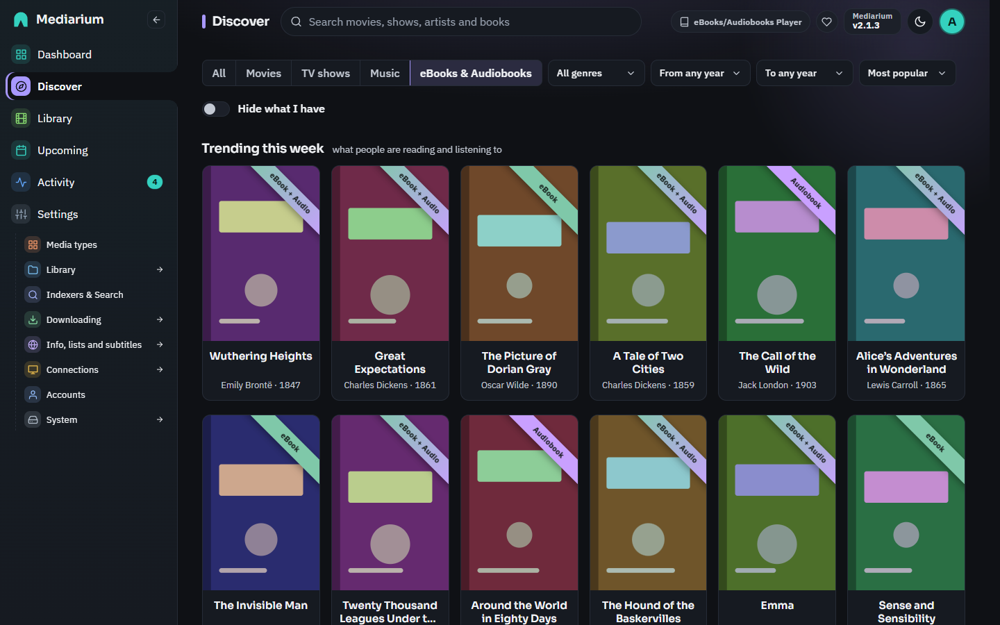
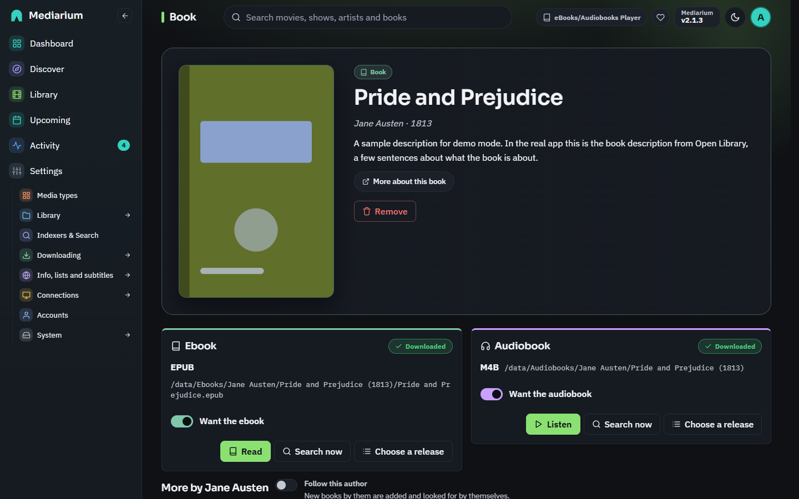
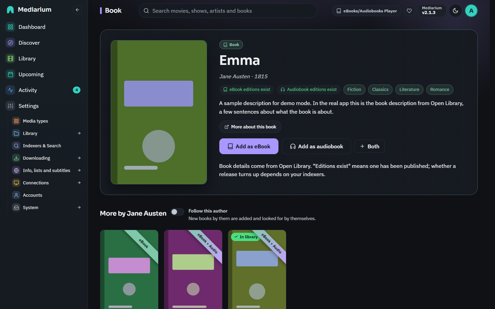
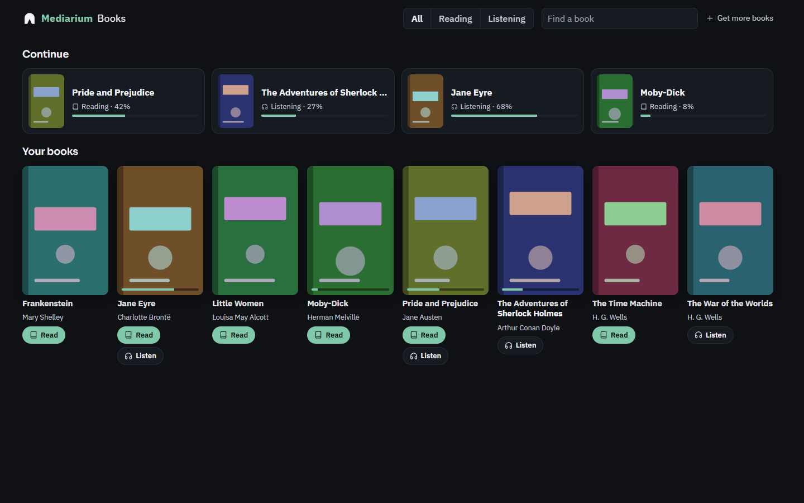
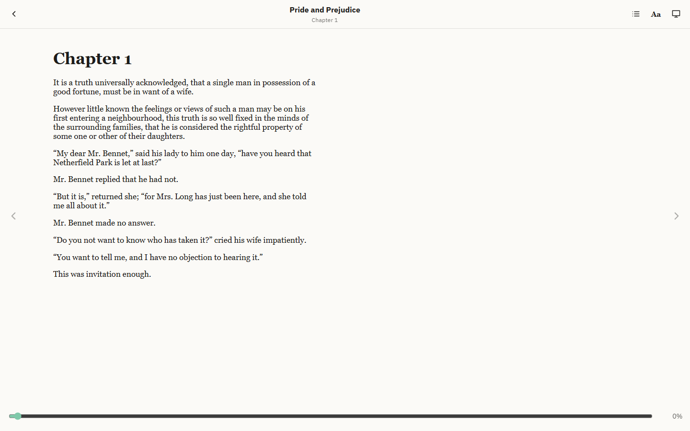
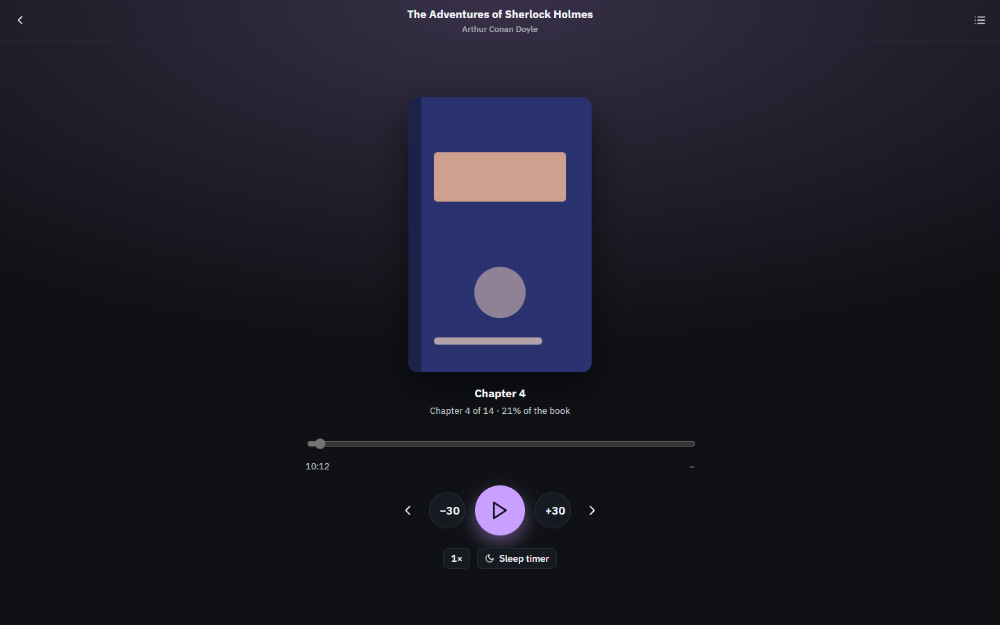

# Ebooks and audiobooks

Mediarium can look after books too: as an ebook, an audiobook or both. Each format is its own switch under **Settings > Media types**, and both are off on a new install.

## Switching them on

1. Open **Settings > Media types** and switch on **Ebooks**, **Audiobooks** or both.
2. Open **Settings > Library > Folders and file names** and check the **Ebooks folder** and **Audiobooks folder**. They start from `EBOOKS_DIR` and `AUDIOBOOKS_DIR` (`/ebooks` and `/audiobooks` by default). The folder has to be mapped into the container; see [modules.md](./modules.md#adding-music-ebooks-or-audiobooks-later).
3. Make sure at least one of your indexers carries books. Ebooks are searched in the Newznab categories 7000 and 7020, audiobooks in 3030.

You can also pick them in the first-run wizard, on the **What do you want to manage?** step.

## Adding a book

Open **Library**, then the **Ebooks** or **Audiobooks** tab, and press **Add**. Type a title or an author's name. The results come from [Open Library](https://openlibrary.org), with their covers. Press **Add** on the right one.

- From the Ebooks tab the book is added as an ebook, from the Audiobooks tab as an audiobook. When the other format is switched on too, tick **Get the audiobook too** (or **Get the ebook too**) to want both.
- Mediarium starts looking for it straight away. After that, the automatic search tries again on its usual schedule for every book still missing.
- A book that is already in your library shows **In your library** instead of **Add**.

## Importing the books you already have

Administrators see an **Import** button on the Ebooks and Audiobooks tabs. Press **Start import** and Mediarium reads that folder, looks each book up on Open Library, and adds what it recognises to your library as downloaded, **where it is**. Nothing is moved, renamed or changed.

- It understands the usual layouts: `Author/Title/book.epub` (Mediarium, Calibre), `Author/Title.epub`, `Author - Title.epub`, and for audiobooks `Author/Title/` or `Author/Series/Title/` with the audio files inside. `CD 1` or `Disc 2` folders count as part of the book above them. A year like `(2021)`, Calibre's `(123)` and notes like `[Unabridged]` are ignored, and so are series numbers like `1 - `.
- An ebook folder with the same book in several formats counts once, with the best format.
- When it's done you see how many were added, already there and not found. The list shows the ones not found, with the path on disk and how the name was read, so you can rename the folder and run it again. **Show all** lists everything.
- Running it again is safe: books already in the library are skipped.
- It pauses briefly between lookups to go easy on Open Library, so a big folder takes a few minutes. You can leave the page; it carries on.

## Finding books on Discover

**Discover** has an **eBooks & Audiobooks** tab (and a section on the All tab) while ebooks or audiobooks are on. It shows what people are reading on Open Library: **Trending this week** and **Popular this year**, then the most read **Classics**, **Fantasy**, **Science fiction**, **Mystery and thrillers**, **Biography and memoir** and **Self-help**. A book already shown in a row higher up is left out of the rows below it.

- **A banner across each cover** says which editions have been published: **eBook**, **Audiobook** or **eBook + Audio** (no banner when Open Library lists neither). It comes from Open Library's list of editions, so it says a version exists, not that your indexers have it.
- **Add** lights up as soon as you point at a cover. The add window starts with the formats that exist (of those switched on), and you can change them.
- **Click a cover** to open the book's info page: cover, description, subjects, which editions exist, **Add as eBook** / **Add as audiobook**, and more by the same author. A book already in your library opens its own page instead. The search box at the top opens the same info page.
- Pick a **Genre**, a year range or an **Order** (most popular, highest rated, newest, oldest) to browse everything that matches instead.
- **Hide what I have** leaves out books already in your library.
- The lists are kept for an hour, so moving around Discover doesn't ask Open Library again each time.



## The book page

Each book has a page with its cover, author, year and description, and a panel for each format that is switched on:

- **Where it stands**: downloaded (with the file type and where the file is), downloading, or waiting for a release.
- **Want the ebook / Want the audiobook**: switch a format off to stop looking for it, or on to start.
- **Search now** looks for that format straight away and downloads the best release it finds.
- **Choose a release** lists what your indexers have for the book, best first, so you can pick one yourself.
- **Remove** (administrators) takes the book out of your library. Tick **Also delete its files** to remove the ebook file and the audiobook folder as well. They go to the recycle bin first when it is on.





## Series

When a book is part of a series, its page (and its info page from Discover) shows **Book 2 of Harry Potter** with every book of the series in reading order, each with **Add**. Books you already have say so. A book that isn't out yet shows the day it comes out.

Switch on **Follow this series** and Mediarium:

- adds the books of the series you don't have yet, in the formats that are switched on (ebook first), and starts looking for the ones that are out;
- checks the series twice a day and adds new books as they appear;
- waits for a book's release date before it looks for it. Until then the book page says when it comes out.

Books with a release date show up on **Upcoming > Calendar** (a green square badge with a book) and in the calendar feed, from 30 days back to 120 days ahead. Clicking one opens the book. On **Upcoming > Wanted**, a book that isn't out yet says **Out** and the day, without a Search now button. Release dates mostly come from Hardcover (see below); Open Library rarely knows them.

Only whole books count: a novella in between (book 2.5), box sets and collections are left out, but you can still add them by hand. Switching **Follow this series** off keeps the books you have.

**Where series come from.** Out of the box, from Open Library. It knows most big series, but not all of them, and rarely knows a book before it is out. For more series and release dates, connect **Hardcover** under **Settings > Info, lists and subtitles**: make a free account at [hardcover.app](https://hardcover.app), copy your token from Settings, Hardcover API, and paste it there. Mediarium checks it before saving and keeps it encrypted. A Hardcover token belongs to your own account and can't be shared, which is why none comes built in. If Hardcover doesn't know a book, or is down, Open Library is used instead.

## Audiobook details

For a book you want as an audiobook, Mediarium looks up who reads it and how long it runs, and shows it in the audiobook panel ("Read by Ray Porter · 16 h 10 min") and in the Mediarium Books player. The details come from [Audnexus](https://audnex.us), which reads Audible's catalogue; Audible's public search finds the book first. When there are several editions it takes the full, unabridged reading, not a translation or a short dramatisation. It is looked up once per book, when you add it or first open its page. If Audnexus knows the series and Mediarium didn't, the book gets it too, and an audiobook that isn't out yet waits for its release day. Nothing needs setting up.

## Authors

A book's page ends with **More by** its author: their other books on Open Library, the most read first, each with **Add**. Box sets, collections and summaries are left out.

Switch on **Follow this author** there and their new books are added by themselves, and looked for straight away. Mediarium checks the authors you follow twice a day. It adds a book first published in or after the year you started following, that has a cover on Open Library, and that isn't already in your library (also under another Open Library entry with the same title). New books are wanted as an ebook while ebooks are on, otherwise as an audiobook. Switch it off on any of their books' pages; the books already added stay.

## Which release is picked

Mediarium searches for the author and title together, and when that finds nothing, for the title alone (some indexers don't index authors). Either way, a release has to name the book's title and the author's surname. Small words like "the" and "of" don't count, so "Tolkien - Hobbit" still matches *The Hobbit*. A release of another book by the same author, or the other format, is left out.

Among the matches, the file type decides:

| Format | Preferred, best first |
|---|---|
| Ebook | EPUB, AZW3, MOBI, PDF |
| Audiobook | M4B, M4A, MP3 or FLAC, OGG or Opus |

A release that doesn't say its type comes after those that do. When two are equal, the indexer priority and then Usenet over torrents decide. Releases you blocklisted are skipped.

## Where the files go

Books are filed by author:

```
<Ebooks folder>/<Author>/<Title (Year)>/<Title>.epub
<Audiobooks folder>/<Author>/<Title (Year)>/<the audiobook's own files>
```

An ebook download keeps only the best ebook file in it. An audiobook keeps all of its audio files with their own names, so the chapters stay in order. A download with no ebook (or no audio) in it is marked as a bad release, blocklisted, and the next best one is tried.

Downloading a better ebook later (an EPUB after a PDF) replaces the file. A worse one doesn't.

## Reading and listening: Mediarium Books

**Mediarium Books** is a reader and an audiobook player built in, made to feel like an app of its own. Open it from **eBooks/Audiobooks Player** at the top right of every page, the **Read** or **Listen** button on a downloaded book's cover in the Library, or **Read** / **Listen** on a downloaded book's page. It opens in a window of its own, with no Mediarium menus, at `/bookshelf/`.

- **Install it as its own app.** In Chrome or Edge, open Mediarium Books and choose **Install** in the address bar (on a phone: **Add to Home screen**). It gets its own icon, named Mediarium Books, separate from Mediarium. Safari on iPhone: **Share > Add to Home Screen**.
- **The shelf** shows **Continue** (what you were reading or listening to, with how far you got) and every downloaded book, with **Read** and **Listen**. **Reading** and **Listening** narrow it to ebooks or audiobooks.
- **Your place is kept on the server**, per account, so a book opens where you stopped on any device.



### The reader

- EPUB books are shown a page at a time (two side by side on a wide screen). Turn pages with the arrows at the sides, the arrow keys, Page Up / Page Down or the space bar, or by swiping on a touch screen.
- **Contents** (the list button) jumps to a chapter. The slider at the bottom jumps to any place in the book and shows how far through you are. The first time a book is opened the percentages take a moment to work out; they're kept in that browser after that.
- **Aa** sets the text size, the page colour (light, sepia or dark) and the font (book or plain). Your choice is remembered in that browser. The screen button goes full screen.
- PDF books open in the browser's own PDF viewer.
- Kindle books (MOBI, AZW and AZW3) open in the reader too. Mediarium turns them into EPUB with its own converter the first time (in well under a second, one book at a time) and keeps that copy in its cache folder (`/config/cache/epub`), so your library folder is never changed and your e-reader or Kavita see no extra files. A freshly downloaded Kindle book is converted straight away in the background. Copies nobody opens for 90 days are removed. Books locked with DRM can't be converted; the reader says so and offers the original as a download.
- Scripts inside a book never run.



### The player

- An audiobook's files play in order as its chapters (named after the files, with "01 - " and the like left off). A whole book in one M4B file uses the chapter marks stored inside it instead, with their own titles; the slider and the time left are then for the chapter, not the whole file. The list button shows them all.
- **−30** and **+30** skip half a minute; the arrows go to the previous or next chapter. Space plays and pauses, and the arrow keys skip.
- The speed button goes round 0.8×, 1×, 1.2×, 1.5×, 1.75× and 2× (remembered in that browser).
- **Sleep timer** goes round 15, 30, 45 and 60 minutes, **End of chapter** (also inside a one-file M4B), and off.
- On a phone, the lock screen and headphone buttons work, with the cover showing.
- How far through the book you are is worked out from the files' sizes, so it's close rather than exact.



### Other apps

You can also read and listen in an app made for it, and connect it under **Settings > Connections > Media servers**:

- **Audiobookshelf** for audiobooks (and ebooks), with apps for iPhone and Android that remember where you got to.
- **Kavita** for ebooks and comics, read in the browser on any device.

Once connected, a new book shows up there right after it's downloaded, and the book's page has a **Listen in Audiobookshelf** or **Read in Kavita** link. Point the app's library at the same folder as Mediarium's Audiobooks or Ebooks folder. See [media-servers.md](./media-servers.md#audiobookshelf-and-kavita-books).

## Search, Wanted, the dashboard and Activity

The search box at the top of every page finds books too (under **Books**, after movies, shows and artists). A book you have opens its page; one you don't opens the add window.

**Upcoming > Wanted** lists every book still missing in a format you want, with **Search now**, and a **Books** filter chip. Books have no upgrades, so they only show under **Missing**.

The dashboard has an **Ebooks** and an **Audiobooks** card with how many books you have in each format and how many are missing, and the missing ones count in the greeting card's **wanted** number. A card is dimmed with "Off" while its format is switched off. Book downloads show in **Activity** like everything else, named after the book with "Ebook" or "Audiobook" and the author underneath.

## For developers

- `GET /api/book-works/{key}/series?title=&author=` is the series a book is in (`{"series": null}` when none is known), with `source` (`openlibrary` or `hardcover`), `key`, `name`, the book's `position`, whether it is `followed`, and its `entries` (`position`, `releaseDate`, `libraryId`...).
- `PUT /api/book-series/{source}/{key}/follow` with `{"name", "ebook", "audiobook"}` follows a series and answers how many books were `added`; `DELETE` on the same address stops following. `GET /api/book-series` lists the series followed.
- `GET`/`PUT /api/settings/hardcover` (administrators) shows whether a Hardcover token is saved, and saves one (`{"token": "..."}`, empty to remove) after checking it. Stored as `books.hardcover_token`.
- A book's `seriesName`, `seriesPosition` and `releaseDate` are part of `GET /api/books`.
- `GET /api/books/{id}/tracks` gives each audio file's `chapters` (`title`, `start` in seconds) when the file (an M4B or M4A) carries two or more chapter marks, read from its QuickTime chapter track or Nero chapter list.
- `GET /api/books/{id}/read?as=epub` answers a Kindle book (MOBI, AZW, AZW3) as an EPUB copy, made once and cached; `422` with a reason when it can't be converted (DRM, an unusual compression). Without `as=epub`, or with `download=1`, the original file is sent.
- A book's `narrators`, `runtimeMin` and `asin` (its Audible id) are part of `GET /api/books` once looked up.
- `GET /api/calendar` lists books with a release date in the window as `kind: "book"` entries with a `bookId`, while ebooks or audiobooks are on.

| Method | Path | What it does |
|---|---|---|
| GET | `/api/books` | Every book in the library |
| POST | `/api/books` | Add a book: `{"olKey", "title", "author", "authorKey", "year", "coverId", "ebook": bool, "audiobook": bool, "searchNow": bool}` |
| GET | `/api/books/search?q=` | Search Open Library |
| GET | `/api/books/discover?list=trending&period=weekly&page=` | Open Library's trending list (`daily`, `weekly`, `monthly`, `yearly`, `forever`), 40 a page |
| GET | `/api/books/discover?list=browse&subject=&from=&to=&sort=&page=` | Books by subject and first publication year; `sort` is `popular`, `rating`, `newest` or `oldest` |
| GET | `/api/books/subjects` | The genres the Discover filter offers |
| GET | `/api/book-works/{key}` | One book from Open Library for its info page: details, description, subjects, `hasEbook`, `hasAudio`, and `libraryId` when it's in the library |
| GET | `/api/books/{id}/read` | The ebook file (PDFs shown inline; `?download=1` saves it) |
| GET | `/api/books/{id}/tracks` | The audiobook's files in playing order: `index`, `name`, `size` |
| GET | `/api/books/{id}/listen/{n}` | Track `n`, with ranges for seeking |
| GET / PUT | `/api/books/{id}/progress?format=` | Your place in one format: `position` (an EPUB location, or `track:seconds`), `percent`, `finished` |
| GET | `/api/books/progress` | Your place in every book, the most recent first |
| GET | `/api/book-authors` | The authors you follow |
| GET | `/api/book-authors/{key}/works?sort=popular\|newest` | An author's books on Open Library (box sets left out), marked when in the library |
| PUT | `/api/book-authors/{key}/follow` | Follow an author: `{"name", "ebook": bool, "audiobook": bool}` |
| DELETE | `/api/book-authors/{key}/follow` | Stop following; their books stay |
| GET | `/api/books/{id}/links` | Where the book can be read or listened to: the connected Audiobookshelf and Kavita servers that have it |
| GET | `/api/books/{id}` | One book |
| PUT | `/api/books/{id}/want` | `{"format": "ebook" or "audiobook", "wanted": bool}` |
| POST | `/api/books/{id}/search?format=` | Search now for one format |
| GET | `/api/books/{id}/releases?format=` | The matching releases, best first |
| POST | `/api/books/{id}/grab` | `{"format", "releaseTitle", "downloadUrl", "sizeBytes", "protocol"}` |
| DELETE | `/api/books/{id}?deleteFiles=` | Remove a book (administrators) |
| POST | `/api/books/import` | Start importing the books already on disk: `{"format": "ebook", "audiobook" or ""}` (administrators). 409 while one runs |
| GET | `/api/books/import` | Where the import is: `phase` (running, done, failed), `done`, `total`, a `summary` by result and the `results` (administrators) |

Every `/api/books` and `/api/book-authors` route answers 404 while both ebooks and audiobooks are switched off. Adding a book in a format that is switched off answers 409.
