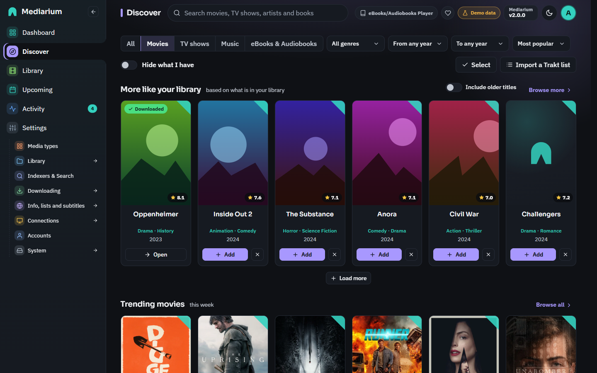
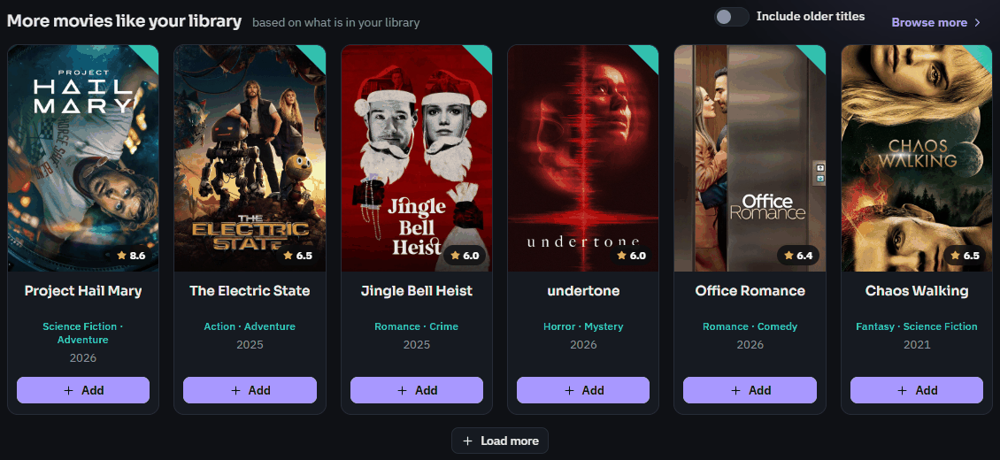

# Discover and adding titles

**Discover** is for when you don't know what to add. It has rails for what's trending, popular and coming soon, and a row of titles like the ones you already have. Every poster has an **Add** button. Titles you already have say so and open their page. **Browse all** and **Browse more** open a list on its own page, in pages of whole rows with **Previous**, page numbers and **Next**.

At the top, **All**, **Movies**, **TV shows**, (with the Music module on) **Music** and (with ebooks or audiobooks on) **eBooks & Audiobooks** choose what you see. **All** has a section for each kind that is switched on, in that order: Movies, TV shows, Music, Books. The Books tab is described in [books.md](./books.md#finding-books-on-discover). Each section has its own title and line, and only holds its own kind. Every tab has the same row of filters: **Genre**, **From year**, **To year** and **Order** (Most popular, Highest rated, Newest first, Oldest first; music has no Highest rated), and on Music also **Type** (Albums, EPs, Singles). Picking one turns the rails into one filtered list. Genre needs a single kind, so it waits on **All**. **Clear filters** puts them back. The **Hide what I have** switch leaves out titles already in your library, and the choice is remembered in this browser. **Import a Trakt list** takes the address of any public Trakt list and shows what's on it, with **Add** buttons. It uses the Trakt Client ID from **Settings > Info, lists and subtitles > Movie info and lists**.

*Discover. The rows for movies and shows like your library come first.*

## More like your library

This row asks the movie database what relates to your titles, merges the answers, and lists the best ones. It shows when your library has at least one movie or show and a movie database key is set (Settings > Info, lists and subtitles > Movie info and lists).

*The movies row. Titles you already have are left out.*

- **Based on your library.** Each visit it picks up to 10 of your 40 most recently added movies (or shows), a different mix from day to day, and asks for the titles related to each.
- **Recent and popular come first.** A title scores higher the more recent and popular it is, and the more of your titles point to it. Titles with a poster come before titles without one.
- **Recent means the last 15 years.** Only titles from this year and the 15 years before it are listed, so a library of classics doesn't fill the row with films from the 1970s. Switch on **Include older titles** to see the rest. They come after newer ones of the same standing. The switch is remembered in this browser.
- **Nothing you already have is listed.** Once you add a title, its card turns into **In library** and it drops off the list the next time it loads.
- **Movies and shows apart.** With **All** selected, the Movies section has a row of movies and the TV shows section a row of shows. With **Movies** or **TV shows** selected there's one row. **Browse more** opens the full list for that kind, with its own Movies and TV shows buttons and the same **Include older titles** switch.

For scripts: `GET /api/discover/list?kind=movie|tv&list=similar&page=1&older=true` returns the same page shape as the other lists (`results`, `totalPages`, `totalResults`), at most 200 titles. `older=true` lifts the 15-year limit. `GET /api/discover/for-you` still returns the first 20 movies of the same ranking.

## The page of a title you don't have yet

Click a poster or title in Discover, a result in the search box at the top, or a result on the Search page, and a title you don't have opens its own page: a big poster, the title and year, the age rating, runtime, rating, genres, the tagline and the full summary, the trailers (Trailer 1, Trailer 2, Teaser and so on), links to the film's website, IMDb and TMDB, the director (or the creators of a show), and the cast with their photos. A show also lists its seasons with the number of episodes in each. All of it is fetched from TMDB when you open the page and kept for ten minutes. It has none of the parts that only make sense for something in your library (what happened, files, subtitles, better copies), and one big **Add to library** button that opens the Add dialog below. Titles you already have open their normal page.

For scripts: `GET /api/tmdb/movies/{tmdbId}` and `GET /api/tmdb/tv/{tmdbId}` return all of this, and any account can read them. A movie carries `directors`, a show `creators` and `seasonList` (`number`, `name`, `episodes`, `airDate`), and both `cast` (up to 12, in billing order) and `trailers`.

## The Add dialog

**Add** on a title opens the Add dialog: the quality profile, what to monitor, where to download from, and whether to start searching now.

- **Monitoring.** A movie is **Monitored** (searched for and downloaded) unless you change it to **Not monitored**. For a show, **Which episodes to monitor** starts on **All episodes**. The other choices are **Only episodes that haven't aired yet** and **None**. Untick **Start searching for it now** (**Start searching for missing episodes now** for a show) to skip the first search. The box is greyed out while no indexer is set up.
- **Keep looking for better versions after it is downloaded.** Tick it and Mediarium swaps the title for a better release when your quality profile allows it. Left off, the title stays as first downloaded. The choice is remembered in this browser, and you can change it for a single title later, on its page, under **Better versions**.

For scripts: `POST /api/movies` and `POST /api/series` take `noUpgrade`. Left out, it's `true` (better versions off). Send `false` to look for better versions. A title added by grabbing a release from a search also starts with better versions off.

## Adding many titles, and Not interested

- **Select** (next to the filters) turns Discover into a picking mode: each poster gets **Pick**, and a bar at the top counts what you picked. **Add N titles** adds them all with the usual defaults (monitored, the default quality profile, and a search straight away). **Done** leaves picking mode.
- The **x** next to **Add** on a poster means **Not interested**: that movie or show is never shown on Discover again. **Not interested (N)** at the top lists them, each with **Show again**. In picking mode, **Not interested** does the same for everything picked. The list is shared by everyone using this Mediarium. Scripts: `GET /api/exclusions`, `POST /api/exclusions` with `{"kind": "movie", "tmdbId": 603, "title": "The Matrix"}`, and `DELETE /api/exclusions/{kind}/{tmdbId}`.
