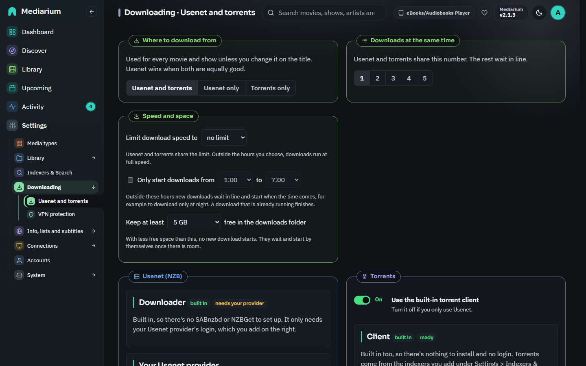
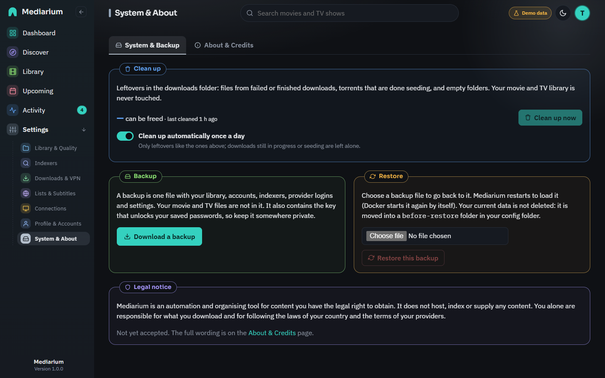

# Downloads

How Mediarium's built-in downloaders use your network and disk: the torrent port, seeding, what happens to downloaded files after they're imported, the clean-up, and what removing a title deletes.



*Settings > Downloading > Usenet and torrents: where to download from, the built-in Usenet downloader (waiting for a provider here) and the built-in torrent client.*

## The Usenet and torrents page

The page has four cards.

- **Where to download from:** **Usenet and torrents**, **Usenet only** or **Torrents only** for every movie and show. You can change it for a single title when you add it or on its page. When a Usenet release and a torrent release are equally good, Usenet wins. Choosing Usenet only also switches the torrent client off.
- **Downloads at the same time:** how many downloads run together (1 to 5). See [below](#downloads-at-the-same-time-the-download-line).
- **Usenet (NZB):** the built-in downloader needs only your provider's login. **Add your Usenet provider** takes the server address, port, username, password, number of connections and whether to use SSL. Press **Test connection** first. **Add server** (or **Save server**) works once the test has passed. Each server has **Test**, **Edit**, **Disable** and **Remove**. A second server (**Add a backup provider**) is used for articles your main one is missing. Priority 0 is the main provider, higher numbers are backups.
- **Torrents:** the switch **Use the built-in torrent client**, and **Client settings** (listen port, seed ratio limit, seed time limit; press **Save**).

## Torrent port (58264)

All torrents run in one built-in engine that listens on **port 58264, TCP and UDP**. The port is in the range never assigned to any service (49152 to 65535), so it's unlikely to clash with anything else, and it's easy to remember next to the web interface's 8264.

- **It's optional.** Torrents download without it, because Mediarium connects out to peers either way. Publishing the port lets other peers connect **to you** too. That finds more peers (faster downloads, fewer stalled torrents) and lets you seed properly.
- **Docker:** the compose files in this repository publish it for you:
  ```yaml
  ports:
    - "8264:8264"
    - "58264:58264/tcp"
    - "58264:58264/udp"
  ```
  With `docker run`, add `-p 58264:58264/tcp -p 58264:58264/udp`. Keep the same number on both sides of the colon.
- **Router:** for peers on the internet to reach you, forward port 58264 (TCP and UDP) on your router to the machine running Mediarium, as you would for any torrent client.
- **Changing it:** Settings > Downloading > Usenet and torrents > Client settings > Listen port (stored as `torrent.listen_port`). If you change it, publish the new number instead (for example `51413:51413/tcp` and `/udp`). `0` means 58264 (the box says "0 = the default, 58264"). Installs that had saved `0` (which used to mean "any port") now use 58264. A port you saved yourself is kept.
- **If the port is taken** by another program on the same machine, the engine falls back to a port the system picks and says so in the log. `GET /api/downloads/status` then reports the port in use as `torrent.activePort`.
- **Is it working?** The Client card says so in plain words: whether the port is open right now, and whether another peer has connected to you yet. The same facts are in `GET /api/downloads/status` (`torrent.listenPort`, `torrent.listening`, `torrent.activePort`, `torrent.activeTorrents`, `torrent.incomingSeen` and `torrent.lastIncomingAt`). The engine only listens while a torrent is downloading or seeding, and a peer only connects when it wants a torrent you have. So "not seen yet" right after starting is normal. If it still says that after a while of seeding, the port is probably not reachable: it isn't published, it isn't forwarded, or a firewall is blocking it.
- **While a VPN is connected** (Settings > Downloading > VPN protection; see [vpn.md](./vpn.md)), torrent traffic only goes out through the tunnel and nothing listens on the host at all, so no incoming connection is ever seen. That's expected, and the port card says "Not used while your VPN is on".

## Usenet connections

Your Usenet provider lets each login open only so many connections at once, and your plan says how many. Mediarium keeps to the number you set on the server for all downloads together, so two downloads at once share it. A new server starts at 10. Raise it once you know your plan allows more.

If the provider says "too many connections" (usually because another program, like SABnzbd, uses the same login), Mediarium lowers the number for the rest of the session, waits a little and tries again, so the download carries on. After several minutes of being refused it stops, and the queue says: "Your Usenet provider says there are too many connections on this login. If another program (like SABnzbd) uses the same account, stop it or lower the number of connections here." The **Test** button says the same. The number it settled on is in the report from **Copy for support** (Settings > System > Server and backup > Help and support).

Connections close when a download finishes, fails or is cancelled, and when you remove or switch off a server or change its address or login. Lowering the number of connections takes effect at once, even for a download that's running.

## What is checked when you save

Every field in Settings points out a mistake under the box when you leave it, or when you press the button, before anything is sent. The server checks the same things, so a script can't save a value the page would refuse.

- **Usenet servers:** the server is a bare host name or IP address (`news.example.com`, no `https://`, no port and no path), the port is 1 to 65535, connections are 1 to 100 and the priority is 0 to 99. A username and password go together.
- **Torrents:** the listen port is 0 (use the default) or 1 to 65535, the seed ratio is 0 to 1000 and the seed time is 0 to 87,600 hours. 0 means unlimited for both.
- **Downloads at the same time:** a whole number from 1 to 5.
- **VPN:** the endpoint is `host:port` with a port from 1 to 65535, the two keys are 44-character WireGuard keys, and the tunnel address is an IP address with an optional `/prefix`.
- **Folders:** each folder must be a full path, starting with `/`, a drive letter such as `D:\`, or a network path such as `\\server\share`. A custom movie file name must include the movie's title and an episode file name its season and episode; both use only known tokens and can't contain `/` or `\` (see [library.md](./library.md#file-names)).

Only what you change is checked, so a value an older version saved never stops you saving something else.

## Seeding

A finished torrent is imported straight away and keeps seeding in the background until its **seeding goal** is met: the seed ratio limit (`torrent.seed_ratio_limit`, uploaded divided by size, for example 2.0) or the seed time limit (`torrent.seed_time_limit_h`, hours), whichever comes first. With both at 0, a torrent seeds until Mediarium stops or torrents are switched off. Seeding doesn't survive a restart. When the goal is met the torrent stops and its data is deleted from the downloads folder (see below).

## Downloads at the same time (the download line)

Downloads run in a line. **Downloads at the same time** (Settings > Downloading > Usenet and torrents, saved as `downloads.concurrent`) is 1 to 5 and starts at **1**, the safest choice. Usenet and torrents share the number, so 1 means one download in total.

- **A download keeps its place for the whole trip:** downloading, repairing (PAR2), unpacking and moving into your library. When it's done, or fails, the next one in line starts. A failed download waits in Activity to retry and doesn't stop the line.
- **Releases that cannot be finished stop early:** Usenet posts lose articles over time. If articles are missing on all your servers and the release has no PAR2 repair files, or too few to rebuild what is gone, Mediarium stops at once instead of downloading the rest. The release goes on the blocklist and, when automation is on, the next-best release is tried. The reason shows in Activity and in Logs and errors as "Parts of a download are missing". A second Usenet provider from a different company often has the missing pieces.
- **Obfuscated releases:** many releases are posted with random file names (`wFvDJHhDrbESDBLq.mkv`, `-Bz4tuzCT0GRU49jgjrQx.par2`). Before repairing, Mediarium reads the real names from the PAR2 files, which also hold a fingerprint of the start of each file, and gives every matching file its real name back. Repair, unpacking and import then work as with any other release. par2 is also given every file in the download, so it finds the data and recovery files whatever they're called. When a release truly can't be repaired, the reason says how many recovery blocks are short.
- **Folders Mediarium can't write to are caught first:** before a download starts, Mediarium checks it may write to the folder the file will go in (or the closest folder above it that exists). If not, nothing is downloaded and the reason says which folder and why, instead of finding out after the whole download.
- **A torrent that's only seeding after it was imported doesn't hold a place.** The next download starts while it seeds.
- **Who goes first.** Everything a person starts (**Choose release**, **Search now**, adding a title with a search, a bulk search, **Retry**) goes before everything the automatic searches added. Inside each group it's first come, first served. [Activity](activity.md#the-download-line) shows the line as "Waiting in line", "Next in line", "3rd in line".
- **Paused and stopped downloads don't hold a place.** **Resume** puts a paused download back at the front of its group, and it starts when a place is free.
- **Changing the number.** Raising it starts waiting downloads at once. Lowering it never stops a running download. The running ones finish, and nothing new starts until fewer than the new number are running.
- **After a restart** the downloads that were waiting are still waiting and start about a minute after Mediarium starts. A download that was running comes back paused (see [Activity](activity.md#after-a-restart)).
- **Safe mode** (`MEDIARIUM_PAUSE_AUTOMATION`) starts nothing by itself. Waiting downloads come back paused, and a download you start yourself still runs.

### Limits on the automatic searches

The automatic search and the RSS check only add to the line, so a big library can't fill it in a minute. They add at most **ten downloads in any hour**, and none while **ten** downloads are already waiting or running. What's left waits for a later run, so it's slower, never lost. Downloads you start yourself are never held back and don't count toward these limits. The automatic loops also wait a minute after Mediarium starts. To start with all of them switched off, see safe mode in the [troubleshooting section](./INSTALL.md#troubleshooting).

## Stalled torrents

A torrent that gets no data at all for 2 hours counts as stalled: usually no one is sharing it any more. Mediarium stops it, puts the release on the blocklist and, when automation is on, looks for another release, the same as for a broken Usenet post. Activity shows the reason.

## Speed and space

**Settings > Downloading > Usenet and torrents** has a **Speed and space** box:

- **Limit download speed to** caps Usenet and torrents together (no limit by default; 1 to 100 MB/s). Tick **Only from ... to ...** to apply it only between two hours, for example from 8:00 to 23:00 so downloads run at full speed at night. The hours are server time and may cross midnight (22:00 to 6:00). Running downloads follow a change at once. Stored as `downloads.speed_limit_mb` and `downloads.speed_limit_hours` ("8-23"); scripts use `speedLimitMB` and `speedLimitHours` in `PUT /api/settings`.
- **Only start downloads from ... to ...** (off by default) sets the hours new downloads may start, for example from 1:00 to 7:00 to download only at night. Outside them, grabbed releases wait in line and start by themselves when the window opens; a download that is already running finishes. Server time, and it may cross midnight. Stored as `downloads.hours` ("1-7"); scripts use `downloadHours` in `PUT /api/settings` ("" for any time).
- **Keep at least ... free in the downloads folder** (5 GB by default, or no minimum): with less free space than that, no new download starts. Running downloads carry on, the rest wait in line and start by themselves once there is room, and Logs and errors says why ("Downloads are waiting: the disk is nearly full"). Stored as `downloads.min_free_gb`; scripts use `minFreeGB`.

## Pausing and stopping

Pause, resume or stop any download from **Activity**, Usenet or torrent, or pause and resume them all at once. A paused download keeps what it has downloaded and stays paused after a restart, even in safe mode. Stopping can delete the partly downloaded files, but only from the downloads folder. The details are on [the Activity page](activity.md#pause-resume-and-stop).

## What happens to downloaded files

Every download works in its own folder, `incomplete/queue-N` inside the downloads folder. Once its files are in the library (hardlinked, or copied when a hardlink isn't possible) that folder isn't needed any more:

- **Usenet:** the folder is deleted straight after the import, including an import you finish later from a parked conflict ("Ask me each time": both **Overwrite** and **Skip** remove the download's folder).
- **Torrents:** the data is kept while the torrent seeds, and deleted once its seeding goal is met, provided the download has been imported. A hardlinked file in the library is a second name for the same data, so deleting the download's copy never touches the library file.
- **Failed downloads** keep their folder for a day, so you can retry them or look inside. After that the clean-up removes it. Stopped downloads whose partial files you chose to keep go the same way.
- **Paused downloads** keep their folder while they're paused, so you can resume them. See [Pause, resume and stop](activity.md#pause-resume-and-stop).

## Clean up

The clean-up is a card on **Settings > System > Server and backup**.



*Settings > System > Server and backup: the live Server card, then Clean up, Backup and Restore.*

The clean-up looks only inside the working folder (`<downloads>/incomplete`). It never deletes anything else in the downloads folder, or anything in the movie or TV library, even when a library folder sits inside the downloads folder. Symbolic links are removed as links and never followed, and paths that would lead outside (`../`, a linked folder) are refused.

It finds these, with the space each one frees (a file that's also hardlinked into the library frees nothing and counts as 0):

| Reason | What it is |
|---|---|
| `imported-leftover` | the folder of a download that was imported and isn't seeding any more (after a restart, for example, since seeding doesn't survive one) |
| `seeding-finished` | a torrent that has reached its seeding goal |
| `orphaned` | a folder or file no download owns any more, or a failed download's folder, unchanged for a day |
| `empty-folder` | a folder with no files in it |

Anything a download is still using (queued, downloading, importing, paused, seeding, or waiting for a conflict decision) is never touched.

- **Automatic:** runs once a day (`cleanup.auto`, on unless you switch it off).
- **Clean up now:** runs it straight away.
- **API:** `GET /api/system/cleanup` returns `{reclaimableBytes, items: [{path, sizeBytes, reason}], lastRunAt, auto, historyRetentionDays}` (`path` is relative to the downloads folder, for example `incomplete/queue-12`). `POST /api/system/cleanup` runs it and returns `{removedBytes, removed: [...], prunedQueueItems, prunedActivity, lastRunAt, errors}`. Both are for administrators only.

### History and activity

Each clean-up also drops finished (completed, failed or stopped) downloads from the queue history, and activity entries, older than **90 days** (`cleanup.history_retention_days`; `0` keeps them forever). Downloads still running, paused or waiting for a decision are never dropped. The Clean up card has the automatic switch and a box for the number of days (**Keep finished downloads and activity for … days**, press **Save**). Scripts can use `historyRetentionDays` in `PUT /api/settings` (`cleanupAuto` is the switch).

## When a download fails

Open **Settings > System > Logs and errors**. Every failed download is listed there with the movie or show it was for, what most likely happened (a full disk, a broken archive, a login your provider refused, missing parts) and what to try, with a button to the settings page that fixes it. "Too many connections" from your Usenet provider is listed there too, with a count. See [Logs and errors](logs-and-errors.md).

## Removing a movie or show

Removing a title from the library leaves nothing behind in the downloads folder. Its downloads are cancelled (a running Usenet download stops, a torrent stops downloading or seeding), their folders are deleted (including leftovers from failed downloads), and they leave the queue. The activity list keeps a line saying so.

**Also delete everything on disk** (`?deleteFiles=true`, unticked in the app, which shows the number of files and their size first) deletes the title's files too:

- **A movie in its own folder** (`Movie (Year)/`): the whole folder, with subtitles, `.nfo`, artwork and extras.
- **A show:** the show's folder with every season, subtitle, `.nfo` and artwork.
- **A file loose in the library folder, or in a folder shared with other titles:** only the video and the files named after it (`Movie (Year).en.srt`, `Movie (Year).nfo` and so on). Other titles' files are left alone. A folder counts as shared when another title in the library has a file in it, or when it holds a video named after something else.

### The recycle bin

Files removed this way are not deleted straight away. They move into a hidden folder, `.mediarium-trash`, inside the same library folder (the movie, TV or music folder they came from). Moving them is instant because they stay on the same disk. Media servers and Mediarium's own scans skip hidden folders, so nothing in the bin shows up anywhere.

- **Activity > Recycle bin** lists what is there, with its size and when it will be deleted for good. **Put back** returns the files to where they were; it refuses, and changes nothing, if something new is already in that place. Putting files back does not add the title to the library again: use **Import** in the Library, or add the title again. **Delete now** and **Empty the recycle bin** delete for good, after a confirmation.
- Files stay **7 days** by default. Change it under **Settings > System > Clean up** ("Keep removed titles' files in the recycle bin for"); 0 deletes removed files straight away, as before. The daily clean-up empties what is older. Stored as `library.trash_days`; scripts use `trashDays` in `PUT /api/settings`.
- If a move fails for any reason other than safety (for example the library folder spans two disks), the files are deleted as you asked and Activity says so.
- Scripts: `GET /api/trash`, `POST /api/trash/{kind}/{id}/restore`, `DELETE /api/trash/{kind}/{id}` and `DELETE /api/trash` (empty everything), for administrators. `kind` is `movies`, `tv` or `music`.

`GET /api/movies/{id}/disk-usage`, `GET /api/series/{id}/disk-usage` and `GET /api/music/artists/{id}/disk-usage` (administrators) answer `{files, bytes, trashDays}`: what that choice would delete from the library, so a script or the app can show it before asking.

The library folder itself is never deleted. A file that isn't inside the movie or TV folder, or is reached through a symbolic link leading out of it, is never deleted either. The removal is refused (409) and nothing is changed, so you can remove it by hand or remove the title without deleting files.
