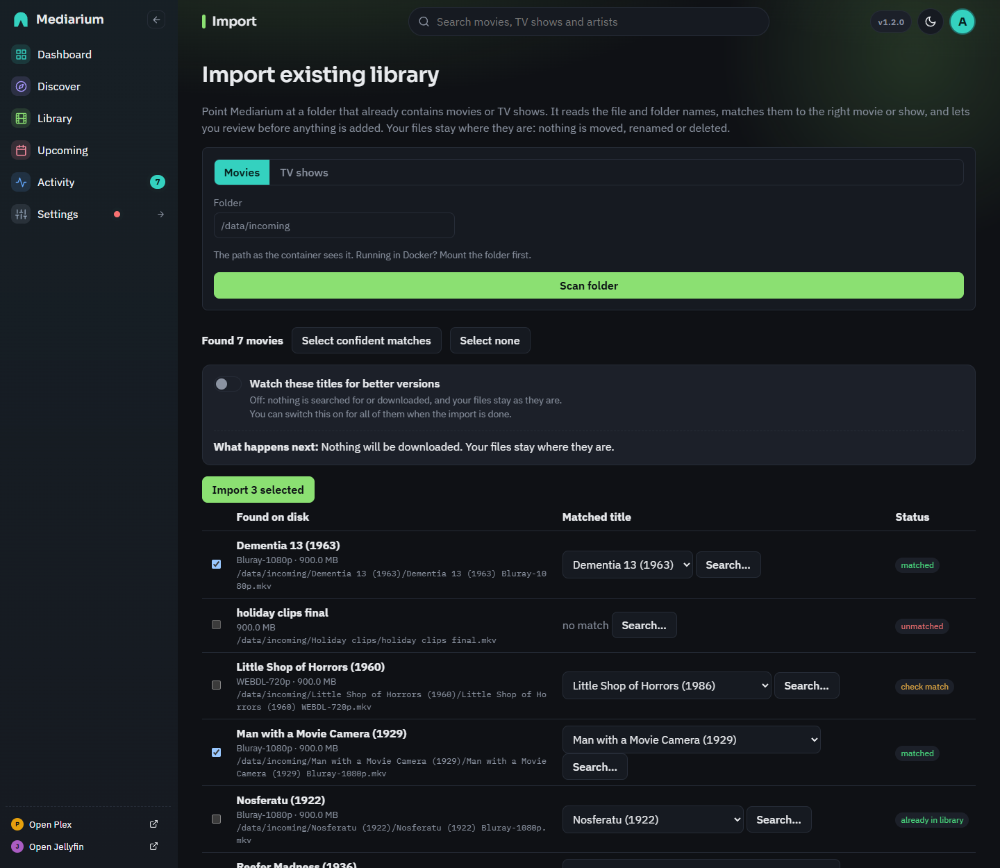
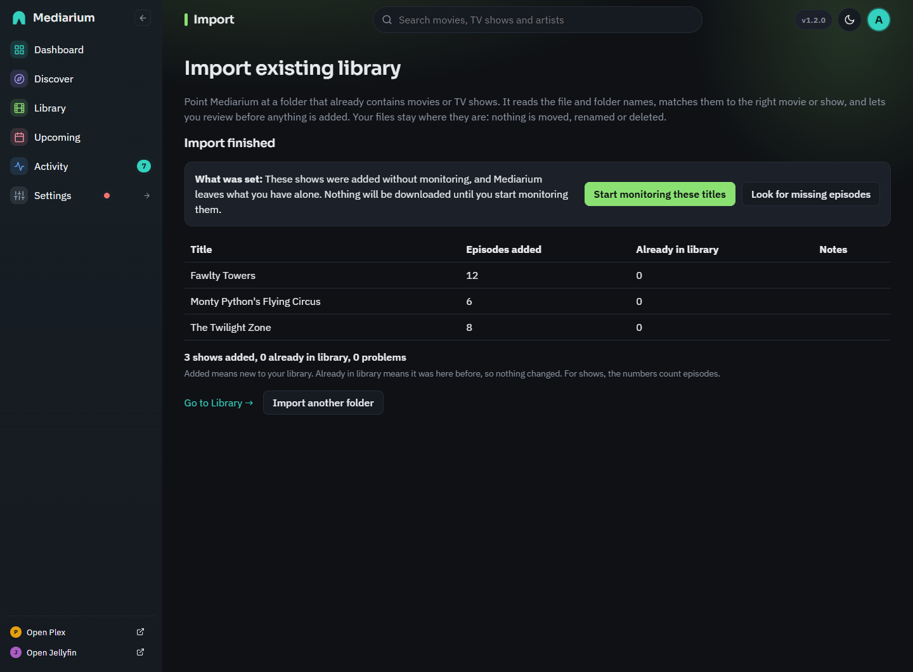

# Importing a library you already have

If your movies and shows are already in folders, Mediarium can find them and add them to its library **without moving, renaming or deleting anything**. Only an administrator can do this. Coming from Radarr or Sonarr? [migrate.md](./migrate.md) brings over more than files (indexers, quality profiles, monitoring). This page is for a plain folder of media.

Open **Library** and press **Import existing** (or **Import what you already have** when the library is empty). The button opens the import for the tab you're on: Movies or TV. The same page is at `/import`, and `/import?kind=tv` opens it on TV shows.

## The steps

1. **Scan.** Pick Movies or TV shows, check the folder (the path as the container sees it; with Docker the folder has to be mapped into the container first) and press **Scan folder**. Mediarium reads the file and folder names and looks each title up in the movie database. A movie can be `Inception (2010)/Inception.mkv` or a flat folder of release names. A show is read from its folder and from `S01E02` style numbers in the file names. Episodes in a `Specials` folder (`S00E01`) count as season 0. Sample clips, extras folders and hidden files (such as the `._Movie.mkv` stubs macOS leaves on a drive) are skipped.
2. **Review.** Every title shows what was found on disk and the match Mediarium picked. Confident matches are ticked. If a match is wrong, pick another from the list or press **Search...** and look it up by hand. Files Mediarium couldn't read are listed under the table.
3. **Choose what happens next** (see below), or just press **Import**.
4. **Confirm.** This answers in about a second, however many titles you chose. Every title is added to the library straight away with what the scan already knows: its name, year, the file, and the quality read from the file name. The titles show in the Library at once, with a "Getting details..." mark until their posters and summaries arrive.

*The review step for a movie folder. Confident matches are ticked.*

## How the quality is read

The quality (for example `WEBDL-1080p`) is read from each file name, for movies and for every episode of a show. When the file name doesn't say (`Show - S01E01 - Pilot.mkv`), Mediarium looks at the folders above it, nearest first: `Season 01 1080p`, then the show's folder such as `Show (2008) [1080p BluRay]`. A folder only fills in what the file name leaves out, so a file that says `720p` is never changed by its folder. A file with no quality anywhere in its path stays **Not stated** (it's `Unknown` in the API), and the search for better versions leaves it alone.

## What happens in the background

After you confirm, the server fills in the rest, a few titles at a time: poster, summary, genres and release date for movies, and the complete season and episode list for shows. Then the episodes found on disk are marked as downloaded.

- **You can leave the page.** A banner across the top of every page shows how far it is ("Importing your library: 4 of 25 shows. You can keep using Mediarium.") with a progress bar and a rough time left. **Import existing** picks the running import up again.
- **A restart doesn't lose it.** The titles still waiting are kept in the database, and the work carries on when Mediarium starts again.
- **A title that can't be looked up isn't lost.** If the movie database doesn't answer, the title is tried again a little later, then less and less often. The card and the report say why in plain words. Once it works, the details fill in and the problem goes away.
- **When it's done** the banner turns into "Import finished. 25 shows added, 0 problems." with a link to the report and a **Dismiss** button. It goes away after a week if you leave it.
- **One import of each kind at a time.** While a movie import is running you can't start another movie import (a TV import is fine). The page says so.

## Nothing is downloaded by surprise

An import adds the titles **without monitoring** and set to **leave what you have alone**. Nothing is searched for or downloaded, whatever your quality profile says. Two switches on the review page change that, and the text under them says what will happen.

- **Watch these titles for new episodes and better versions** (for movies: **for better versions**). On, the titles are monitored and no longer left alone. A show picks up new episodes as they come out, and files below your quality profile's target can be replaced when the profile allows better versions. Off, Mediarium never replaces your files.
- **Also look for missing episodes** (shows only). On, the episodes of an imported show that aren't on your disk are wanted, so Mediarium searches for them and downloads them, and picks up new episodes as they come out. The show is monitored, but its files are only replaced if the first switch is on too. Off, missing episodes stay missing.

A show or movie that was in the library before the import keeps its monitoring. You can change a single title later on its page, under **Better versions**.

Automation starts looking after the details are in, because a show has no episode list until then.

### Start monitoring afterwards

The report has a box, **What was set**, that says what the import did. Once the import has finished it also has buttons:

- **Start monitoring these titles** monitors exactly the titles this import added (not the rest of your library) and turns "leave what I have alone" off for them, the same as switching the first option on before the import.
- **Look for missing episodes** (shows only) makes the missing episodes of those shows wanted.

Titles that were in the library before the import are left as they were. After a click the box shows the new state and the button goes away. The buttons need a finished import. While details are still coming in, the box says so.

## The report

The import page starts with the **What was set** box, then a table of every title with **Added**, **Already in library** and notes, and a total line under it, for example "188 movies added, 0 already in library, 0 problems". For shows the two columns count episodes. **Already in library** means the title was there before, so nothing changed. Importing the same folder twice is safe: what's already there is counted, not added again.

*The report after a TV import.*

## Recently added

An imported title's **added date is the date of its file** (for a show, its newest episode file), so **Recently added** on the Library page follows when the files really arrived, not when you ran the import. If Mediarium can't read a file date it uses the time of the import.

## Where the numbers come from

Getting details takes one request to the movie database per movie, and one for the show plus one for each season of a show (the seasons are asked for at the same time). Mediarium works on five titles at once. Confirming never waits for these requests.

## For scripts

These are administrator endpoints. The full list is in [reference/api.md](./reference/api.md).

- `POST /api/library/scan` `{path, kind}` starts a scan (`409` when an import of that kind is running).
- `GET /api/library/scan/{id}` is the scan and its review rows.
- `POST /api/library/import` `{jobId, selections: [{key, tmdbId, title?, year?}], monitor?, noUpgrade?, monitorMissing?}` registers the titles and answers `{jobId, batchId}`. `monitor` (watch the titles) and `monitorMissing` (shows only) are `false` when left out. `noUpgrade` follows `monitor` when left out (`true` unless `monitor` is `true`).
- `GET /api/library/import/active` lists the scans waiting or running and the imports that are running or finished and not dismissed.
- `GET /api/library/import/batches/{id}` is one import's counts and its report rows, with `monitor`, `noUpgrade` and `monitorMissing` as they are now. `POST .../dismiss` closes its banner.
- `POST /api/library/import/batches/{id}/watch` `{watch?, missing?}` starts monitoring the titles that import added (`watch`) and/or makes the missing episodes of its shows wanted (`missing`, TV imports only). It answers `{movies, shows, message}`, `409` while the import is still getting details, `400` when neither is asked for. Titles that were already in the library are not touched.
- `PUT /api/movies/{id}/no-upgrade` and `PUT /api/series/{id}/no-upgrade` `{noUpgrade}` switch the search for better versions off or on for one title. Movies and shows also report `noUpgrade`, `detailsState` (`pending` or `problem` while an import is still getting details) and `detailsNote`.
