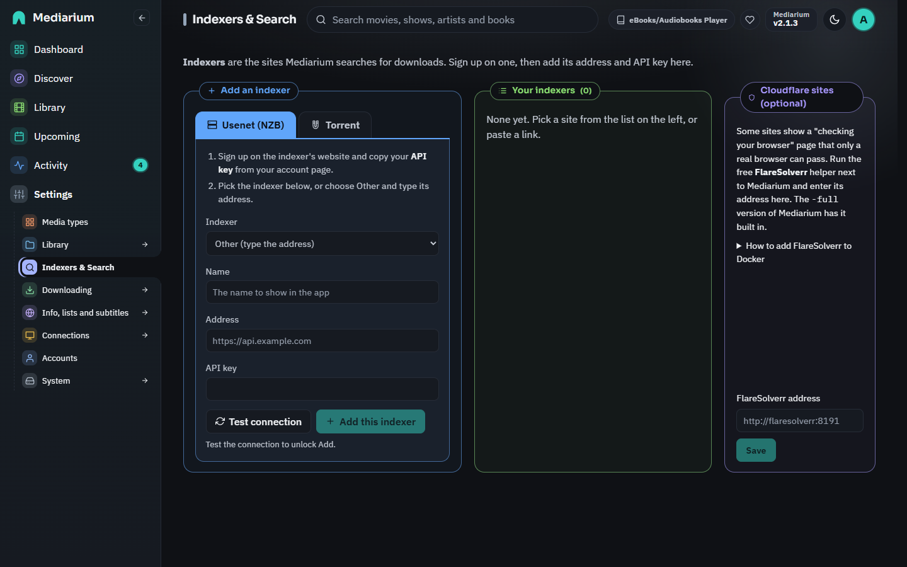

# Indexers & Search

Indexers are the sites Mediarium asks when it looks for releases. You'll find them under **Settings > Indexers & Search**. There are three kinds, and you can mix them. Every search goes to all enabled indexers at once, and the results come back as one list.

| Kind | What it is | You need |
|---|---|---|
| **Newznab** (Usenet) | The API almost every Usenet indexer offers. Results are NZB files, downloaded by the built-in Usenet client. | The indexer's address and your API key, plus a Usenet provider account (Settings > Downloading > Usenet and torrents). |
| **Torznab** (torrents) | The same API for torrent sites, offered by some trackers and by Prowlarr or Jackett if you already run them. | The Torznab address and API key. |
| **Sites from the definition list** (torrents) | Torrent sites without an API, driven by a community-maintained definition that describes how to search the site and read its pages. Prowlarr and Jackett use the same approach ("Cardigann"). It's built into Mediarium, so you don't need an extra container. | Nothing for public sites. Your login or browser cookie for private ones. |



*Settings > Indexers & Search: add an indexer on the left, your indexers in the middle (with Test, Edit, Disable and Remove) and the optional Cloudflare helper (FlareSolverr) card on the right. The addresses shown are examples.*

## Searching for a release by name

**Search > Search your indexers for a release** asks every indexer for a release name, the way you would on the indexer's own site (for example "Heat 1995 1080p"). The results list the quality, indexer, size and seeders; blocklisted releases are hidden unless you untick **Hide blocklisted releases**. **Download** works out the movie or show from the release name, adds it to your library if it isn't there yet, and downloads it as usual. Scripts: `GET /api/search?q=...` and `POST /api/search/grab`.

## Priority, health and Test all

Each indexer card has a **Priority**: **Preferred**, **Normal** (the default) or **Last resort**. Quality always comes first. Between two releases that are equally good, the one from the more preferred indexer is picked, then a Usenet release over a torrent. Scripts: `PUT /api/indexers/{id}/priority` with `{"priority": 1}` (1 preferred, 2 normal, 3 last resort).

Under the address, each card says how its last test went ("Last test passed 2 hours ago", or why it failed). **Test all** above the list tests every enabled indexer, one after another, and says which did not answer.

## Usenet or torrent?

- **Usenet**: you pay a Usenet provider for access and use an indexer to find NZBs. Downloads are a direct, encrypted connection to your provider. Nobody else sees what you fetch.
- **Torrents**: free, but you download from (and upload to) other people. Everyone in a swarm can see your IP address. Mediarium's built-in VPN (Settings > Downloading > VPN protection, see [vpn.md](./vpn.md)) can hide it. Torrents can be switched off in Settings, and torrent indexers are then skipped.

## Adding a Newznab or Torznab indexer

Under **Add an indexer** on Settings > Indexers & Search, choose the **Usenet (NZB)** or **Torrent** tab. For Usenet, pick your indexer from the list (or **Other** and type its address) and paste your API key. For a Torznab link, choose **Paste a Torznab link** on the Torrent tab, then paste the address and the API key. Press **Test connection**, then **Add this indexer** (it stays greyed out until the test has passed). The name is required, the address must start with `http://` or `https://` and name a server, and the API key can't contain spaces or line breaks. Mistakes are pointed out under the field, and the server refuses the same ones from a script.

**Indexers from Prowlarr or Jackett:** add each one with its own Torznab (or Newznab) feed address, not Prowlarr's main page. In Prowlarr, open the indexer and copy its feed address, which looks like `http://192.168.1.10:9696/5/api`, and use Prowlarr's API key (Settings > General). An address that gives back a web page instead of a feed is refused with a message saying so. To bring over all of them at once, use **Settings > System > Move from other apps** ([migrate.md](./migrate.md)). A few indexers are built into Prowlarr's own code rather than the shared definition list (Toloka, for example). Those can only be added through Prowlarr's feed address.

Each saved indexer has **Test**, **Edit**, **Disable** and **Remove**. **Edit** changes the name, address and API key, and a blank API key keeps the saved one. A failed test says what went wrong in plain words (address not found, connection refused, no answer in time, certificate problem, wrong API key, IP address not allowed). The key is never sent back to the browser. The indexer list only says whether one is saved (`hasApiKey`).

## Adding a site from the definition list

On the **Torrent** tab of Settings > Indexers & Search, **Pick a site from the list** opens a searchable list of sites, which you can narrow with **Public**, **Semi-private** and **Private**. Pick one, fill in what it asks for and press **Add** (the button carries the site's name). Then press **Test** on its card in **Your indexers**. Adding doesn't test it for you.

- **The list isn't part of Mediarium.** Mediarium ships no list of sites. The first time you open the list, your server downloads the community definitions (one archive from GitHub) and keeps a copy in `/config/indexer-definitions`. It refreshes that copy at most once a day when you open the list again, or when you press **Update list**. You choose which sites, if any, to add.
- **Public sites** usually need nothing: pick one and save. Some let you choose sorting or filters.
- **Private sites** need your account. Depending on the site, the form asks for a username and password (Mediarium signs in for you and signs in again when the site logs it out), an API key or passkey, or the **cookie** from your browser (for sites whose login has a CAPTCHA). To copy a cookie: sign in to the site in your browser, open the developer tools (F12), reload a page of the site, open the request in the Network tab and copy the whole `Cookie` request header. Some sites also want your browser's User-Agent. When the site signs you out, copy a fresh cookie.
- Passwords, cookies, API keys and passkeys are stored encrypted and never sent back to the browser. **Edit** on a site added from the list only renames it. To change its login or cookie, remove the site and add it again.
- **Addresses**: sites often have several mirrors. The form lets you choose one of the addresses in the definition, and the first is used unless you pick another.
- **Test** signs in (if needed), runs a search and reports how many releases came back. If a test fails, the dashboard shows it until a later test passes.
- Mediarium waits between requests to the same site (at least one second, longer if the definition asks, up to ten seconds) and keeps each site's sign-in between searches, so it doesn't hammer sites.

### What doesn't work (yet)

A few definitions use things the engine can't run. The list marks them as unsupported and says why. Today that's:

- logins that always show a CAPTCHA (use the cookie option if the site offers it);
- regular expressions with look-ahead or look-behind in the definition's extraction filters (in text clean-up replacements they're skipped, leaving the text unchanged);
- a small number of definitions with invalid selectors.

Sites change their pages. When a site changes before its definition is updated, searches from it fail or come back empty. A date the site writes differently from what its definition expects is read as any common date format instead, so it no longer fails the search. Refreshing the list picks up the fix once the community has made one.

## Sites behind a Cloudflare check

Many public sites sit behind Cloudflare, which sometimes shows a "checking your browser" page that only a real web browser can pass. Mediarium can't embed a browser. When a site shows that page you'll see:

> This site is behind a Cloudflare check. Set up FlareSolverr (see Settings > Indexers & Search) to use it.

[FlareSolverr](https://github.com/FlareSolverr/FlareSolverr) is a small helper that opens the page in a headless browser and hands back the cookies that let Mediarium in. Only sites that show the check use it. Everything else talks to sites directly.

**The simple way is the `-full` image** (`ghcr.io/rdborg/mediarium:latest-full`). The helper is built in and running, so there's nothing to add or type. Settings > Indexers & Search then shows "Built in and running". An address of your own saved there is used instead. The differences in size and memory are in [INSTALL.md](./INSTALL.md#optional-getting-past-cloudflare-checks). Cloudflare changes its checks now and then, so no site is guaranteed to keep working.

**Or add FlareSolverr yourself** as a separate container next to Mediarium in your compose file:

```yaml
services:
  flaresolverr:
    image: ghcr.io/flaresolverr/flaresolverr:latest
    container_name: flaresolverr
    restart: unless-stopped
    environment:
      - LOG_LEVEL=info
      - TZ=Etc/UTC
    # Only needed if Mediarium is not in the same compose file:
    # ports:
    #   - "8191:8191"
```

Then set its address in the **Cloudflare sites (optional)** section of Settings > Indexers & Search (stored as `flaresolverr.url`, `flareSolverrUrl` in `GET/PUT /api/settings`): `http://flaresolverr:8191` when both are in the same compose file, otherwise `http://<host>:8191`. With no address set, Cloudflare-protected sites fail with the message above.

Cloudflare's clearance is tied to your IP address and the browser's User-Agent, so FlareSolverr should reach the internet the same way Mediarium does (same host, same VPN or none). The built-in helper of the `-full` image always does, because it runs in the same container.

Technical: the `-full` image sets `BUNDLED_FLARESOLVERR=1` and runs the helper on `127.0.0.1:8191`. `GET /api/flaresolverr/status` (administrators) reports `{bundled, configured, running, version}`, and the dashboard shows a warning if the built-in helper stops answering.

## Where the definitions come from, and their licence

The definitions are the community-maintained Cardigann YAML files from [github.com/Prowlarr/Indexers](https://github.com/Prowlarr/Indexers) (the current `definitions/v11` folder), many of them synced from [Jackett](https://github.com/Jackett/Jackett). At the time of writing the Prowlarr/Indexers repository publishes no licence file (GitHub reports none). Jackett is GPL-2.0. Mediarium, which is AGPL-3.0, doesn't include, modify or redistribute these files. Your own server downloads them from GitHub when you open the site list, and reads them as data. The engine that runs them is Mediarium's own code. Credit for the definitions goes to the Prowlarr and Jackett contributors.

## Responsible use

Mediarium doesn't include, recommend or endorse any site. You choose which indexers and sites to add, and you're responsible for using them, and what you download through them, in line with the law where you live and the rules of each site. See [LEGAL.md](./LEGAL.md).

## For developers

- Engine: `internal/indexers` (`cardigann*.go` for the engine, `definitions.go` for the download and cache, `cardigann_selector.go` for the CSS selector subset). Tests use local fixture sites only (`internal/indexers/testdata/cardigann`).
- To check the engine against a local copy of the real definitions: `MEDIARIUM_CARDIGANN_DEFS=/path/to/definitions/v11 go test ./internal/indexers -run Corpus -v`.
- API: `GET /api/indexer-definitions?refresh=1`, `POST /api/indexers` with `{definitionId, name, baseUrl?, settings}`, `PUT /api/indexers/{id}` with any of `{name, baseUrl, apiKey, protocol, enabled, settings}` (left out = unchanged; blank `apiKey` or secret setting = keep the saved one; `protocol` only for Newznab/Torznab), `POST /api/indexers/{id}/test`. See [reference/api.md](./reference/api.md).
- Result download links from definition-based sites look like `mediarium-indexer://<id>?link=...`. The grab pipeline resolves them through that indexer's session (login, details page, Cloudflare) when the download starts.

## FlareSolverr with the bundled compose file

The compose file in this repository has an optional `flaresolverr` service. Start it together with Mediarium:

```bash
docker compose --profile cloudflare up -d
```

Then enter `http://flaresolverr:8191` under Settings > Indexers & Search. The first request to a protected site can take up to a minute while FlareSolverr passes the check. Later requests reuse its cookies and are fast.
