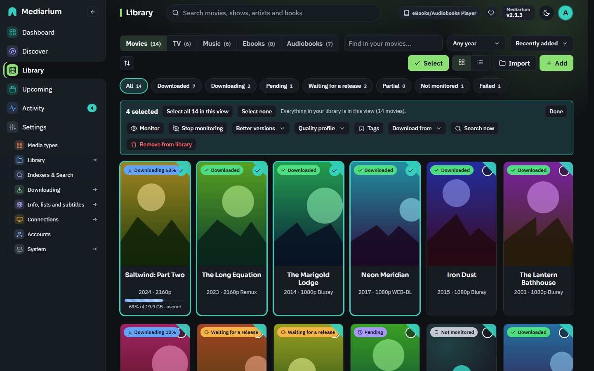

# The Library page

The Library shows what's in your library: a tab each for **Movies**, **TV**, **Music**, **Ebooks** and **Audiobooks** (only the kinds that are switched on, see [modules.md](./modules.md)). Every title is a poster or a row, with a status, and the things you do most are one click away: search for a release now, monitor or stop monitoring, open the page, and (for administrators) remove it. Above the list you can search by name, filter by genre, decade and status, and sort. The list is sorted by **Recently added**, newest first, until you pick another sort. The book tabs are described in [books.md](./books.md). To keep kids' films, 4K or anything else apart, use tags (below) rather than separate folders.

*The Library, Movies tab.*

To do the same thing to many titles at once, use **Select**.

## Finding your way

- **Status words.** Each title says where it is: **Downloaded**, **Downloading**, **Pending** (waiting its turn in the download line), **Waiting for a release** (monitored, and Mediarium checks regularly for one), **Partial** (some episodes are downloaded), **Not monitored** (in your library, but nothing is downloaded on its own) and **Failed**. The chips under the toolbar filter by these words and show how many titles each holds.
- **Clear filters.** When a search, chip, genre or year is narrowing the list, a **Clear filters** button appears beside the chips, and in the "Nothing matches these filters" message when nothing is left. It puts them all back.
- **Sort direction.** The button with the up-and-down arrows next to **Sort** reverses the order (oldest first, Z to A). The sort and its direction are remembered in this browser.
- **Press `/`** anywhere (except while you type in a box) to jump to the search box at the top, and **Esc** to leave it.

## Selecting many titles

**Select** is for administrators. Members see the Library without it.

*Five movies selected. The bar stays in view while you scroll.*

1. Press **Select** in the toolbar. A tick circle appears on every poster and a tick box on every row of the list view.
2. Tick titles by clicking them. Hold **Shift** and click to tick everything between the last one you ticked and this one. In the list view the box in the header ticks everything in the view.
3. The bar at the top of the page stays in view while you scroll. It says how many are selected ("12 selected") and has:
   - **Select all N in this view** and **Select none**. "This view" is what's showing after your search, genre, year and status filters. The Library isn't split into pages, so that's all of them at once. A line beside the buttons says what that reaches: "Everything in your library is in this view (64 movies)." or, with a filter on, "Filters are on: this view has 7 of the 300 shows in your library."
   - The actions below.
   - **Done**, which leaves select mode and clears the ticks.

Actions only reach titles you can see. If you tick ten titles and then type in the search box, the bar counts, and the actions change, only the ticked titles that still match. Clear the search and the others are still ticked.

On a phone the bar takes one row and the actions fold away behind an **Actions** button.

## What you can do to the selection

| Action | What it does |
|---|---|
| **Monitor** / **Stop monitoring** | Turns automatic searching on or off. Stopping also removes downloads that were only waiting for these titles. |
| **Better versions** | **Look for better versions** lets Mediarium swap a download for a better one, if the title's quality profile allows upgrades. **Leave what I have alone** stops that for these titles, whatever their profile says, and removes waiting downloads that would have replaced a file. |
| **Quality profile** | Gives them a profile, or the default. |
| **Download from** | Usenet only, torrents only, both, or the choice in Settings. |
| **Search now** | Looks for releases of the selected titles that are **monitored and missing something**. A confirmation says how many will be searched, for example "42 of the 64 selected are monitored and missing something". At most **25 titles** are searched per press, and the rest are left to the automatic search. The search runs in the background, one title after another, and the result is written to Activity ("Searched for 25 titles and started 3 downloads."). Only one such search runs at a time. Movies that aren't out yet are skipped. |
| **Remove from library** | Takes them out of the library. See below. |

Every action says how it went. When all went well you get a short message such as **Done: 12 updated.** If some couldn't be done, a note stays on the page with the reason for each ("Alpha: It isn't in your library any more.") until you dismiss it, and the message says how many worked: "Done: 10 updated. 2 titles could not be changed."

### Removing many titles

Removing shows a question with the names of the titles and the number. Downloads running for them are cancelled and their working files in the downloads folder are deleted, whatever you choose.

**Files in your library are only deleted if you tick "Also delete the files of all N from the disk".** That goes for one title or many. When you remove a single title, the box shows how many files and how much space they take in your library (for example "3 files, 11.0 GB"). They go to the recycle bin first (**Activity > Recycle bin**) and are deleted for good after 7 days, so a slip can be undone with **Put back** (see [Removing a movie or show](downloads.md#the-recycle-bin)). When you tick it, a red line repeats how many titles are affected. A title whose files lie outside your library folder is never touched. It's left in place, and the note says why. The others carry on.

Every removal writes a line to **Activity** that says what happened to the files, for one title and for many alike: "Night Harbour removed from library. Its files were deleted (4 files, 1 folder)." or "Night Harbour removed from library. Its files were kept (1 file)." A title with no file on disk says "It had no files on disk."

## Tags

Tags are your own words for sorting a library that lives in one folder: **Kids**, **4K**, **Christmas**, **Dad's films**, anything. They are the way to keep kids' films or 4K copies apart without separate folders.

- **On a title's page**, under the controls: type a tag and press Enter (or a comma). Tags already in use are suggested as you type. Press × on a tag to take it off.
- **When adding** a movie or show, the add window has a **Tags** box, so a title can be tagged Kids from the start.
- **On many titles at once**: in **Select** mode, **Tags** adds a tag to every chosen title, or removes one of the tags they have.
- **Filter by tag**: the Library's **Tag** filter (shown once a tag is in use) lists only the titles with that tag. Cards show their tags under the title.
- Up to 20 tags per title, 30 characters each. Case doesn't matter: "kids" joins an existing "Kids".
- **On your media server** every tag becomes a collection of the same name: in Plex the title's collection field, in Jellyfin and Emby a collection (box set) named after the tag. So a "Kids" tag gives a Kids collection to browse, or to share with a child's account. A title that isn't on the server yet gets its tags a few minutes after it's downloaded. Taking a tag off takes the title out of that collection. Collections you made yourself on the server are never touched. See [media-servers.md](./media-servers.md#tags-as-collections).
- Tags live in Mediarium's database and go when the title is removed.

## Anime and daily shows

Most TV releases name episodes by season (`Show.S02E05`). Two kinds of show don't:

- **Anime** counts episodes from the very first one: `[Group] Long Voyage - 1085 (1080p)`, `Show E105`, or a batch `Show - 01-12`.
- **Daily shows** (talk shows, news) go by the day: `The.Evening.Desk.2024.03.15`.

A show's page has **Episode numbering**: *Seasons (S01E05)*, *Anime (episode 105)* or *Daily (by air date)*. Mediarium sets it when the show is added, also when it comes from a library import or from Sonarr, which passes on its own setting (Japanese animation is Anime; talk shows and news are Daily), and you can change it. Later anime seasons named like "Show S2 - 05" are read as that season's episode, and a recap such as "Show - 12.5" is not taken for episode 12. For an Anime show, episode 105 is found by counting the show's episodes season by season from the first one (specials left out); for a Daily show, by matching the air date. Searches then also look for "Show 105" or "Show 2024 03 15", and releases and downloaded files named that way are matched to the right episode. A release that does carry a season marker is always taken as it says.

The counting follows TMDB's seasons. When a show's seasons on TMDB are split differently from how a fansub group counts, an episode can come out a few places off; Choose a release on the episode always works as a fallback. Scripts: `seriesType` on a show, and `PUT /api/series/{id}/type` with `{"type": "standard" | "anime" | "daily"}`.

## Specials

A show's specials (TMDB's season 0: behind-the-scenes episodes, Christmas specials, OVAs) are listed on its page as **Specials**, below the other seasons. They start **unmonitored**, because they are rarely posted in a form that can be found, and they don't count towards how much of the show you have until you ask for them. Mediarium can't look for specials yet, so they have no Search button or Monitored box; they are there so you can see what exists. Switching a whole show on or off leaves them alone. Shows already in your library pick up their specials at the next refresh.

## One folder per kind

Each kind of media has one library folder (Settings > Library > Folders and file names). To keep kids' films, 4K copies or anything else apart, use tags (above) instead of separate folders. To see how full the disk is, the folder boxes show the free space, and Settings > System shows storage.

## File names

**Settings > Library > Folders and file names** picks how imported files are named. Plex, Jellyfin / Emby, Kodi and Simple each name movies and episodes the way that media player likes. **Custom** lets you write your own. The page shows a preview of a made-up movie and episode as you type.

With **Custom** you can:

- **Start from** a ready-made format (Plex, Jellyfin / Emby, Kodi, *Detailed, like Radarr and Sonarr*, or *Plex with editions*) and change it.
- **Paste the format you already use in Radarr or Sonarr.** Mediarium understands their token names, so `{Movie CleanTitle} ({Release Year}) - {Custom Formats}{ - Edition Tags}` works as it is.
- **Click a token** in the list next to the boxes to add it where the cursor is.

There is one box for movies and one for episodes. An episode name needs `{Season}` and `{Episode}` (or `{Air-Date}` for daily shows), so two episodes never get the same name. A movie name needs its title.

**Tokens.** Names aren't case sensitive, and `{Movie.CleanTitle}` or `{Movie_CleanTitle}` puts a dot or underscore between the words.

| Group | Tokens |
|---|---|
| Movie | `{Movie Title}`, `{Movie CleanTitle}`, `{Movie TitleThe}`, `{Movie CleanTitleThe}`, `{Movie TitleFirstCharacter}`, `{Release Year}`, `{Movie Year}`, `{Year}`, `{Edition Tags}` |
| Show and episode | `{Series Title}`, `{Series CleanTitle}`, `{Series TitleYear}`, `{Series CleanTitleYear}`, `{Series TitleThe}`, `{Season}`, `{Episode}`, `{Episode Title}`, `{Episode CleanTitle}`, `{Air-Date}` |
| Ids | `{TmdbId}`, `{ImdbId}`, `{TvdbId}` |
| Quality | `{Quality Full}` (for example `Bluray-1080p Proper`), `{Quality Title}`, `{Quality Proper}`, `{Quality}`, `{Source}` |
| Media info | `{MediaInfo Simple}`, `{MediaInfo Full}`, `{MediaInfo VideoCodec}`, `{MediaInfo AudioCodec}`, `{MediaInfo AudioLanguages}`, `{MediaInfo VideoDynamicRange}`, `{MediaInfo VideoDynamicRangeType}`, `{MediaInfo 3D}`, `{Codec}` |
| Release | `{Release Group}`, `{Custom Formats}` |

**Text around a token.** Anything inside the braces next to the token name is only written when the token has a value. `{ - Edition Tags}` adds " - Extended" for an extended cut and nothing otherwise; `{[Quality Full]}` adds the brackets only with a quality. For Plex's edition tag, `{edition-{Edition Tags}}` gives `{edition-Extended}`.

**Numbers.** `{Season:00}` pads to two digits (`S01`), `{Episode:000}` to three.

**What Mediarium doesn't know yet.** The media info comes from the release name, not from reading the file, so audio channels, bit depth and subtitle languages are left out (those tokens are accepted and write nothing). Mediarium doesn't have custom formats yet, so `{Custom Formats}` holds the edition; when the format also has `{Edition Tags}`, the edition is written once. `{Preferred Words}` is accepted and writes nothing.

Scripts: `GET /api/settings/naming-tokens` lists the tokens and ready-made formats, and `GET /api/settings/naming-preview?kind=movie|tv&format=...` returns the preview and, for a format with a mistake, what's wrong in `problem`. The formats are saved as `movieNameFormat` and `episodeNameFormat` with `PUT /api/settings`.

## Renaming existing files

Files keep the name they had when they arrived. After you change the naming preset (Settings > Library > Folders and file names), **Rename existing files** on the same page lists every movie and episode whose name would change, as "old name → new name". Untick any you want to leave alone and press **Rename**. Subtitles, `.nfo` and artwork named after a video move with it, empty folders left behind are removed, and your media server is told. A file is never moved outside the library folder or onto another file; those are listed as not renamed. Scripts: `GET /api/rename?kind=movie|tv` (the preview) and `POST /api/rename` with `{"items": [{"kind": "movie", "id": 12}]}`.

## Statistics

**See statistics** under the dashboard's cards opens the Statistics page: how many movies, shows, episodes and albums you have and how many are downloaded, how much space the library takes, the number of titles at each quality (with their size), and how many downloads finished or failed each month, with how much came from Usenet. The months go back as far as the history is kept (90 days unless changed). Scripts: `GET /api/stats/library`.

With **What's been watched** on (Settings > Media servers, see [media-servers.md](./media-servers.md#whats-been-watched)), the page also has **What gets watched**: how many of the movies and episodes you have were played, how much space the never-played ones take, the most watched titles and the ones watched lately. It counts what your media servers last said, so it is as fresh as the last read.

## Music

The Music tab has the same **Select** mode for artists, with **Follow**, **Stop following**, **Quality profile** (the music profiles) and **Remove from library**. Removing asks the same way and keeps the album folders unless you tick the box.

## For scripts

Tags: `GET /api/tags` lists them with how many movies and shows have each; `PUT /api/movies/{id}/tags` and `PUT /api/series/{id}/tags` take `{"tags": ["Kids", "4K"]}` and replace the title's tags; `PUT /api/library/bulk/tags` takes `{"items": [...], "add": [...], "remove": [...]}` (administrators). Movies and shows carry `"tags"` in their JSON.

All of these are for administrators. A title is `{"kind": "movie" | "tv", "id": n}`. Each request changes all its titles in one database transaction, so a failure part way changes nothing. A title that's not in the library (any more) is skipped and reported, and the rest are changed. Up to 5000 titles per request.

| Request | Body | Notes |
|---|---|---|
| `PUT /api/library/bulk/monitored` | `{items, monitored}` | |
| `PUT /api/library/bulk/no-upgrade` | `{items, noUpgrade}` | `true` leaves the titles alone; `false` looks for better versions again |
| `PUT /api/library/bulk/profile` | `{items, profileId}` | `0` is the default profile; an unknown profile is refused (`400`) and nothing changes |
| `PUT /api/library/bulk/sources` | `{items, sources}` | `""` (default), `usenet`, `torrent` or `both` |
| `POST /api/library/bulk/search-now` | `{items}` | answers `202` at once; `{searching, leftOut, limit, skipped, failed, message}` |
| `POST /api/library/bulk/remove` | `{items, deleteFiles}` | `deleteFiles` is `false` when left out |
| `PUT /api/music/bulk/follow` | `{ids, monitored}` | artists |
| `PUT /api/music/bulk/profile` | `{ids, profileId}` | artists; `0` is the default music profile |
| `POST /api/music/bulk/remove` | `{ids, deleteFiles}` | artists |

Every answer except search-now is `{updated, failed: [{kind, id, title?, reason}], message}`.

## Big lists

`GET /api/movies` and `GET /api/series` are the two biggest answers, and the Library page asks for them every few seconds. They're sent compressed (gzip) when the client accepts it, and carry an `ETag`. A client that sends it back in `If-None-Match` gets `304 Not Modified` with no body while nothing has changed. These two answers are marked `Cache-Control: private, no-cache` (the browser may keep a copy but has to ask first). Every other answer in the API is `no-store`.

The interactive release lists (`GET /api/movies/{id}/search`, `GET /api/series/{id}/search` and `POST /api/music/albums/{id}/search`) answer with a plain list. With `?detail=1` they answer `{results, sources, unanswered: [{name, message}]}`, which also says how many indexers were asked and which of them didn't answer.
