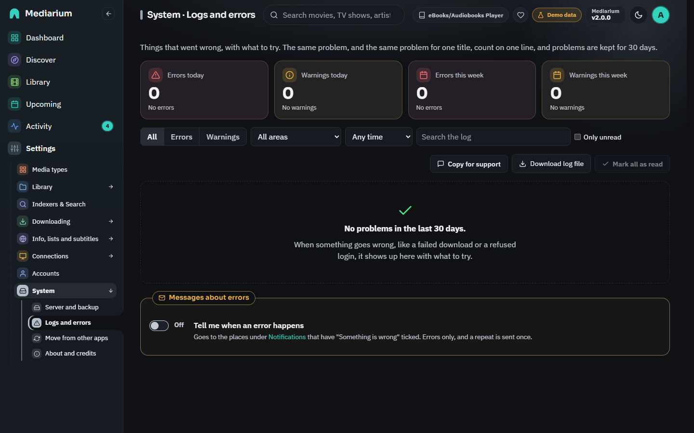

# Logs and errors

**Settings > System > Logs and errors** lists the things that went wrong, in plain words, with what to try. Only administrators can open it.

It's not a copy of the log file. Normal activity (a movie was added, a download finished) is in [Activity](activity.md). This page keeps only real problems, such as a download that failed, a Usenet provider that refused the login, an indexer that said "too many requests" or a disk that's full.

## What is recorded

| Where | Examples |
|---|---|
| Downloads | a download failed, an archive could not be unpacked, a repair (PAR2) did not work, parts of a release are missing |
| Usenet | the provider says there are too many connections, refused the login, or cannot be reached |
| Indexers & Search | an indexer is limiting you, refused the key, cannot be reached or returned an error |
| Media servers | Plex, Jellyfin or Emby cannot be reached, or refused the sign-in, when Mediarium asked for a library refresh |
| Import | a file could not be moved into the library, a download had no video, a file is already there |
| Disk and folders | the disk is full, Mediarium may not write to a folder, a folder is missing |
| Database | a call to the database took several seconds |
| Movie and show info | TMDB or OpenSubtitles said Mediarium has asked for too much, TMDB refused the key |
| Notifications | a message could not be delivered |
| Updates and system | a check for updates or an update failed, Mediarium restarted itself |

Every kind has a fixed name (a code, such as `usenet.too_many_connections`). The names, what each one means and what to try are in the [list of problem codes](reference/problem-codes.md).

## The page

*Settings > System > Logs and errors, with one problem opened.*

- **Cards** at the top count errors and warnings today (since midnight) and in the last 7 days. An error is something that failed and didn't fix itself. A warning is something that went wrong but Mediarium worked around, or that may pass by itself.
- **Filters** narrow the list by level, by part of the app, by time (a preset or your own dates), by words (**Search the log** looks in the message, the technical detail and the name of the movie or show) and to **Only unread**. **Clear filters** puts them back.
- **Each row** shows the level, the part of the app, a plain title, when it last happened, how many times, and the movie or show it was about (a link). A red **New** tag stays until you mark it as read.
- **Open a row** to see **What happened**, **What to try** (with a button to the settings page where it can be fixed) and **Technical detail** (with a **Copy** button). Activity and the title pages use plain words. The exact error text is here. A problem the page has no help for yet shows its own message and the detail.
- **Mark as read** on a row, or **Mark all as read** at the top, clears the **New** tags.
- The list shows 50 problems at a time. **Show more** adds 50.
- The page stays up to date while it's open.

The same problem happening again within 10 minutes is counted on the same row ("14 times, last 2 minutes ago") instead of adding a new one. When it is about a movie, show or album, the same problem for that title is also counted on one row for 24 hours, even when a different download caused it. A different indexer, server or title gets its own row.

## Where else you see it

- A **red dot** appears next to **Settings** in the sidebar while there are errors from the last 24 hours that nobody has marked as read. Once Settings is open, the dot is next to **System**, and the number of them is next to **Logs and errors**.
- The **dashboard** shows "N new errors in the last 24 hours" in its "Needs your attention" box, with a link to this page.

## Copy for support and the log file

- **Copy for support** copies the same report as **Settings > System > Server and backup > Help and support**: version, database, setup warnings, the latest problems from this page and the last 500 lines of the log.
- **Download log file** saves the problems as a plain text file. It follows your filters, so to save everything, clear them first.

Passwords, API keys and tokens are taken out before anything is stored, so what you copy or download is safe to send.

## Messages about errors

Switch on **Tell me when an error happens** at the bottom of the page to get a message too. It goes to the places you set up under [Notifications](notifications.md) that have **Something is wrong** ticked. Only errors are sent, not warnings. A problem that repeats is sent once (again after 10 quiet minutes), and an indexer or Usenet server the connection check already told you about isn't sent a second time. The setting is `notify.on_problems`.

## How long problems are kept

Problems are kept for **30 days**, and at most 2000 of them. A shorter history time (`historyRetentionDays`, see [History and activity](downloads.md#history-and-activity)) applies here too. The daily [clean-up](downloads.md#clean-up) removes older ones.

## "Mediarium is slow to answer right now"

A yellow notice under the top bar. It appears when Mediarium itself takes more than 10 seconds to answer the page, for example while a big download is being unpacked or a library import is running, and goes away by itself once answers come back at normal speed. Nothing needs doing; if it stays for a long time, check the server isn't out of memory or disk space (**Settings > System**).

Lists that come from outside services don't raise it: Discover (TMDB, MusicBrainz, Open Library), the search box, release searches on your indexers, subtitles and media server links. Those show their own loading placeholders, and if one of the services doesn't answer at all, the message names it ("Open Library is slow to answer right now") instead of blaming Mediarium.

## Examples

**"Too many connections to your Usenet provider."** Your provider allows only so many connections at once for one login. If another program such as SABnzbd uses the same account, stop it, or lower the number of connections in **Settings > Downloading > Usenet and torrents**. Mediarium lowers the number itself while the provider complains, so downloads keep going, just slower.

**"Could not get a file from an indexer."** A download was chosen, but the indexer didn't hand over the file that starts it (the NZB or torrent). This is filed under **Indexers**, not Usenet, because your Usenet provider was never asked. Use **Test** on the indexer. If it works, retry the download in **Activity**.

**"The disk is full."** Free some space, or run **Clean up now** on **Settings > System > Server and backup**. Then open **Activity** and retry the download.

**"Mediarium may not write to a folder."** Give the user Mediarium runs as (the `PUID` and `PGID` you set) read and write access to the folder. On a Synology, check the permissions of the shared folder.

## For scripts

Administrators only, like the page: `GET /api/system/problems` (filters and paging; `summary=1` for only the counts), `POST /api/system/problems/read`, `GET /api/system/problems/export` (plain text) and `PUT /api/system/problems/notify`. See [reference/api.md](reference/api.md).
