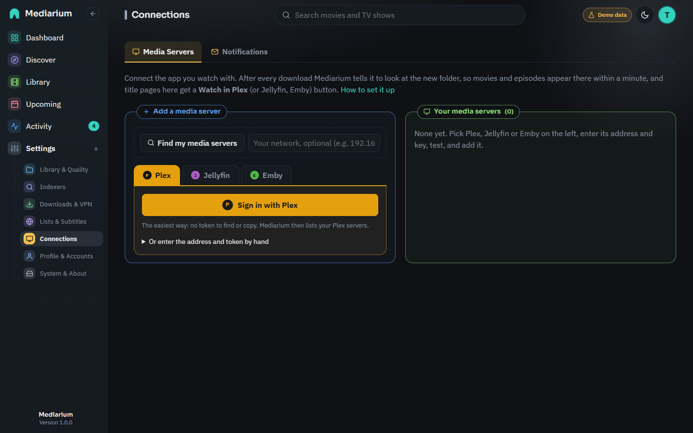

# Media servers (Plex, Jellyfin, Emby, Audiobookshelf, Kavita)

Mediarium downloads and organises your movies and shows; you watch them in Plex, Jellyfin or Emby. Connecting your media server lets the two work together:

- **New downloads show up straight away.** After each import, Mediarium asks the media server to scan the folder the new file went into, so you don't wait for its next scheduled scan.
- **Refresh now.** A button that asks the server to scan all of its libraries.
- **Watch in Plex / Jellyfin / Emby.** A title's page links straight to the same title on your media server (found by its TMDB id).
- **Open Plex / Jellyfin / Emby.** A small link at the top right of every page, named after the kind of server (Plex, Jellyfin, Emby, Audiobookshelf, Kavita), opens its own web app.

Mediarium doesn't convert video, and its only player is the simple in-browser one on a title's Files card. Your media server is still the place to watch.

## The page

**Settings > Connections > Media servers** lists the servers you have added at the top, each with **Test**, **Refresh now**, **Open**, **Edit**, **Disable** and **Remove**. Below them, **Add a media server** has the ways to connect on the left (**Find my media servers**, **Plex**, **Jellyfin**, **Emby**) and the form for the one you pick on the right. On a phone the list becomes a row you slide sideways. What you type for one kind is kept while you look at the others, until you add the server.

*Settings > Connections > Media servers: the servers you added, each with Test, Refresh now, Open, Edit, Disable and Remove, and the ways to connect another. The addresses shown are examples.*

## Find my media servers

**Find my media servers** is the first choice when you add a server. It looks for Plex, Jellyfin and Emby on your network, so you don't have to know addresses and ports. It takes about ten seconds and does two things at once. The search runs on the machine where Mediarium runs, not in your browser, so your browser doesn't ask for permission to reach the local network.

- It **asks the network**: Jellyfin and Emby answer a broadcast on UDP port 7359, and Plex answers its "GDM" discovery on UDP port 32414.
- It **checks the usual ports** (32400 for Plex, 8096 for Jellyfin and Emby) on every address of a few networks, and asks whatever answers who it is. This needs no sign-in.

When you don't type a network, Mediarium also tries the machine's default gateway and the names `host.docker.internal`, `host.containers.internal`, `jellyfin`, `plex` and `emby`. In Docker that reaches the computer Docker runs on (where a published Plex or Jellyfin port answers) and servers on the same Docker network.

The networks checked are the ones Mediarium itself is on (Docker's own networks last, so they don't crowd out your home network), plus the most common home networks (`192.168.0.x`, `192.168.1.x`, `10.0.0.x`, `10.0.1.x`, `172.16.0.x`). You can type your own instead, for example `192.168.50.0/24` or a single address like `192.168.50.10`: up to 8 networks, each at most 256 addresses (`/24`). Only private networks are ever checked (`10.x.x.x`, `172.16.x.x` to `172.31.x.x`, `192.168.x.x`, and `100.64.x.x` to `100.127.x.x`, which Tailscale uses); anything else is refused, so the search can never be pointed at the internet.

Each server found shows its type, name, address and version, and whether it is **already added**. Press **Connect** on one to sign in to it (see below); the address is filled in for you.

### Why the broadcast may find nothing in Docker

Broadcasts only reach devices on the same network. With Docker's default **bridge** network, Mediarium sits on a small private network inside your computer, and broadcasts from it don't reach your home network. The port check still works, as long as you search the right network: if your home network is `192.168.50.x`, type `192.168.50.0/24` and search again. The Docker network itself (usually `172.17.0.x`) is always included, which finds a media server running directly on the same computer (at `172.17.0.1`).

What works where:

| Where Mediarium runs | Broadcast | Port check |
| --- | --- | --- |
| Directly on the machine (Windows, macOS, Linux) | Yes | Yes |
| Docker with `network_mode: host` (Linux), or a macvlan network | Yes | Yes |
| Docker's default bridge network | Only servers in containers on the same Docker network | Yes for the Docker network, the computer Docker runs on and any home network you type. Not for a home network you don't type (only the common ones are tried) |

If nothing is found, the page says so and why. In Docker's default network it suggests typing your home network, adding the server by its address, or using host networking. There is an **Add one by its address** button that takes you to the forms. Details in [Adding a server](#adding-a-server).

## Sign in with Plex

The easiest way to add Plex, and the one other Plex apps use:

1. Choose **Sign in with Plex**. Mediarium opens a small `app.plex.tv` window. If nothing opens, use the **Open it here** link under the button.
2. Sign in to your Plex account there (if you aren't already) and approve **Mediarium**.
3. Back in Mediarium, your Plex servers are listed: the ones you own, and ones shared with you. Press **Add** on the one that holds your library.

Mediarium tries the server's local addresses first and uses the first one that answers; if the address you picked doesn't answer, it tries the others. It saves that server's own access token (encrypted), not your Plex account's. Your account token is kept in memory only while you choose, is never saved, and is forgotten after 30 minutes. The sign-in expires after 30 minutes too, so just start again.

Mediarium needs to reach `plex.tv` for this. Adding a server shared with you works, but Plex only lets the owner's token rescan libraries, so **Refresh after every download** won't work on a shared server.

## Jellyfin Quick Connect

Quick Connect lets you sign Mediarium in to Jellyfin without typing a password into it:

1. Enter the Jellyfin address (or pick it from **Find my media servers**) and choose **Use Quick Connect**. Mediarium shows a six-digit code.
2. In a Jellyfin app or web page where you are signed in as an administrator, open your user menu, then **Quick Connect**, and enter the code.
3. Mediarium notices within a few seconds and adds the server.

The code is valid for 10 minutes. Quick Connect has to be switched on in Jellyfin: **Dashboard, General, Quick Connect**. If it is off, Mediarium says so; switch it on, or use a username and password instead. Quick Connect is a Jellyfin feature; Emby doesn't have it.

## Username and password (Jellyfin and Emby)

Enter the server's address and your Jellyfin or Emby username and password, then choose **Sign in to Jellyfin** (or **Sign in to Emby**). Mediarium signs in once, gets an access token from the server and saves that (encrypted). The password is sent only to your media server, and is never saved or written to the log.

Use an **administrator** account: Mediarium needs one to ask the server to rescan its libraries, and says so if the account isn't one. "Wrong username or password" means just that; "Could not reach ..." means the address or port is wrong or the server is off.

Signing in again to a server that is already added (by any of these methods) updates its address and token instead of adding it twice, which is also how to fix a token that stopped working.

## Adding a server

You can always add a server by hand, with its address and a token or API key. Go to **Settings > Connections > Media servers** and pick the kind on the left of **Add a media server**. For Plex, open **Or enter the address and token by hand**; for Jellyfin or Emby, open **Or enter an API key by hand**. **Address you open in your browser** and **Folder mapping** are under **More options**.

| Field | What to enter |
|---|---|
| Type | The kind you picked on the left: Plex, Jellyfin or Emby. |
| Address | How Mediarium reaches the server, for example `http://192.168.1.10:32400` (Plex) or `http://192.168.1.10:8096` (Jellyfin and Emby). If both run in Docker on the same network, the container name works too: `http://plex:32400`. |
| Plex token / API key | See below for where to find it. It is stored encrypted and never shown again; leave it blank when editing to keep the saved one. |
| Address you open in your browser (optional) | The address *you* open in your browser or app, if it's different from the one above (for example `https://jellyfin.example.com`). "Watch in" links use it. When it is blank, the address above is used, and Plex links go through `app.plex.tv`, which works anywhere you are signed in to Plex. |
| Refresh after every download | On by default, and set on the server's card in the list. Turn it off if you'd rather the server only scans on its own schedule. |
| Folder mapping (optional) | Only needed when the server sees your library under a different folder than Mediarium does. See [Path mapping](#path-mapping). |

**What is checked.** The address (and the browser address, if you use one) must be an `http://` or `https://` address with a server name, and its port, if any, must be 1 to 65535. Tokens and API keys can't contain spaces or line breaks. Each folder mapping needs both sides filled in, and each side must be a full path (starting with `/` or a drive letter such as `D:\`). The page shows the problem under the field, and the server refuses the same mistakes from a script.

Press **Test** before saving. If something is wrong, the test says what: the address can't be reached, the token was refused, or the address answered but isn't a server of the chosen type. A good test lists the server's libraries and the folders they use, which helps with path mapping.

### Finding your Plex token

1. Open Plex in a web browser and sign in as the server owner.
2. Open any movie or episode, choose the **...** menu, then **Get Info**, then **View XML**.
3. A new tab opens. At the very end of its address is `X-Plex-Token=` followed by a string of letters and numbers. That string is your token.

Treat the token like a password: it gives full access to your Plex server.

### Finding a Jellyfin API key

1. In Jellyfin, open **Dashboard** (Administration), then **API Keys**.
2. Choose **+**, name it `Mediarium` and save.
3. Copy the key that appears in the list.

### Finding an Emby API key

1. In Emby, open **Settings** (Manage Emby Server), then **Advanced**, then **API Keys**.
2. Choose **New API Key**, name it `Mediarium` and save.
3. Copy the key.

## Audiobookshelf and Kavita (books)

While ebooks or audiobooks are switched on, the list of servers also offers **Audiobookshelf** (for listening to audiobooks, with phone apps) and **Kavita** (for reading ebooks and comics in the browser). Both are free and run in their own container next to Mediarium. Mediarium doesn't play or show books itself: these apps do that, and Mediarium keeps them filled.

To connect one, pick it, type its address and paste a key:

- **Audiobookshelf**: an API token. In Audiobookshelf open **Settings > API Keys** and add one (older versions: **Settings > Users**, your user, **API Token**). The usual address is `http://<server>:13378`.
- **Kavita**: your API key. In Kavita open your user settings (your name, top right), then **3rd Party Clients**, and copy the key. The usual address is `http://<server>:5000`. Mediarium swaps the key for a short sign-in token and keeps it for half an hour.

Press **Test**, then **Add**. What you get:

- **New books show up straight away.** After a book is downloaded, the library that holds its folder is scanned. Only libraries whose folder contains the book are scanned; a book folder outside all of them is left alone (an Audiobookshelf with audiobooks only is never asked about ebooks). Podcast libraries are never scanned.
- **Read in Kavita / Listen in Audiobookshelf** on the book's page, when the server has the book (looked up by title).
- **Refresh now** scans all of the server's book libraries.
- Movies, shows and music are never sent to these two.

If the server sees your books under another path (for example Mediarium's `/audiobooks` is `/data/audiobooks` there), add a folder mapping, the same as below.

Plex, Jellyfin and Emby are told about a new book only when one of their libraries holds its folder. They don't get a whole-library scan for it.

## Path mapping

Mediarium tells the media server *which folder* changed, using the folder's name as Mediarium sees it. If your media server sees the same files under a different name, it won't recognise the folder. Path mapping (called **Folder mapping** in the app) translates the name.

Example: in Docker, Mediarium has your movies at `/movies`, but Plex has the same drive at `/data/movies`. Add one mapping:

| Mediarium folder | Media server folder |
|---|---|
| `/movies` | `/data/movies` |

Now a new film in `/movies/Heat (1995)` is reported to Plex as `/data/movies/Heat (1995)`. Add one row per library folder (for example another for `/tv`). A Windows media server works too: map `/movies` to `D:\Media\Movies`.

When nothing needs translating (both see `/movies`), leave path mapping empty.

If Plex can't match the folder to any library, Mediarium scans all of Plex's movie (or TV) libraries instead, so the new file still appears, just more slowly; the log says so and suggests checking the mapping. Jellyfin and Emby are told the translated folder. If that folder is not inside any of the server's libraries (the server lists them, and Mediarium compares), Mediarium asks for a scan of the whole library instead, again so the new file still appears, and the log suggests adding a mapping.

## What happens after an import

- Imports are collected for about 15 seconds first, so a season pack, or several downloads finishing together, cause one scan per folder rather than one per file.
- **Plex** scans just that folder in the library that contains it (a partial scan). **Jellyfin and Emby** are told which folders changed and scan those; an old version that doesn't support this gets a full library scan instead.
- It runs in the background. A media server that is down never delays or fails an import; the outcome is written to the log.
- If a server's last test or refresh failed, the dashboard shows it ("Plex (Plex) isn't working") with the reason, until a test or refresh works again. A failed refresh is also listed under **Settings > System > Logs and errors** ([logs-and-errors.md](./logs-and-errors.md)).
- Servers that are switched off, or have **Refresh after every download** off, are left alone.
- **Music** works the same way once the music module is on ([music.md](./music.md)): after an album is imported, its folder (`<Artist>/<Album (Year)>`) is scanned. Plex scans it in the library that contains it, which must be a Plex *music* library (type "Music"); if none contains the folder, all music libraries are scanned, never your movie or TV ones. Jellyfin and Emby are told the album folder like any other. Add a path-mapping row for the music folder too (for example `/data/music` to `/music`).

## Tags as collections

Tags you put on movies and shows in Mediarium (see [library.md](./library.md#tags)) are passed on to every enabled Plex, Jellyfin and Emby server:

- **Plex**: the tag is added to the title's **Collection** field, so Plex shows a collection of that name in the library.
- **Jellyfin and Emby**: the title is put in a collection (box set) named after the tag, created when it doesn't exist yet.

Taking a tag off takes the title out of that collection. Only tags changed in Mediarium are touched: collections you made yourself on the server stay as they are. A title the server doesn't have yet gets its tags a few minutes after it's downloaded (once the server has scanned it). Audiobookshelf and Kavita don't get tags.

## Watch in and Open links

On a movie or show page, Mediarium asks each enabled server whether it has the title (by TMDB id) and shows a **Watch in** link for each one that does. Answers are remembered for a few minutes (and forgotten after an import or a refresh), so pages stay quick. Every account, basic users included, sees these links; only administrators can see or change the servers themselves.

Matching needs the TMDB id on the media server's side:

- **Plex:** the current Plex Movie and Plex TV Series agents record TMDB ids, and so does the older "The Movie Database" agent. Titles matched only by the old IMDb or TheTVDB agents can't be found; refreshing their metadata with a current agent fixes that.
- **Jellyfin and Emby:** the TMDB metadata provider is on by default. A title without a TMDB id gets no link.

A server that can't be reached is simply left out of the links.

## What's been watched

Under the list of servers, **What's been watched** is a switch, **off** until you turn it on. With it on, Mediarium asks Plex, Jellyfin and Emby every six hours which movies and episodes have been played, and shows it on title pages ("Watched 2 times · last on 3 Mar 2026", or "12 episodes watched" for a show) and on the Statistics page (how much of your library gets watched, and the space taken by what nobody played). **Read now** asks straight away.

- Plex tells Mediarium what the account whose token you connected has watched. Jellyfin and Emby tell it about all their users together (up to 25), so a title counts as watched when anyone watched it.
- Titles are matched by their TMDB id, episodes by their show, season and number. Nothing is changed on the media server.
- Switching it off clears nothing on the server and switches cleanup off too.

## Cleanup rules

Once **What's been watched** is on, **Cleanup rules** can free up space. Each rule has its own switch and a number of days:

- **Movies watched a while ago**: a movie last watched that many days ago.
- **Movies nobody watched**: a movie never watched, that many days after it was added.
- **Episodes watched a while ago**: an episode last watched that many days ago.
- **Always keep titles tagged**: tags (for example `Keep, Kids`) that protect a movie or a whole show from every rule.

**Preview** lists what the rules match right now and changes nothing. **Remove these now** removes the previewed titles straight away. **Run once a day** (off by default, and it asks first) applies the rules every day.

What a removal does: the title's files are deleted, or moved to the recycle bin when it is on (Settings > System). The title stays in your library as missing and stops being looked for, so it isn't downloaded again; switch monitoring back on to get it again. Every removal is written to Activity. A run removes at most 50 titles, and nothing runs when what's been watched hasn't been read in the last two days.

## Troubleshooting

| Message | What to check |
|---|---|
| Could not reach ... | The address and port, that the server is running, and that Mediarium's container can reach it (inside Docker, `localhost` means the Mediarium container itself; use the host's IP or the container name). |
| ... refused the token / API key | That the whole token or key was copied, and it hasn't been removed or regenerated. |
| That address answered, but it does not look like a ... server | The port (Plex is usually 32400, Jellyfin and Emby 8096), and that the right type is chosen. |
| This is a Jellyfin server / This looks like an Emby server | Change the type to the one the message names. |
| Secure connection (certificate) problem | Use the plain `http://` address on your local network for the Address field, and put the `https://` one under **Address you open in your browser**. |
| Find my media servers: nothing answered | See [Why the broadcast may find nothing in Docker](#why-the-broadcast-may-find-nothing-in-docker): type your home network and search again. |
| ... is not a private network / is too large to scan | Only private networks of at most 256 addresses can be searched, for example `192.168.1.0/24`. |
| Could not connect to "..." at any of its addresses (Sign in with Plex) | Mediarium can't reach the Plex server on any address plex.tv knows. Add it by its address instead. |
| Quick Connect is turned off | Switch it on in Jellyfin under **Dashboard, General, Quick Connect**, or sign in with a username and password. |
| ... is not an administrator on this server | Sign in with an administrator account. |

## For developers

- `GET`/`PUT /api/watched/settings` (administrators): `sync` (read what's been watched), `status` (last read, how many movies and episodes, the last problem, the last cleanup) and `cleanup` (`enabled`, `moviesWatchedDays`, `moviesUnwatchedDays`, `episodesWatchedDays`, `keepTags`; 0 days switches a rule off). Stored as `watched.sync`, `watched.status` and `cleanup.rules`.
- `POST /api/watched/sync` reads now. `GET /api/watched/cleanup/preview` (optionally `?rules=` with the rules as JSON) lists what would be removed; `POST /api/watched/cleanup/run` applies the saved rules once.
- `GET /api/watched` (every account) gives play counts and last-played dates by movie id and, for shows, by series id with how many episodes were watched. Empty while reading is off.

Endpoints (administrators, except the links): `GET/POST /api/media-servers`, `PUT/DELETE /api/media-servers/{id}`, `POST /api/media-servers/test`, `POST /api/media-servers/{id}/test`, `POST /api/media-servers/{id}/refresh`, and `GET /api/media-servers/links?tmdbId=&kind=movie|tv` for every account. Details are in [reference/api.md](./reference/api.md). The code is in `internal/mediaservers`.

Finding and signing in (administrators only; no token is ever included in an answer):

| Endpoint | Body | Answer |
|---|---|---|
| `POST /api/media-servers/discover` | `{subnets?: ["192.168.1.0/24"]}` (optional) | `{found: [{kind, name, address, version?, id?, alreadyAdded, via: "broadcast"\|"scan"}], scanned: ["192.168.1.0/24"], note?}`; 400 for a public, too large or unreadable network, or more than 8 |
| `POST /api/media-servers/plex/pin` | none | `{pinId, code, authUrl, expiresIn}` |
| `GET /api/media-servers/plex/pin/{pinId}` | | `{done: false}`, `{done: false, expired: true, error}`, or `{done: true, servers: [{name, machineIdentifier, version?, owned, alreadyAdded, connections: [{uri, local}]}]}`; 404 for an unknown or expired sign-in |
| `POST /api/media-servers/plex/pin/{pinId}/add` | `{machineIdentifier, uri?}` | the saved server (201, or 200 when it was already saved and got a new token); 409 before the PIN is approved |
| `POST /api/media-servers/jellyfin/quickconnect` | `{baseUrl}` | `{id, code, expiresIn}` |
| `GET /api/media-servers/jellyfin/quickconnect/{id}` | | `{done: false, code}`, `{done: false, expired: true, error}`, or `{done: true, server}`; 404 once used or expired |
| `POST /api/media-servers/login` | `{kind: "jellyfin"\|"emby", baseUrl, username, password}` | the saved server (201, or 200 when already saved) |

Problems worth showing as they are (wrong password, can't reach, Quick Connect off) come back as 400 `{"error": "..."}`. The install's device id sent to plex.tv, Jellyfin and Emby is stored in the `mediaservers.client_id` setting.
