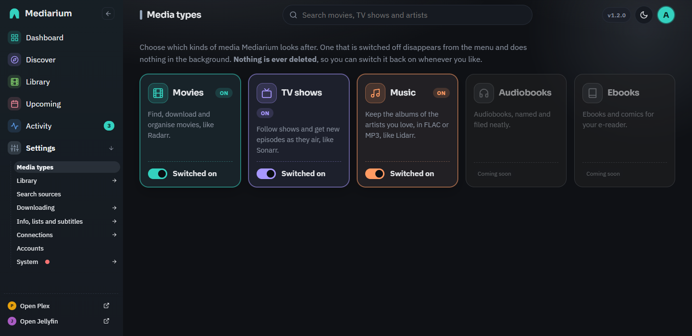
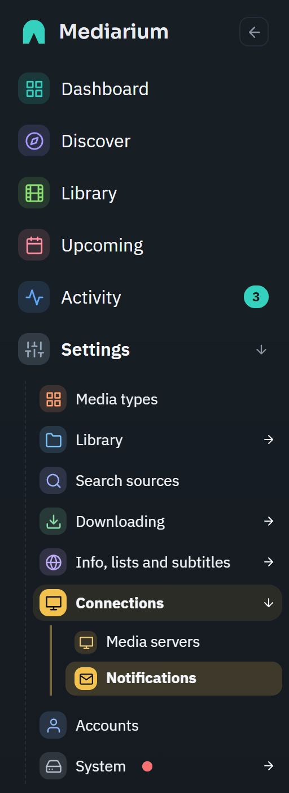
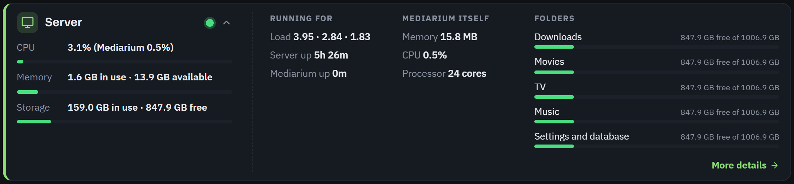

# Media types (modules)

Mediarium looks after several kinds of media, and each kind is a module. **Settings > Media types** (administrators only) is where you switch them on and off. A module that's off disappears from the menu and does nothing in the background.

| Module | Default | State |
|---|---|---|
| Movies | on | available |
| TV | on | available |
| Music | off | available, see [music.md](./music.md) |
| Audiobooks | off | coming soon (cannot be switched on yet) |
| Ebooks | off | coming soon (cannot be switched on yet) |

## The Media types page



*Settings > Media types. Movies, TV shows and Music are switched on. Audiobooks and Ebooks are greyed out as coming soon. The Settings entry in the sidebar is open.*

**Settings > Media types** is the first page in Settings, and the one administrators land on. Each kind of media has a card with a switch, side by side and all the same height. There's no Save button, and a small message confirms the change. If the server refuses it, the switch goes back and the reason is shown.

- **Movies**, **TV shows** and **Music** can be switched on and off.
- **Audiobooks** and **Ebooks** are greyed out with a "Coming soon" label.
- Each card says **On** or **Off**, and its switch reads **Switched on** or **Switched off**.
- The last module that's on can't be switched off. Its switch is locked, with a note that Mediarium needs at least one kind of media.
- All five cards look alike: an icon, the name, a one-line description and either the switch or the "Coming soon" label.
- The music folder and the **Import my existing collection** button are on the **Folders and file names** page, with the movie, TV and downloads folders (see [music.md](./music.md#importing-an-existing-collection)). The music folder shows there even while Music is off, greyed out with a note to switch Music on first. The Ebooks and Audiobooks folders are greyed out as "Coming soon", with the folder Mediarium would use (from `EBOOKS_DIR` and `AUDIOBOOKS_DIR`, or the one you set in the setup wizard).

Every signed-in account, basic users included, sees only the modules that are on. The Movies, TV and Music tabs in the Library and Discover, and the music pages, appear and disappear with the switches.


*The Library with all three modules on: one tab each for Movies, TV and Music. Switch a module off and its tab disappears.*



*The Settings menu in the sidebar. Pages on one topic share an entry (here Connections). Opening it shows its pages underneath, and the other entries stay closed.*

## In the setup wizard

The second step of the first-run wizard is **What do you want to manage?**, with the same five cards. Movies and TV shows start on, Music starts off, and Audiobooks and Ebooks are marked coming soon. At least one has to stay on. Your choice is saved to the same switches (`PUT /api/modules`), and the later steps only ask about what you picked. The **Library paths** step has a box for each kind you chose plus Downloads, and **Quality & naming** talks only about movies and TV shows (with music alone there's nothing to pick there). Folders for ebooks and audiobooks can be filled in ahead of time in a section for later.

## Folders for each module

Each kind of media has its own folder, set with a container variable (or the box in the wizard and Settings). The value in Settings wins over the variable.

| Module | Variable | Default | Setting |
|---|---|---|---|
| Movies | `MOVIES_DIR` | `/movies` | `library.movies_path` |
| TV | `TV_DIR` | `/tv` | `library.tv_path` |
| Music | `MUSIC_DIR` | `/music` | `music.path` |
| Ebooks | `EBOOKS_DIR` | `/ebooks` | `ebooks.path` |
| Audiobooks | `AUDIOBOOKS_DIR` | `/audiobooks` | `audiobooks.path` |

Downloads use `DOWNLOADS_DIR` (`/downloads`, setting `library.downloads_path`). `GET /api/settings` returns the folder in use for each (`moviesPath`, `tvPath`, `downloadsPath`, `musicPath`, `ebooksPath`, `audiobooksPath`) and a read-only `containerFolders` object with the values from the environment, so a screen can tell when a saved folder differs from the mapped one.

### Adding music, ebooks or audiobooks later

1. Create the folder on your server (on a NAS, before the next step, or Docker won't start).
2. Give it to the container: either a `*_DIR` line in `environment` pointing inside your `/data` folder (for example `MUSIC_DIR=/data/music`), or a `volumes` line such as `- /path/to/music:/music`. Then recreate the container ([INSTALL.md](./INSTALL.md#optional-folders-music-ebooks-and-audiobooks)).
3. Switch the type on under **Settings > Media types** (music today), and check the folder under **Settings > Library > Folders and file names**, which shows whether it's **Mapped to your device**.

## On the dashboard

The top row of the dashboard has a card for every kind of media (Movies, TV shows, Music, Audiobooks, Ebooks) and a compact **Server** card as the last one. A card shows how many you have and opens that Library tab. A kind that's switched off keeps its card, dimmed with an "Off" label and the count it had. Audiobooks and Ebooks are dimmed with "Coming soon". The Server card shows the processor (with Mediarium's own share), memory and storage in use, with a small dot that turns amber and then red as any of them fills up. What's downloading and what's wanted are in the greeting card above it. The wanted number is the length of the list on Upcoming > Wanted: monitored titles with no file, and episodes that have already aired. On wide screens all six cards sit in one row, on medium screens in two rows of three, and on phones two by two. Basic users don't see the Server card.



*The Server card opened in place: load and uptimes, what Mediarium itself uses, and one bar per folder. Press it again to close it.*

The full picture (bars for CPU, memory and storage side by side, load, uptimes and the disk of each folder) is on the Server card of the **Server and backup** settings page.

The numbers come from `GET /api/system/stats` (administrators only).

- `cpu.percent` is the whole machine, all cores together (100 means every core busy). In a container limited to fewer cores than the machine has (Docker `--cpus`, a NAS app limit), it's that container's own use of its allowance instead, and `cpu.cores` is the allowance.
- `app.cpuPercent` is Mediarium's own use as a share of **one** core (100 is one core fully busy, 250 is two and a half), so it can pass 100 on a multi-core machine.
- On Docker Desktop for Windows or macOS, the container only sees the small Linux virtual machine Docker runs in, not the computer around it. An idle Mediarium then shows about 0% for the machine, while `app.cpuPercent` shows what Mediarium itself uses.
- Readings are taken over at least a second, so opening the page twice in a row shows the same figure.
- `storage` (`{usedBytes, freeBytes, totalBytes}`) adds up the disks that hold the downloads, movies, TV, music (when the music module is on) and settings folders. Each disk is counted once, however many of the folders are on it. Two folders count as one disk when the system gives them the same device or file system id, or when they report exactly the same total, free and used space. That second check catches a NAS volume (Synology Btrfs shares, for example) whose shared folders are separate mounts that all sit on one volume. On Windows a disk is a drive letter. `disks` still lists every folder.

## What switching a module off does

- Its pages are hidden, for basic users too.
- Automation skips it: no scheduled searches, no RSS sync and no automatic retries for that kind of media.
- Adding a title of that kind is refused with `409` and "Movies are switched off. Switch them on in Settings > Media types." (for TV: "TV is switched off. Switch it on in Settings > Media types."). That includes grabbing a release from the search page that would add one.
- **Nothing is deleted.** Your movies, shows, artists, files and settings stay as they are. Downloads already running finish. Switch the module on again and everything carries on.

At least one kind of media must stay on. A change that would switch every available module off is refused.

## For scripts

`GET /api/modules` (any signed-in account) returns

```json
{
  "movies":     {"enabled": true,  "available": true},
  "tv":         {"enabled": true,  "available": true},
  "music":      {"enabled": false, "available": true},
  "audiobooks": {"enabled": false, "available": false},
  "ebooks":     {"enabled": false, "available": false}
}
```

`PUT /api/modules` (administrators) takes any of `{"movies": bool, "tv": bool, "music": bool, "audiobooks": bool, "ebooks": bool}` and returns the same shape. Fields left out keep their module as it is. Turning audiobooks or ebooks on is refused with 400 `{"error": "Coming soon"}`, and a change that leaves nothing on with 400 `{"error": "At least one media type has to stay switched on."}`. A refused request changes nothing.

The switches are stored as the settings `modules.movies`, `modules.tv`, `modules.music`, `modules.audiobooks` and `modules.ebooks` (see [reference/settings-keys.md](./reference/settings-keys.md)). The older `music.enabled` setting still works: it's used while `modules.music` has never been set, and is kept in step when the switchboard changes music. `PUT /api/settings` with `musicEnabled` goes through the same rules.
