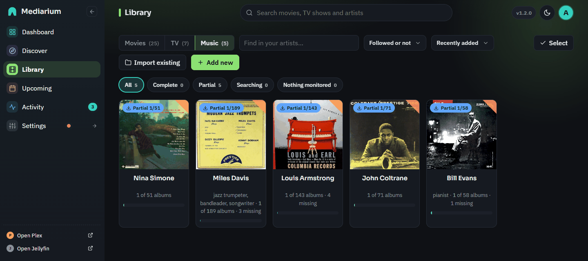
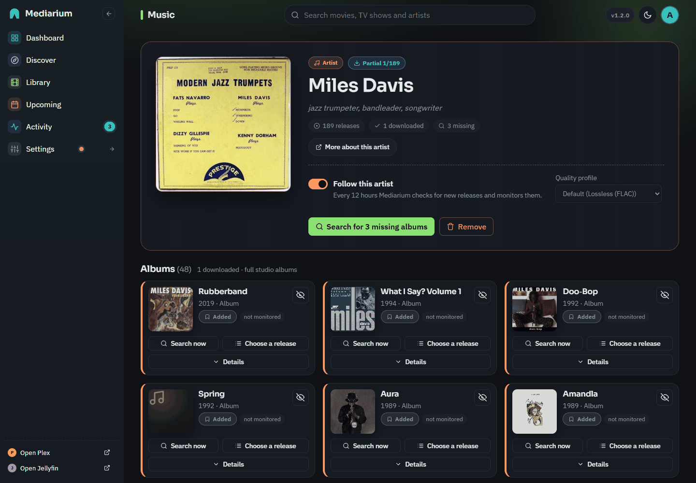
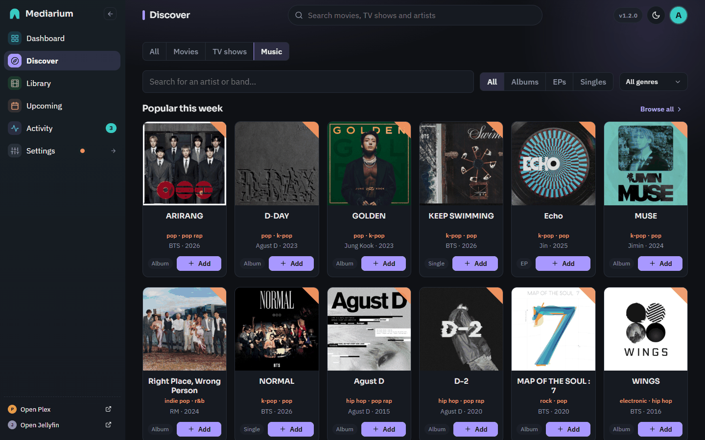

# Music

Mediarium can look after a music collection: artists, their albums and the tracks on them. It finds them with the same indexers, and downloads them with the same Usenet and torrent downloaders, as your movies and shows. Music is a module you switch on. Until you do, nothing about music appears or runs.

## Switching it on

1. Decide where your music lives. Inside the container this is `/music`. With the recommended single `/data` folder (see [INSTALL.md](./INSTALL.md)), add this line to the `environment` section of your compose file so music sits beside your movies and TV and finished downloads can be hardlinked:

   ```yaml
         - MUSIC_DIR=/data/music
   ```

   Or map a folder of its own, for example `- /volume1/music:/music` (no `MUSIC_DIR` line is needed while the right side stays `/music`). The compose file in the install guide has both as commented lines you can switch on. On a NAS, create the folder first, or Docker stops with `Bind mount failed ... does not exist`. The folder is only used once the module is on.
2. As an administrator, open **Settings > Media types** and switch on **Music** (see [modules.md](./modules.md)). Then you can change the music folder on the **Folders and file names** page (Settings > Library). The value in Settings wins over `MUSIC_DIR`.

In the first-run setup wizard, choosing Music on the **Media types** step adds a music box to the **Library paths** step. It starts from `MUSIC_DIR`. If nothing is mapped at `/music` but your movies and TV share a parent folder such as `/data`, it suggests a folder inside it (for example `/data/Music`). If the folder isn't mapped at all, it shows the exact compose line to add.

Switching it off again hides the music pages and stops automatic album searches. Nothing is deleted: your artists, albums and files stay, and downloads already running finish.

For scripts: `PUT /api/settings` with `{"musicEnabled": true, "musicPath": "/data/music"}` switches it on, `PUT /api/modules` with `{"music": true}` does the same, `GET /api/modules` tells every signed-in account which modules are on, and while the module is off every `/api/music/...` request answers 404 `{"error": "The music module is switched off. ..."}`.

## In the app

With the module on, music shows up next to movies and TV. Basic users can browse, add artists and grab releases. The buttons that delete things or change settings are for administrators.



*Library, Music tab: your artists, with how many of their albums you have.*



*An artist page: the summary, the follow switch and quality profile, and the albums with their status.*



*Discover, Music tab: the same filter row as Movies and TV shows, and the rails of popular and new albums.*

- **Library, Music tab** (`/library?kind=music`): your artists as cards with a coloured corner, how many albums you have and how many are missing. Find an artist by name, filter by followed or not, sort by name, date added or most albums missing, and use the chips for Complete, Partial, Waiting for a release or Nothing monitored. **Add new** opens the artist search, **Import existing** starts the collection scan (administrators). Administrators can also use **Select** to follow, stop following, set the quality profile of or remove several artists at once (see [library.md](./library.md)). A kind that's switched off has no tab. If your last-used tab was switched off, the first tab that's on opens.
- **Artist page** (`/music/artist/{id}`): the artist with a summary (releases, downloaded, missing, the quality profile in use, monitored) and their **Albums**, **EPs** and **Singles** as cards. Each card shows the cover, year, quality, what it's doing (Waiting for a release, Downloading with a progress bar, Downloaded, Not monitored) and:
  - an eye button to monitor or stop monitoring the album,
  - **Search now** (or **Look for better** once downloaded),
  - **Choose a release**, the list of releases found, with the quality and the reason automation would skip a release, or a "fallback" label when only a fallback profile accepts it. Grabbing is always allowed,
  - **Details**, which opens the album across the page: **Tracks** (each track with "in library" or "missing"), **Releases**, **What happened** (the album's own activity log, newest first) and **Files** (everything in the album's folder, see below).

  The page refreshes every few seconds while it's open. **Search for N missing albums** searches every monitored album that's missing. Administrators can **Remove** the artist (the "Also delete everything on disk" option is unticked, and shows how many files and how much space the albums take) and change two things right in the summary: **Follow this artist** (whether releases that come out later are picked up, see "Following an artist") and the artist's **Quality profile** (Default, or one of the music profiles). Basic users see both as labels. The cover on the page is the artist's picture (the cover of their first album that has one). When there's none, a music note takes its place.
- **Discover, Music** (`/discover?kind=music`, and inside **All** while Music is on): it has the same row of filters as the Movies and TV shows tabs. To look for an artist by name, use the search box at the top of the page. Below the filters are the rails **Popular this week**, **New releases**, **Coming soon** (albums with a release date still ahead) and **Popular artists**. An album card shows the cover, title, artist, year, whether it's an album, EP or single, and an **Add** button. Artists show how many listens they have. Something already in your library says **In your library** and opens its artist page. Each rail has **Load more** and **Browse all**, which opens the whole list on its own page with pages to step through, a time choice for the popular lists (this week, month, year, all time) and the same filters. The filters are **Genre** (Rock also finds punk rock and hard rock), **From year**, **To year**, **Order** (Most popular, Newest first, Oldest first) and **Type** (Albums, EPs, Singles). Once you pick one, the rails give way to one list of everything that matches, taken from the most played albums of all time, in pages of whole rows. **Hide what I have** leaves out what is already in your library. If a list can't be shown right now, the rail says so instead of staying empty.

  **Add** opens the "Add <artist>" dialog (the same one the header search uses, see "Adding an artist"): **Follow all albums**, **Only future albums** or **Only this album** (for an album; the artist is added but nothing else is monitored), the quality profile, and whether to start searching now. For an artist already in the library, adding an album only switches that album on.
- **Header search**: with music on, the search box at the top also lists matching **Artists** under the movies and shows, each with Add or Open when already in the library. Add opens the same "Add <artist>" dialog as Discover: the choice of what to follow, **Quality profile** and a tick box to start searching now.
- **Album files**: the **Files** tab lists what's in the album's folder (songs, cover, notes) with sizes and dates. **Play** on a song opens a small player in front of the page. **View** shows the cover or a text file. Playing is direct, so it depends on your browser: MP3 and AAC/M4A play everywhere, FLAC in current browsers and Apple Lossless only in Safari. If your browser can't play a file, the player says so. The file itself is untouched.
- **Calendar**: with music on, albums with a release date show up on the Upcoming calendar with an orange round badge with a music note (and an "Album" entry in the legend). Clicking one opens the album on its artist page.
- **Settings > Library > Quality > Music** (administrators): all music profiles as cards with their formats, where they stop upgrading (highlighted), fallback and how many artists use them. **New profile** and **Edit** open the same kind of editor as for movies, scrolled into view with the cursor in the name (name, accepted qualities, the quality at which upgrading stops, upgrades on or off, and the fallback order, which you drag). **Make default** sets the profile artists without one of their own use. **Delete** asks first, and a profile that's the default or that artists use is refused with the reason.
- **Upcoming, Wanted**: with more than one kind of media on, chips (All, Movies, TV shows, Music, each with its own icon) filter the list. Albums that are monitored, released and missing (or below the profile's cutoff, under Upgrades) are listed as "Artist – Album" with the cover, the profile and the last search result on hover, a **Search now** button and a link that opens the album on its artist page. The counts on the Missing and Upgrades tabs include albums.
- **Activity**: album downloads appear in the queue like movie downloads, titled "Artist – Album" with the cover and an orange edge, and with the same retry, blocklist-and-search-again and remove buttons. A failed one opens the album from the arrow. Albums still waiting for a release join the "Waiting for a release" list. Recently added and recently downloaded albums on the dashboard open their album too.
- **Import my music collection** (`/music/import`, administrators): press **Start scanning** and follow the progress bar (it reads the folder, then looks each album up in the music database, one a second). Then you get a summary (added, already in your library, not matched, with a problem) and two lists side by side: what was added (each opens its artist) and what wasn't matched, with the reason and the folder. Scanning again is safe.

## Adding an artist

Search for the artist by name. A short description ("jazz", "UK rock band") tells artists with the same name apart. When you add one, Mediarium lists its **albums, EPs and singles**. Live albums, compilations, remixes, soundtracks and DJ mixes are left out, so the list is the artist's own studio releases.

The Add dialog is the same everywhere you can add an artist (Discover and the header search), with these choices:

| Choice | What is monitored |
|---|---|
| **Follow all albums** (default) | every album, EP and single, and new releases as they come out |
| **Only future albums** | releases that are not out yet (and new ones, once they are found) |
| **Just add the artist** | nothing: the artist is listed, you pick albums yourself |
| **Only this album** (when you add from an album) | that one album; nothing else is monitored |

You can switch any album on or off later. Only albums that are monitored and already released are searched for automatically, and each album has its own switch. Basic users can add artists and albums and grab releases just like movies. Removing an artist is for administrators.

Adding a large discography can take a few seconds, because the music database allows only about one lookup a second. Mediarium remembers answers for a few hours. Where the data comes from is listed under [Sources](#sources).

## How albums are found

Mediarium searches your indexers for **"Artist Album"** in the audio categories (3000 audio, 3010 MP3, 3040 lossless, 3050 other). For every result it reads the release name: artist, album, year, format (FLAC, ALAC, MP3, AAC), bitrate (320, V0, 256, 192), bit depth (16 or 24 bit) and source (WEB, CD, vinyl). Both common styles are understood:

- `Artist - Album (2020) [FLAC 24bit-96kHz]`
- `Artist_Name-Album_Title-(CAT001)-WEB-2020-GROUP`

A release is skipped when it's another artist or another album, a discography or collection instead of one album, dated before the album came out (a later year is fine: that's a reissue or remaster), blocklisted, or of a quality the album's profile doesn't take. The album's page shows every result with these reasons (interactive search), and its activity log records each automatic search: how many releases were found, how many were acceptable, why the others weren't, and which one was picked.

Wanted albums are searched on the same schedule as movies and shows (see [Automatic searching](./quality-profiles.md#automatic-searching)), at most 25 albums per run. A longer wanted list is worked through over the next runs.

### Following an artist

An artist is either **followed** or not (`monitored` on the artist). Following decides one thing: whether releases that come out **later** are picked up. Every 12 hours (while the music module is on) Mediarium checks the releases of each followed artist again. A new album is added and monitored, so it's searched for as soon as it's out, and an announced album that now has a release date gets it. Unfollowing an artist stops that. **It never changes the monitored switch of any album already listed.** Those keep deciding, one by one, what is searched for, so an unfollowed artist's monitored albums are still wanted.

Administrators change it, and the quality profile, with `PUT /api/music/artists/{id}` and `{monitored?: bool, profileId?: number}` (`profileId` 0 puts the artist back on the default profile; a field left out changes nothing). The answer is the artist with its albums, like `GET /api/music/artists/{id}`.

## Quality

Music has its own quality ladder, worst to best: **MP3-192, MP3-256, AAC-256, MP3-320/V0, FLAC, FLAC 24bit**. ALAC counts as FLAC. A release name that says nothing about the format is "Unknown" and isn't taken automatically. An MP3 release that names no bitrate counts as MP3-192. Once files are on disk their quality is read from the files themselves (see below), not from the release name.

Two profiles are built in:

| Profile | Takes | Stops upgrading at |
|---|---|---|
| **Lossy (MP3 320)** (default) | MP3 320/V0, AAC 256 | MP3-320/V0 |
| **Lossless (FLAC)** | FLAC, FLAC 24bit; falls back to *Lossy* when no lossless release exists | FLAC |

Upgrades start off on both, so an album is downloaded once and left alone. "Stops upgrading at" is where a profile stops if you switch upgrades on (Settings > Library > Quality > Music, *Keep looking for better versions after it is downloaded*). An album that's only there because of a fallback profile is still replaced when a release the main profile accepts appears, with upgrades on or off.

MP3 is the default because it's the most common format. With the Lossless profile, an album that's only available as MP3 320 is downloaded as MP3 (a fallback), and replaced as soon as a FLAC release turns up. New installs start with this order. Profiles and the default you already chose are not changed, and they keep the upgrade setting they were saved with. 24-bit FLAC is taken when it's the best release found, but not hunted for: those files are several times larger.

## Where files go

After the download is repaired and unpacked (as for movies), Mediarium finds the audio files (`.flac`, `.mp3`, `.m4a`, `.aac`, `.ogg`, `.opus`, `.alac`), matches them to the album's tracklist from the metadata service, and places them like this:

```
<music folder>/<Artist>/<Album> (<Year>)/01 - Title.flac        one disc
<music folder>/<Artist>/<Album> (<Year>)/2-01 - Title.flac      albums with several discs
```

Plex, Jellyfin and Navidrome all read this layout. Files are hardlinked from the downloads folder when both are on the same disk (no extra space), otherwise copied. `cover.jpg` and `folder.jpg` (or `.png`) are kept beside the tracks. Other files (`.nfo`, `.log`, `.cue`) aren't copied.

Files are matched by disc and track number first (from the file name, or a `CD1`/`Disc 2` folder), then by title, then by number alone. If none of a release's files can be matched, the release is blocklisted as bad and the next-best one is tried, as for movies. Tracks the release doesn't have, and extra files it has, are listed in the album's activity. When an album is upgraded (MP3 to FLAC), the old files are removed once the new ones are in place.

### Your own profiles

Administrators can make, change and delete music profiles, and choose which one is the default (used by artists that have none of their own; the built-in Lossy (MP3 320) until you change it). A profile has a name, the qualities it accepts, a **cutoff** (once an album reaches it, it's no longer searched for upgrades), whether upgrades are allowed at all, and an optional **fallback chain**: other profiles tried, in order, when nothing a profile accepts can be found. The rules are those of the movie and TV profiles: the name is unique, at least one quality is picked, the cutoff must be one of them, and a profile that's the default or that an artist uses can't be deleted (the answer says which). Only a profile's own fallback list is followed.

`POST /api/music/profiles`, `PUT /api/music/profiles/{id}` and `DELETE /api/music/profiles/{id}` take and return `{id, name, allowed[], cutoff, upgradeAllowed, fallback[], default, inUse}` (`GET /api/music/tiers` lists the qualities to pick from, worst to best). The default is chosen with `musicDefaultProfileId` in `PUT /api/settings` (stored as `music.default_profile_id`).

### Tags and real quality

Mediarium reads the tags inside audio files (ID3, Vorbis comments, MP4) with the [dhowden/tag](https://github.com/dhowden/tag) library: title, artist, album artist, album, track and disc number, year and whether a picture is embedded. **It only reads. Your files and their tags are never rewritten.** After a download the tags identify each file first (track and disc number, title), then the file and folder names fill in what the tags lack.

The quality of the files is read from their headers, so it's what the files are and not what the release was called:

| Format | How it is rated |
|---|---|
| FLAC | 16 bit is **FLAC**, 24 bit is **FLAC 24bit** |
| Apple Lossless (`.m4a`) | the same, from the bit depth stored in the file |
| MP3, constant bitrate | 320 kbit/s is **MP3-320/V0**, 256 is **MP3-256**, less is **MP3-192** |
| MP3, variable bitrate | by the average bitrate: about 220 kbit/s and up (LAME V0 averages 220 to 260) is **MP3-320/V0**, 190 and up **MP3-256**, less **MP3-192** |
| AAC (`.m4a`, `.aac`) | 224 kbit/s and up is **AAC-256**, less ranks with the lowest MP3 |
| Ogg Vorbis and Opus | a rough guide from the average bitrate, on the MP3 steps |

An album is rated by its weakest file, so one MP3 among FLAC files makes it MP3. A file whose header can't be read is left out of the count. When none can be read the album is **Unknown**, which automation never upgrades.

## Files and playing tracks

`GET /api/music/albums/{id}/files` (any account) lists the files in an album's folder like the movie and show file listings: `{folder, files: [{path, size, modified, kind, main, trackId}]}`. `folder` is relative to the music folder (never the full path on the server), `kind` is `audio`, `image`, `nfo`, `subtitle` or `other`, and a track's file has `main: true` and its `trackId`. An album that isn't on disk yet has an empty listing.

`GET /api/files/stream?album={id}&path=<relative path>` sends one of those files as it is, with range support so a browser can seek, and an audio file with its own type: `audio/flac`, `audio/mpeg` (MP3), `audio/mp4` (M4A, ALAC), `audio/aac`, `audio/ogg` and `audio/opus`. The cover and text files preview as they do for movies, and everything else is refused. Every answer keeps the `nosniff`, `Content-Security-Policy: sandbox` and inline `Content-Disposition` headers. Only files inside the album's folder, which must lie inside the music folder, can be reached: no `../`, no absolute paths, no symbolic links leading out. Whether a browser can play a format is up to the browser (MP3 and AAC/M4A play everywhere, FLAC in current browsers, ALAC only in Safari). Playing is refused while the music module is off.

## Dashboard

`GET /api/dashboard` (any account) has a `library.music` block, `{artists, albums, downloaded, missing}`, counted from your library whether or not the music module is switched on (zeros when there's nothing). `missing` counts albums that are neither downloaded nor downloading. The other fields are unchanged.

## Calendar

Albums appear on the calendar (`GET /api/calendar`, entries with `kind: "album"`) while the music module is on: monitored albums that come out within the same window as episodes, 30 days back and 120 days ahead. Only albums with a full release date can be placed on a day, so an album that's only dated to a year isn't shown. An entry is `{kind: "album", id, albumId, artistId, title: "Artist — Album", subtitle: "Album"|"EP"|"Single", releaseDate, status}`. Movies and episodes are unchanged.

## Media servers

After an album is imported, Plex, Jellyfin and Emby are asked to scan its folder, with the same short wait, path mapping and settings as for movies and shows ([media-servers.md](./media-servers.md)). Albums found by scanning an existing folder aren't announced, because the files were already there. Point your media server's music library at the same folder as Mediarium's music folder.

## Discover

The Music option on Discover also lists what's popular, what came out lately and what's coming. The lists come from a free public service that needs no account or key. They're kept in memory for an hour, so many people can open the page without asking again. Every account can use them, and like every music route they answer 404 while the module is off.

`GET /api/music/discover` takes:

| Query | Values | Meaning |
|---|---|---|
| `list` | `popular` (default), `new`, `upcoming` | `popular`: the most listened-to releases over `range`. `new`: released in the last 14 days, newest first. `upcoming`: dated after today, up to 90 days ahead, soonest first. |
| `type` | `all` (default), `album`, `ep`, `single` | Only that kind of release. Live albums, compilations, remixes and other odd releases are left out, as they are when an artist is added. |
| `range` | `week` (default), `month`, `year`, `all_time` | Only for `popular`. |
| `genre` | a genre name, case-insensitive | Only releases with a tag that is that genre or a kind of it (`rock` finds `punk rock`). A list whose releases carry no tags at all cannot be filtered, so the genre is then ignored. |
| `yearFrom`, `yearTo` | a four digit year | Only releases from that year on, and up to that year. A release with no known date is left out when either is given. |
| `sort` | `popular` (default), `newest`, `oldest` | `popular` keeps the order of the list. The other two order by release date; releases with no date come last. |
| `page`, `pageSize` | 1.., 24 (at most 100) | Paging. |

It answers `{page, totalPages, items, note?}` where each item is `{mbid, title, type, artistName, artistMbid, releaseDate, genres, coverUrl, inLibrary, artistId?, albumId?}`. `mbid` is the release group id, `type` is `album`, `ep` or `single`, `genres` is a list of up to four names (empty when there are none), and `releaseDate` is `YYYY-MM-DD` (or a shorter date, or empty, when only that is known). `inLibrary` is true when that album is already in your library (then `albumId` and `artistId` are set and `coverUrl` is the album's own cover). `artistId` alone means you have the artist but not that release. `totalPages` is at least 1, and a page past the end has no items. If the lists can't be reached the answer is still 200 with `items: []` and `note: "The list is not available right now. Try again later."`.

`GET /api/music/discover/artists?range=week|month|year|all_time&page=&pageSize=` lists the most listened-to artists as `{page, totalPages, items: [{mbid, name, listenCount, inLibrary, artistId?, coverUrl?}], note?}` (`coverUrl` is only there for artists you have). Add one with `POST /api/music/artists` and its `mbid`.

Covers on these lists never come from an outside host. `coverUrl` is `/api/music/covers/release-group/{mbid}` (any account), which fetches the front cover of that release group once, keeps it in the `music-covers` folder and serves it like the album covers below. A release group without cover art answers a plain 404.

## Cover art

Covers are the 500 pixel front cover of the album, fetched **once** per album and kept in the `music-covers` folder inside your config folder, so the app never loads images from an outside site and your browser only talks to Mediarium. `GET /api/music/albums/{id}/cover` and `GET /api/music/artists/{id}/cover` (any account) serve the image with cache headers so browsers keep it for a day. An artist's picture is the cover of its first album that has one. If there's no cover the answer is a plain 404, and Mediarium doesn't look again for a day.

When an album is imported after a download and its folder has no `cover.jpg`, `folder.jpg` or `cover.png`, the cover is saved there as `cover.jpg` (`cover.png` for a PNG) so Plex, Jellyfin and Navidrome show it too. **An existing cover is never replaced**, and a cover file already in the album folder is also what the cover routes serve. Scanning an existing collection writes nothing into your folders.

## Importing an existing collection

If your music is already in the music folder as `Artist/Album/tracks` (a year in the album folder name helps: `Album (1997)`, `1997 - Album`), an administrator can have Mediarium find it. `POST /api/music/import/scan` reads the folder in the background, looks every artist and album up in the music database by name (and year), and registers what matches **where it is**. No file is moved, renamed or changed.

- A matched artist is added to the library with its albums, EPs and singles. Only the albums found in your folder are monitored, so nothing else starts downloading.
- A matched album is marked downloaded, its folder recorded and each track linked to its file.
- The tags of the files say who and what an album is (the artist, album and year most of its files agree on), so a folder with a wrong or odd name is still found. The folder names are used when the files have no tags, and as a second try when the tags find nothing in the music database.
- The quality is read from the files (see "Tags and real quality"). It's **Unknown** only when no file's header can be read. Automation leaves an Unknown album alone, so it's never swapped for a better release behind your back. Choose the album and search by hand if you want an upgrade.
- What doesn't match is reported, with the reason: no artist of that name in the music database, no album of that name among the artist's albums, or audio files loose in an artist folder (put them in an album folder).
- Scanning again is safe: albums already registered are reported as "already in your library".

`GET /api/music/import/scan/{id}` answers `{id, root, phase: "scanning"|"matching"|"done"|"failed", done, total, summary: {artists, albums, imported, already, unmatched, failed}, results: [{artist, album, folder, files, status: "imported"|"already"|"unmatched"|"failed", message, artistId, albumId, quality, tracks}], error?}`. Starting a scan while one is running returns the running one.

## Removing an artist

Removing an artist (administrators) always cancels its downloads and deletes their files in the downloads folder. With **Delete files** its album folders in the music folder go too, and the artist folder once it's empty. Nothing outside the music folder is ever deleted.

## Sources

Album, artist and release information, cover art and the popular and new-release lists on Discover all come from free public music services. They ask apps to make at most one request per second and to say who they are, and Mediarium does both. The services are named and credited on the **About and credits** page in the app and in [LEGAL.md](./LEGAL.md).

## API

| Method | Path | Body / query | Answer |
|---|---|---|---|
| GET | `/api/music/search?q=` | | `[{mbid, name, sortName, disambiguation, type, country, score, artistId}]` (`artistId` 0 when not added) |
| GET | `/api/music/discover?list=&type=&range=&genre=&yearFrom=&yearTo=&sort=&page=&pageSize=` | see "Discover" | `{page, totalPages, items: [{mbid, title, type, artistName, artistMbid, releaseDate, genres, coverUrl, inLibrary, artistId?, albumId?}], note?}` |
| GET | `/api/music/discover/artists?range=&page=&pageSize=` | | `{page, totalPages, items: [{mbid, name, listenCount, inLibrary, artistId?, coverUrl?}], note?}` |
| GET | `/api/music/covers/release-group/{mbid}` | | the front cover of a release group (JPEG or PNG), or a plain 404 |
| GET | `/api/music/profiles` | | `[{id, name, allowed[], cutoff, upgradeAllowed, fallback[], default, inUse}]` |
| GET | `/api/music/tiers` | | `["Unknown", "MP3-192", ..., "FLAC 24bit"]` |
| POST | `/api/music/profiles` | `{name, allowed[], cutoff, upgradeAllowed, fallback[]}` | 201 profile; admin only |
| PUT | `/api/music/profiles/{id}` | same (a missing `fallback` keeps the chain) | the profile; admin only |
| DELETE | `/api/music/profiles/{id}` | | 409 when it is the default or in use; admin only |
| POST | `/api/music/artists` | `{mbid, monitor?: "all"\|"future"\|"none", profileId?, searchNow?}` | 201 artist with `albums` |
| GET | `/api/music/artists` | | `[artist]` |
| GET | `/api/music/artists/{id}` | | artist with `albums` |
| PUT | `/api/music/artists/{id}` | `{monitored?, profileId?}` | the artist with `albums`; admin only |
| DELETE | `/api/music/artists/{id}?deleteFiles=true` | | admin only |
| GET | `/api/music/albums/{id}` | | album with `artistName` and `tracks` |
| PUT | `/api/music/albums/{id}/monitored` | `{monitored}` | |
| POST | `/api/music/albums/{id}/search` | | `[release]` with `rejections` |
| POST | `/api/music/albums/{id}/grab` | `{releaseTitle, downloadUrl, sizeBytes, protocol?}` | 202 `{queueId}` |
| POST | `/api/music/albums/{id}/search-now` | | `{grabbed, message}` |
| GET | `/api/music/albums/{id}/files` | | `{folder, files: [{path, size, modified, kind, main, trackId?}]}` |
| GET | `/api/files/stream?album={id}&path=` | | one file of the album, with ranges (audio types as above) |
| GET | `/api/music/albums/{id}/cover` | | the cover image (JPEG or PNG), or a plain 404 |
| GET | `/api/music/artists/{id}/cover` | | a picture for the artist (its first album cover), or a plain 404 |
| GET | `/api/music/albums/{id}/events` | | `[{at, kind, message, level}]` |
| GET | `/api/music/wanted?kind=missing\|cutoff` | | `[album + {artistName, profileName, cutoff, lastSearch, lastSearchAt}]` |

An artist is `{id, mbid, name, sortName, disambiguation, monitored, monitorNew, profileId, profileName, addedAt, addedBy, albumCount, monitoredCount, downloadedCount, coverUrl, imageUrl}`; an album `{id, artistId, mbid, title, type, releaseDate, year, monitored, status, quality, path, coverUrl, coverArchiveUrl}`; a track `{id, disc, position, title, lengthMs, hasFile, filePath}`. A release in the interactive search carries what its name says (`artist, album, year, format, bitrate, bitDepth, source, discography, quality`) beside the usual `title, indexerName, protocol, downloadUrl, sizeBytes, publishDate, seeders, peers, blocklisted, rejections, acceptedBy`. `coverUrl` (and, on artists, `imageUrl`, the same address) point at the cover routes above. `coverArchiveUrl` is the address of the original picture at the cover-art service. Album downloads appear in `GET /api/queue` with `albumId` and the title "Artist – Album".
