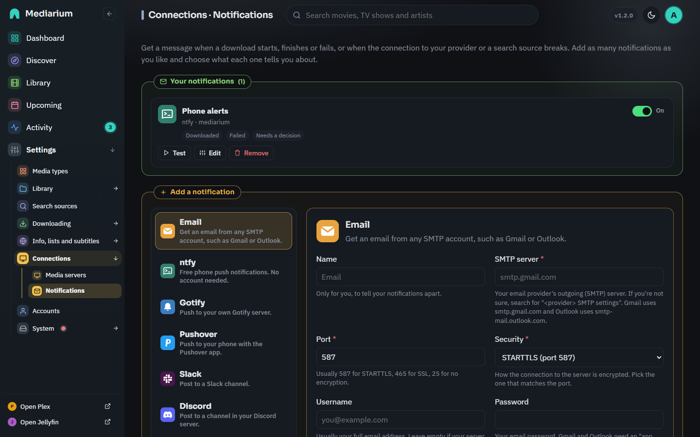

# Notifications

Notifications tell you when something happens: a download started or finished, a download failed, Mediarium needs a decision, a subtitle arrived, a connection to your Usenet provider or an indexer broke, an error was added to Logs and errors, or a new version of Mediarium is out. Administrators set them up under **Settings > Connections > Notifications**.

## The page

- **Your notifications** at the top lists everything you have set up, one card each: the logo, its name, where it goes, and what it tells you about. Every card has an **on/off switch** (off keeps the settings but sends nothing), **Test** (sends a test message right now), **Edit** and **Remove**. With no notifications yet, the section says so and suggests ntfy, which needs no account.
- **Add a notification** below it has the list of ways to be notified on the left and the form for the one you picked on the right. On a phone the list becomes a row you slide sideways. What you type in one method is kept while you look at the others (a small dot marks the ones you started), until you press **Add**.



*Settings > Connections > Notifications: the notifications you have set up, each with its switch, Test, Edit and Remove, and the ways to add another below.*

## Ways to be notified

| Method | What it needs |
|---|---|
| Email | The outgoing (SMTP) server of your email account, a login if it needs one, a "from" and a "to" address. Gmail and Outlook need an app password. The **From name** box sets the name emails show as coming from (Mediarium unless you change it). |
| ntfy | A topic name, nothing else. Free push messages to your phone; use your own ntfy server if you have one. |
| Gotify | The address of your Gotify server and an application token. |
| Pushover | Your user key and an application token from pushover.net. |
| Slack | An incoming-webhook address from a Slack app. |
| Discord | A webhook address from a channel's Integrations settings. |
| Telegram | A bot token from @BotFather and the chat ID. |
| Webhook | Any address; Mediarium sends it a small JSON message, for your own automations. You can write your own JSON body with `{{event}}`, `{{title}}`, `{{message}}` and `{{at}}`. |

## Adding one

1. Choose the method on the left.
2. Fill in the fields. Each has a short explanation underneath, required ones are marked with a star, and mistakes (an address without `http://`, an email address without an `@`, a port that is not a number) are pointed out as you type.
3. Choose **when** it should tell you: download started, downloaded, failed, needs a decision, subtitles, something is wrong, a new version of Mediarium. The default is downloaded, failed, something is wrong and a new version.
4. Press **Send a test** and check your device, then **Add**. Add works without a test, but a test finds a wrong address or password before you rely on it.

### The test log

**Send a test** shows a dark log box under the form, for every method, with a line for each step and the time it happened, for example:

```
14:05:01.113  Connecting to smtp.example.com:587
14:05:01.290  Connected
14:05:01.291  Starting a secure connection
14:05:01.402  Secure connection started (TLS 1.3)
14:05:01.403  Signing in as name
14:05:01.655  Sign-in refused: wrong username or password (535)
```

The last line is the result: `Done: accepted by the server`, or the reason it failed, such as `Could not connect: connection refused`, `Refused: wrong token, key or password (401)` or `Not found: check the address, topic or chat (404)`. **Copy** puts the whole log on your clipboard. Passwords, tokens and the secret part of a webhook address are never in it. The friendly one-line result stays above it. The same log appears when you press **Test** on a notification you already set up. Scripts get the lines as `steps` (`time`, `text`, `ok`) in the answer of `POST /api/notifications/test`.

## What a message looks like

Every message has a clear subject and the same details, made from one template, so an email, a Discord message and a phone push say the same thing:

| Event | Subject |
|---|---|
| Downloaded | `Titanic (1997) is ready to watch` (an album: `is ready to listen to`) |
| Download started | `Downloading Titanic (1997)` |
| Failed | `Download failed: Titanic (1997)` |
| Needs a decision | `Needs your decision: Titanic (1997)` |
| Subtitles | `Subtitles added: Titanic (1997)` |
| Something is wrong | `Mediarium needs attention: your Usenet login was refused` |
| New version | `Mediarium 2.1.0 is available` |
| Test | `Mediarium test message` |

Under the subject is one sentence and a small table: title, year, quality, size, where it was saved (or the reason it failed, or the release name) and the time.

- **Email** is a formatted page with the Mediarium name on the brand colour, the poster, the table and an **Open in Mediarium** button, plus a plain-text version of the same message for mail programs that don't show pages. It loads nothing but the poster picture from TMDB: no tracking pictures, scripts or fonts. A message about a problem uses a warmer colour under the header.
- **Discord** gets an embed with the poster as a thumbnail and a field per detail. **Slack** gets a header, the sentence, the details in two columns and a button. **Telegram** gets bold text and a link. **ntfy** gets a title, a priority, an emoji tag for the event, and the title's page as the tap action. **Gotify**, **Pushover** and webhooks get the same subject and details in their own format.
- A webhook keeps `event`, `title`, `message` and `at`, and adds `details` (a list of `label` and `value`), and `link` and `poster` when there are any. `title` is now the subject and `message` the sentence with the details, one per line. A custom JSON body sees the same `{{title}}` and `{{message}}`.

### The link

**Quiet hours** on the same page hold everyday messages (downloading, ready to watch, subtitles, a new version) between two hours, for example from 23:00 to 7:00; they arrive together when the quiet hours end. Problems (a failed download, a broken connection, a decision to make) are always sent straight away. Waiting messages are kept in memory, so a restart during the quiet hours drops them. The hours are server time. Stored as `notify.quiet_hours` ("23-7"); scripts use `notifyQuietHours` in `PUT /api/settings`. A season pack already sends one message, not one per episode.

**Link in messages** on the same page holds the address you open Mediarium at, for example `https://mediarium.example.com`. Saved by itself. With it, messages get the **Open in Mediarium** button, and the footer of an email links to this page. Without it, messages carry no link. Scripts use `publicUrl` in `PUT /api/settings`, stored as `server.public_url`.

**What is checked.** Web addresses must start with `http://` or `https://` and name a server. The email server is a bare host name (`smtp.gmail.com`, no `http://` and no port), the port is a number from 1 to 65535, and every From and Send to address must look like `name@example.com`. Email needs a username and password together, or neither. Tokens and keys can't contain spaces or line breaks, and a Telegram chat ID is a number (groups start with a minus sign) or an `@channel` name. The page says what is wrong under the field, and the server refuses the same mistakes if you use the API directly.

## Changing or removing one

**Edit** opens the same form filled in. Passwords, tokens, keys, webhook addresses and ntfy topics are stored encrypted and are never shown again: their fields say "Saved. Leave empty to keep it." so you don't need to type them again to keep them. **Save changes** saves your edits, and a test from the edit form uses what is in the form.

## Connection watch

Every half hour Mediarium checks that your Usenet provider and indexers still accept your login. If one stops working it notifies you once, and again when it recovers; turn on **Something is wrong** on a notification to get these. **Check now** runs it straight away. The box **Check every … minutes** changes how often (5 or more; 0 turns the checks off), and you press **Save**. Scripts use `monitorIntervalMinutes` in `PUT /api/settings`, stored as `monitor.interval_minutes`.

## Errors

Turn on **Tell me when an error happens** at the bottom of **Settings > System > Logs and errors** to get a message, through the notifications that have **Something is wrong** ticked, whenever a new error is added to that page. Warnings are not sent. It is off by default. See [Logs and errors](logs-and-errors.md#messages-about-errors).

## New versions

Once a day (see [INSTALL.md](./INSTALL.md#knowing-when-there-is-a-new-version)) Mediarium checks whether a newer release is out. When one is, it sends one message for that version to every notification that has **New version** ticked, and no more for the same version. Notifications you made before this existed do not have it ticked: edit them to add it.

## For scripts

`GET /api/notifications`, `POST /api/notifications`, `PUT /api/notifications/{id}` (also used by the on/off switch), `DELETE /api/notifications/{id}`, `POST /api/notifications/test` (send the form as it stands, or just `{id}` for a saved one), `GET /api/notifications/types` (the methods and their fields) and `GET /api/notifications/events` (the events you can choose) are listed in [reference/api.md](./reference/api.md). All are administrator-only.
