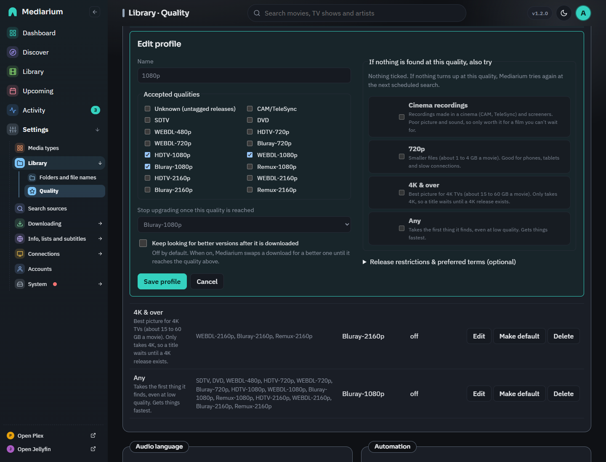

# Quality profiles

A quality profile decides which releases Mediarium may download for a movie or show, and when it stops looking for something better. Every title uses the **default profile** unless you give it one of its own. Change the default with **Make default** on Settings > Library > Quality (or `PUT /api/settings` with `defaultProfileId`), and a single title's profile from its page.

A profile has:

- **Accepted qualities**: the quality tiers it accepts, such as `WEBDL-1080p` or `Bluray-2160p`. A release in any other tier is skipped.
- **Stop upgrading once this quality is reached** (the *cutoff*): once a title has a file at or above this tier, Mediarium stops searching for upgrades.
- **Keep looking for better versions after it is downloaded** (shown as *Better versions* in the list, `upgradeAllowed` in the API): a title with a file below the cutoff keeps being searched for a better allowed release. Left off, the first acceptable release is kept. A new profile starts with it off.
- Optional **Release restrictions & preferred terms**: words a release name must contain at least one of, words it must not contain any of, and preferred words with a score. One term per line, matched anywhere in the release name, ignoring capitals, with dots and dashes counting as spaces.
- Optional fallback profiles (**If nothing is found at this quality, also try**): other profiles to try, in order, when nothing found is acceptable to this one (see below).

*Settings > Library > Quality: the profiles come first, each with its qualities, where it stops upgrading, and Edit, Make default and Delete. The default profile's fallback order sits below the list.*

*Edit on a profile opens this form above the list.*

## The built-in presets

Mediarium comes with five presets, loosely based on the [TRaSH Guides](https://trash-guides.info/) recommendations. All five start with better versions off, so a title is downloaded once and then left alone. The cutoff in the table is where a profile stops if you switch better versions on. They're listed from lowest to best, with Any last.

| Preset | Allowed qualities | Cutoff | Good for |
|---|---|---|---|
| **Cinema recordings** | CAM/TeleSync only | CAM/TeleSync | a film that is still only in cinemas |
| **720p** | HDTV-720p, WEBDL-720p, Bluray-720p | Bluray-720p | small screens, little storage or slow connections |
| **1080p** (default) | HDTV-1080p, WEBDL-1080p, Bluray-1080p | Bluray-1080p | most people |
| **4K & over** | WEBDL-2160p, Bluray-2160p, Remux-2160p | Bluray-2160p | 4K screens with plenty of storage |
| **Any** | every recognised tier, from SDTV and DVD up to Remux-2160p | Bluray-1080p | getting *something* for rare or old titles |

Good to know:

- **Each resolution preset takes only its own resolution.** 1080p never settles for 720p and 4K & over never settles for 1080p. A title with no release at that resolution waits until one appears. Use **Any** (or your own profile) for titles that may never get one.
- **1080p** doesn't include **Remux-1080p**. A remux is an untouched copy of the disc, often 20 to 40 GB per movie, several times the size of a Bluray encode that looks the same on most screens. For remuxes, make your own profile.
- **4K & over** has a Bluray-2160p cutoff, so a 4K remux is downloaded only when it's the best release found, not hunted as an upgrade.
- **Any** stops upgrading at Bluray-1080p, so a title isn't chased all the way to a 4K remux. Releases whose name carries no recognisable quality aren't accepted.
- **Cinema recordings and screeners** (CAM, HDCAM, TeleSync/TS/HDTS, Telecine/TC, screeners, R5) are their own quality, **CAM/TeleSync**, even when the name also says 1080p. Only the **Cinema recordings** preset accepts them, and it accepts nothing else, so a new film with only such copies waits for a proper release. Tick CAM/TeleSync in your own profile if you want them.
- **Cinema recordings** works best as a fallback (see below). A film that's still only in cinemas gets a recording now, and a proper release replaces it as soon as one appears.

The presets are ordinary profiles. Edit, rename or delete them (except the current default), or make your own from scratch.

**Edit** opens the form right under the profile you pressed it on, scrolls it into view and puts the cursor in the name. **New profile** opens the form under the list the same way. On a wide screen the form has two columns: the name, qualities, cutoff and better versions on the left, the fallback order and the release restrictions on the right.

A profile needs a name of up to 60 characters, at least one accepted quality, and a cutoff that is one of the accepted qualities. Each restriction box takes at most 50 terms of up to 60 characters, and a term can't contain `|`. A preferred term is written as `term = score` with a whole-number score between -10,000 and 10,000. The page points these out as you type and the server refuses the same mistakes.

## Release size

Two size rules keep fakes and oversized releases out, with nothing to fill in:

- **Fakes are skipped.** A release far too small for the quality it claims (a "1080p Bluray" movie of 40 MB, a 4K remux of 2 GB) is never picked by an automatic search. The minimums are built in, per quality, for a whole movie and for each TV episode (a season pack counts as at least three episodes). A release whose size the indexer doesn't report is not held back.
- **Largest download (GB)** in a profile skips anything bigger. Leave it empty for no limit (the default). Handy on a small disk or a slow line. Scripts use `maxSizeGB` on `/api/profiles` (0 = no limit).

You can still pick any release by hand from a title's release list.

**Duplicate** next to a profile opens a copy of it ("1080p copy") to change and save as a new profile.

## Automatic searching

The **Automation** card on the same page has one switch, **Automatic searching and downloading** (`automation.enabled`, or `automationEnabled` in `PUT /api/settings`). When it's off, Mediarium doesn't search by itself for missing titles, new releases or upgrades. **Search now** and grabbing a release by hand still work.

Under the switch are two numbers:

- **Look for missing items every … hours** is how often Mediarium searches for everything that's missing or could be upgraded. Whole hours from 1 to 168, starting at 6 (`automation.hunt_interval_hours`, or `huntIntervalHours` in `PUT /api/settings`).
- **Check for new releases every … minutes** is how often it looks at the newest releases of each indexer and matches them against what you're waiting for. From 5 to 1440 minutes, starting at 15 (`automation.release_check_minutes`, or `releaseCheckMinutes`).

A new number is used from the next wait on, with no restart. A number outside these limits is refused and the old one stays.

## Audio language

**Settings > Library > Quality > Audio language** sets the language you want to hear (`quality.language`, or `qualityLanguage` in `PUT /api/settings`). English is the starting value. It applies to every profile.

Mediarium reads the language tags in a release name (`ITA`, `ITALIAN`, `GER`, `GERMAN`, `FR`, `FRENCH`, `TRUEFRENCH`, `VFF`, `ESP`, `SPANISH`, `RUS`, `ENG`, `MULTi`, `DUAL`, `German.DL` and more). Tags are only read after the title, so a film called "The Italian Job" isn't taken for an Italian release. A release with no language tag is taken to be English. Subtitle tags such as `VOSTFR` and `SUBBED` don't change the audio language.

| The release is | With English wanted, automatic search and RSS |
|---|---|
| untagged, or `ENG` | **Taken first.** |
| the wanted language and another, such as `iTA-ENG`, or `MULTi` naming the wanted language | Taken only when there's no plain release. |
| `MULTi` or `DUAL` with no language named, or `German.DL` | Taken only when there's nothing better than that, after `iTA-ENG`. |
| clearly one other language, such as `ITALIAN`, `GERMAN` or `TRUEFRENCH` | **Never taken.** It counts as not acceptable, like a quality the profile doesn't allow. |

The language comes before the quality when Mediarium ranks acceptable releases, so a plain English 1080p WEB-DL is chosen over an `iTA-ENG` Bluray. Upgrades follow the same rule, and a fallback profile judges the language the same way. Pick Italian and releases tagged `ITA` are taken first, plain untagged releases (taken to be English) come after them, and releases only in another language are still skipped.

A film made in another language (a Korean or a French film, say) is usually released with its own language as the audio. Mediarium doesn't know a film's original language, so for those either pick that language for a while or grab the release yourself.

In a title's release list a **Language** column shows what each release says ("Italian + English", "Multi"). A release that automation would skip for its language is marked with the reason ("Italian audio, not English"), and **Grab** still works, because a release you pick by hand is always allowed. The release list in `GET /api/movies/{id}/search`, `GET /api/series/{id}/search` and `GET /api/search` has `language` and `languageFit` (`ok`, `mixed` or `other`) for each release.

## Fallback profiles

A profile can name other profiles to fall back on, in order. Every profile starts with none, and you choose them per profile. Over the API that's `fallback` in `GET/POST /api/quality-profiles` and `PUT /api/quality-profiles/{id}`: an ordered list of profile ids. Ids that don't exist, and the profile's own id, are ignored, and an update that leaves `fallback` out keeps the saved list. Deleting a profile removes it from every fallback list.

When an automatic search (the scheduled search, the new-releases check, **Search now**, the search after adding a title, the retry after a bad release) finds releases for a title with **nothing downloaded yet**:

1. The results are judged against the title's own profile first. If any is acceptable, the best of those is grabbed, as always.
2. Only if none is acceptable are the same results judged against each fallback profile, in order. The best release of the first fallback that accepts anything is grabbed. Each fallback uses its own allowed qualities and release restrictions, and a fallback's own fallbacks aren't followed.

The title keeps its own profile. A file that came from a fallback (its quality is outside the title's profile but allowed by one of its fallbacks) is always searched for a replacement, even when upgrades are off, and any release the title's own profile accepts replaces it, whatever the cutoff. Upgrades for a file the title's own profile already accepts never use a fallback.

For example, a **1080p** profile with **Cinema recordings** as its fallback downloads a TeleSync copy of a film that's still only in cinemas, then replaces it with the first 1080p release.

The activity list says when a fallback was used ("nothing matched the "1080p" profile, so ... was downloaded with the fallback profile "Cinema recordings". It will be replaced when a "1080p" release appears."). In the release list of a title's interactive search, each result has `acceptedBy` (`{profileId, profileName, fallback}`, left out when no profile accepts it), and a release only a fallback accepts is explained as "allowed only as a fallback (...)".

## Music profiles

With the music module on, **Settings > Library > Quality** ends with a **Music** section. It lists the music profiles: the formats each one takes (MP3-192 up to FLAC 24bit, worst to best), the format where it stops upgrading (highlighted), what it falls back to, and how many artists use it. Administrators can create, edit and delete music profiles there, drag the fallback order and choose the default for artists without a profile of their own. The rules are the ones above: a unique name, at least one quality, a cutoff among the accepted qualities. A profile that's the default or in use can't be deleted. The built-in default is **Lossy (MP3 320)**, which falls back to **Lossless (FLAC)**. Choose an artist's profile when adding it, or later on the artist's page. See [music.md](./music.md#quality).
